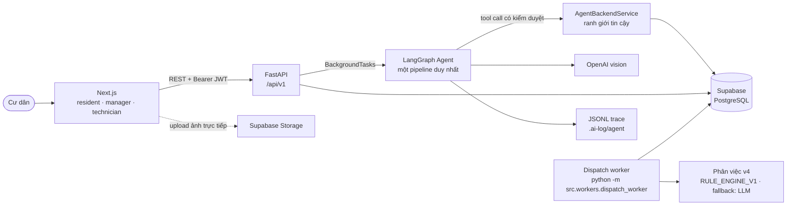

# FixIt Agent — Phân loại & ưu tiên phản ánh sự cố chung cư

> Cư dân gửi mô tả và tấm ảnh → AI Agent tự phân loại, chấm mức nghiêm trọng, hỏi lại khi chưa rõ, và xếp ưu tiên xử lý → Ban quản lý chỉ duyệt và phân công.

|                        |                                                                          |
| ---------------------- | ------------------------------------------------------------------------ |
| **Backend**            | FastAPI + LangGraph · `https://deploytestp092-production.up.railway.app` |
| **API docs**           | `/docs` (Swagger) · `/redoc` · `/openapi.json`                           |
| **Kiến trúc chi tiết** | [docs/architecture_diagram.md](docs/architecture_diagram.md)             |
| **Log hành vi Agent**  | [docs/agent-logging.md](docs/agent-logging.md)                           |
| **Vận hành**           | [docs/operations.md](docs/operations.md)                                 |
| **Triển khai agent phân tích** | [docs/analysis_agent_deploy.md](docs/analysis_agent_deploy.md)    |

---

## 1. Vấn đề

Ban quản lý chung cư nhận phản ánh qua Zalo, hotline, sổ tay giấy. Hệ quả:

- **Không có thứ tự ưu tiên.** Một cái chập điện và một cái đèn hành lang hỏng nằm cùng một hàng đợi, xử lý theo thứ tự ai gọi trước.
- **Mô tả của cư dân quá ngắn để hành động.** "Mất điện rồi" — mất cả tầng hay riêng một căn? Điều phối viên phải gọi lại hỏi, mất thêm một vòng.
- **Không thấy sự cố lan rộng.** Bốn căn cùng báo rò nước trong 2 ngày ở các tầng liền kề là _một_ sự cố đường ống, nhưng vào hệ thống thành bốn việc rời rạc.
- **Không có dữ liệu để cải thiện.** Không đo được SLA, không biết loại sự cố nào hay tái diễn ở đâu.

## 2. Giải pháp

Một AI Agent đứng giữa cư dân và Ban quản lý, làm đúng ba việc mà con người đang làm thủ công:

|                         | Agent làm gì                                                                          | Cơ chế                                                                      |
| ----------------------- | ------------------------------------------------------------------------------------- | --------------------------------------------------------------------------- |
| **Phân loại**           | Đọc mô tả **và ảnh** để xác định Category + mức nghiêm trọng                          | LLM vision + structured output, chọn trong catalog Category do BQL quản lý  |
| **Hỏi lại khi chưa đủ** | Tự sinh câu hỏi trắc nghiệm nhắm đúng thứ làm thay đổi mức ưu tiên                    | LangGraph `interrupt()` — dừng graph, chờ cư dân bấm trả lời, rồi chạy tiếp |
| **Gom cụm sự cố**       | Phát hiện nhiều ticket rò nước/chập điện cùng toà, tầng liền kề, ≤3 ngày là một sự cố | Tool `search_related_tickets` + `propose_case_grouping`, backend xác thực   |

Sau đó **Backend** — không phải LLM — chấm điểm theo công thức minh bạch và ra Priority + hạn SLA. Trường hợp nguy hiểm (khói, lửa, dây điện hở, ngập nước) được đẩy thẳng lên mức khẩn cấp nhất, bỏ qua chấm điểm.

## 3. Ba vai trò

| Vai trò                | Đăng nhập                                                            | Làm được gì                                                                                                                                                                |
| ---------------------- | -------------------------------------------------------------------- | -------------------------------------------------------------------------------------------------------------------------------------------------------------------------- |
| **Cư dân**             | Supabase Auth — số điện thoại + OTP                                  | Tạo phản ánh (mô tả + tối đa 5 ảnh), trả lời câu hỏi của Agent, theo dõi tiến độ, hủy khi còn mới, bổ sung thông tin theo yêu cầu BQL                                      |
| **Điều phối viên BQL** | Supabase Auth — email + password, quyền `COORDINATOR` do backend cấp | Dashboard ticket, xử lý hàng chờ duyệt tay (P0), override Category/Priority kèm lý do, duyệt & phân công KTV, quản lý cụm sự cố, danh mục Category, báo cáo SLA, audit log |
| **Kỹ thuật viên**      | Supabase Auth + hồ sơ `TechnicianProfile` tin cậy                    | Xem hàng việc theo thứ tự, bắt đầu xử lý, hoàn thành kèm ảnh nghiệm thu, hoặc báo không xử lý được kèm lý do                                                                                     |

## 4. Tech stack

| Tầng        | Công nghệ                                                                                 |
| ----------- | ----------------------------------------------------------------------------------------- |
| AI Agent    | LangGraph 1.2 + LangChain 1.3, `MemorySaver` checkpointer, structured output qua Pydantic |
| LLM         | OpenAI Chat (vision), cấu hình qua `MODEL_NAME`                                           |
| Backend     | FastAPI 0.141 + Uvicorn, SQLAlchemy 2.0 (đồng bộ), Pydantic v2 / pydantic-settings        |
| Database    | PostgreSQL (Supabase), migration bằng Alembic — 16 revision                               |
| Auth        | Supabase Auth (JWT, verify qua JWKS hoặc auth server)                                     |
| Storage     | Supabase Storage, bucket private + signed URL                                             |
| Frontend    | Next.js 15 (App Router) + React 19 + TypeScript, PWA cho giao diện cư dân                 |
| DevOps      | Docker multi-stage, GitHub Actions, Railway (backend) + Vercel (frontend)                 |
| Test / lint | pytest 9, ruff 0.16                                                                       |

---

## 5. Kiến trúc tóm tắt



Nguyên tắc xuyên suốt: **Agent đề xuất, Backend quyết.** Agent không ghi thẳng vào ticket — nó gọi tool, backend kiểm ngân sách + catalog snapshot rồi tự chấm điểm trong `finalize()`. Nếu Agent khai số lần dùng tool không khớp bộ đếm trong DB, `finalize()` từ chối với HTTP 409.

Sơ đồ đầy đủ (components, LangGraph state machine, 5 data flow, ERD, deployment): **[docs/architecture_diagram.md](docs/architecture_diagram.md)**.

---

## 6. Setup

### Yêu cầu

- **Python 3.11+** — bắt buộc, không phải khuyến nghị. 14 file trong `src/` dùng `from datetime import UTC`, hằng số chỉ có từ 3.11. Bản dev đang chạy 3.13.
- **Node.js 20+** (cho frontend)
- Một project **Supabase** (Auth + PostgreSQL + Storage)
- **OpenAI API key** có quyền gọi model vision

Ba thứ đầu phải cài sẵn trên máy. Mọi thứ còn lại do script setup lo.

### 6.1 Đường ngắn nhất từ `git clone` tới app chạy

Bốn bước dưới đây là **toàn bộ** những gì cần làm. Tất cả đã được chạy thật trên Windows 11 + PowerShell từ thư mục vừa clone.

**Bước 1 — Clone và bootstrap.**

```bash
git clone https://github.com/AI20K-Build-Phase-Cohort-3/P-092.git
cd P-092
```

```powershell
# Windows PowerShell
powershell -ExecutionPolicy Bypass -File scripts\setup.ps1
```

```bash
# macOS / Linux / Git Bash
bash scripts/setup.sh
```

Script tạo `.venv` bằng Python 3.11+, cài dependency backend, rồi tạo `.env` và `frontend/.env.local` và chạy `npm install`. Chạy lại nhiều lần an toàn — file env đã có sẵn sẽ không bị ghi đè.

**Bước 2 — Điền API key.**

`.env.example` đã có sẵn DB và Supabase dùng chung, nên `.env` vừa tạo chỉ còn thiếu **`OPENAI_API_KEY`** (hoặc `ANTHROPIC_API_KEY` nếu dùng fallback). Điền vào là xong; các biến còn lại để nguyên.

**Bước 3 — Chạy backend** (tab thứ nhất, từ repo root):

```powershell
# Windows
.venv\Scripts\python.exe -m uvicorn src.main:app --reload --port 8000
```

```bash
# macOS / Linux
.venv/bin/python -m uvicorn src.main:app --reload --port 8000
```

> Luôn gọi qua `python -m uvicorn` như trên, đừng gõ `uvicorn` trần — lệnh trần tra PATH và rất hay trúng bản Python global, kéo theo lỗi thiếu `psycopg` khó hiểu. Gọi thẳng `.venv\Scripts\python.exe` thì không cần `activate` trước.

**Bước 4 — Chạy frontend** (tab thứ hai, để backend chạy nguyên):

```powershell
# Windows
cd frontend
npm.cmd run dev
```

```bash
# macOS / Linux
cd frontend
npm run dev
```

Bước 1 đã `npm install` sẵn. Nếu bỏ qua script setup thì chạy tay `npm install` trước.

**Kiểm tra đã lên đủ chưa:**

| URL | Mong đợi |
|---|---|
| `http://localhost:8000/health` | `{"status":"ok"}` |
| `http://localhost:8000/ready` | `database`, `migration` = `ok`; `supabase_auth`, `supabase_storage` = `configured` |
| `http://localhost:8000/docs` | Swagger UI |
| `http://localhost:3000/resident` | Giao diện cư dân |

Nếu `/ready` báo `migration` khác `ok` thì DB chưa có schema. Bật cờ ngay trên
lệnh migration, đừng để sẵn trong `.env`:

```powershell
$env:ALLOW_LIVE_MIGRATION="true"; .venv\Scripts\python.exe -m alembic upgrade head; Remove-Item Env:ALLOW_LIVE_MIGRATION
```

Cờ để sẵn trong `.env` là cờ luôn bật. Chuỗi migration hiện tại đi qua
`a1b2c3d4e5f7` — revision xoá toàn bộ dữ liệu ticket và không có `downgrade`.
Với DB không phải localhost còn phải khai thêm `MIGRATION_TARGET`; xem
`docs/operations.md` §12. Các lệnh chỉ đọc như `alembic current` không cần bật
hai cờ migration.

**Dừng lại:** `Ctrl+C` ở từng tab. Nếu lỡ đóng tab mà port vẫn bị giữ:

```powershell
# Windows — tìm rồi kill tiến trình đang giữ port
Get-NetTCPConnection -LocalPort 8000 -State Listen | ForEach-Object { Stop-Process -Id $_.OwningProcess -Force }
```

## 7 Vòng hỏi–đáp với Agent

Agent chạy nền. Client **polling** hai endpoint (chưa có WebSocket/SSE):

```bash
TICKET=<ticket_id>

# Có câu hỏi nào đang chờ không?
curl $BASE/tickets/$TICKET/agent-question -H "Authorization: Bearer $TOKEN"
```

```jsonc
{
  "data": {
    "id": "9f2c...",
    "question_type": "MULTIPLE_CHOICE",
    "question_text": "Tình trạng mất điện đang ảnh hưởng tới phạm vi nào?",
    "options": ["Riêng căn hộ tôi", "Cả tầng", "Cả toà nhà", "Tôi không rõ"],
    "allow_free_text_fallback": true,
    "round_number": 1,
    "expires_at": "2026-08-16T09:12:00Z",
  },
}
```

Ba kiểu trả lời:

```bash
# a) Chọn một option có sẵn
curl -X POST $BASE/tickets/$TICKET/agent-question/9f2c.../answer \
  -H "Authorization: Bearer $TOKEN" -H 'Content-Type: application/json' \
  -d '{"answer_type":"OPTION","answer_text":"Cả tầng"}'

# b) Tự nhập (chỉ được khi allow_free_text_fallback = true)
curl -X POST $BASE/tickets/$TICKET/agent-question/9f2c.../answer \
  -H "Authorization: Bearer $TOKEN" -H 'Content-Type: application/json' \
  -d '{"answer_type":"FREE_TEXT","answer_text":"Mất điện từ tầng 5 lên tầng 8"}'

# c) Gửi ảnh mới (xin signed upload URL trước, như bước 4)
curl -X POST $BASE/tickets/$TICKET/agent-question/9f2c.../answer \
  -H "Authorization: Bearer $TOKEN" -H 'Content-Type: application/json' \
  -d '{"answer_type":"NEW_PHOTO","upload_id":"<upload_id>"}'
```

Trả lời xong, backend `resume` graph — Agent trích xuất lại **toàn bộ** với thông tin mới, kể cả kiểm tra lại dấu hiệu nguy hiểm.

> Quá `expires_at` (tổng ngân sách chờ 300s) mà chưa trả lời → session `TIMED_OUT`, ticket chuyển `INVALID`, cư dân được thông báo gửi lại.

## 8. API reference

| Nhóm           | Endpoint                                                                                                                                                                                                                                                                     |
| -------------- | ------------------------------------------------------------------------------------------------------------------------------------------------------------------------------------------------------------------------------------------------------------------------- |
| Health         | `GET /health` · `GET /ready`                                                                                                                                                                                                                                                 |
| Auth           | `POST /auth/otp/request` · `POST /auth/otp/verify` · `GET /me` · `POST /me/bind-unit`                                                                                                                                                                                        |
| Catalog        | `GET /catalog/locations` · `GET /catalog/categories`                                                                                                                                                                                                                         |
| Storage        | `POST /storage/ticket-attachments/upload-url` · `POST /storage/completion-evidence/upload-url`                                                                                                                                                                              |
| Cư dân         | `POST /tickets` · `GET /tickets` · `GET /tickets/{id}` · `POST /tickets/{id}/cancel` · `POST /tickets/{id}/supplements` · `GET /tickets/{id}/agent-question` · `POST /tickets/{id}/agent-question/{qid}/answer` · `GET /tickets/{id}/attachments/{aid}/download-url`         |
| Thông báo      | `GET /notifications` · `POST /notifications/{id}/read`                                                                                                                                                                                                                       |
| Điều phối viên | `GET /coordinator/tickets` · `GET /coordinator/tickets/{id}` · `POST .../approve` · `POST .../assign` · `POST .../manual-review/resolve` · `POST .../manual-review/reject` · `POST .../request-information` · `PATCH .../classification` · `GET /coordinator/clusters` · `POST /clusters/{id}/approve` · `POST /clusters/{id}/assign` · `GET\|POST\|PATCH\|DELETE /coordinator/categories` · `GET /coordinator/technicians` · `GET /coordinator/audit-logs` · `GET /coordinator/reports/*` |
| Kỹ thuật viên  | `GET /technician/assignments` · `POST .../accept` · `POST .../start` · `POST .../complete` · `POST .../unable-to-handle`                                                                                                                                                    |

Tất cả có tiền tố `/api/v1`. Mã lỗi ổn định định nghĩa tại [src/models/api/errors.py](src/models/api/errors.py) — ví dụ `AUTH_REQUIRED`, `DESCRIPTION_REQUIRED`, `AGENT_BUDGET_EXHAUSTED`, `OVERRIDE_REASON_REQUIRED`, `INVALID_STATUS_TRANSITION`, `CONFLICT_VERSION`.

### Ai được thấy một ticket

Một phản ánh là **riêng tư với người gửi** trong suốt giai đoạn AI:

```text
riêng tư  <=>  classification_status IN (PENDING, PROCESSING)
```

Khoảng đó gồm cả lúc Agent đang phân tích lẫn lúc đang chờ Cư dân trả lời câu
hỏi bổ sung. Khi phân loại kết thúc — `RESOLVED`, `MANUAL_REVIEW`, `FAILED`, hay
một kết thúc invalid — ticket được **công bố**: chia sẻ cho các tài khoản còn
hoạt động trong cùng căn hộ và bàn giao cho Ban quản lý xem xét.

| Người gọi | Giai đoạn AI riêng tư | Sau khi công bố |
| --- | --- | --- |
| Người gửi | Xem danh sách, chi tiết, ảnh và câu hỏi AI; trả lời câu hỏi; hủy khi trạng thái cho phép | Xem được; thao tác dành riêng người gửi vẫn còn |
| Thành viên khác cùng căn hộ | Không thấy ở danh sách, `total`, chi tiết, ảnh hay câu hỏi AI | Xem được ticket và ảnh; không bao giờ hủy hoặc trả lời câu hỏi AI |
| Cư dân căn hộ khác | Không có quyền | Không có quyền |
| Điều phối viên | Không thấy và không thao tác được | Theo luồng Điều phối viên hiện hành |
| Agent / worker nội bộ | Truy cập bình thường | Không đổi |

Backend là nơi quyết định, không phải giao diện:

- Vị từ hiển thị chạy trong SQL **trước** `count`, `offset` và `limit`, nên một
  dòng không được phép xem không lọt vào `total` và không chiếm chỗ trên trang.
- Chi tiết, signed URL của ảnh và endpoint câu hỏi AI áp cùng quy tắc, nên không
  đi vòng bằng URL trực tiếp được.
- Hủy ticket và trả lời câu hỏi AI chỉ dành cho người gửi.
- Đọc không được phép trả **404**, không phải 403 — đoán ID không xác nhận được
  ticket có tồn tại hay không.

Quy tắc nằm một chỗ tại
[src/services/ticket_visibility.py](src/services/ticket_visibility.py), và được
lặp lại ở tầng RLS bởi migration `8b9c0d1e2f3a`.

### Phản ánh trùng

Hệ thống vẫn phát hiện và liên kết phản ánh trùng: Agent tra cứu ứng viên, nhánh
`DUPLICATE_EXISTING` đưa ticket sang `LINKED_DUPLICATE` với
`duplicate_of_ticket_id`, cư dân theo dõi bản rút gọn của ticket gốc và nhận
thông báo kết quả. Điều phối viên vẫn liên kết duplicate thủ công bằng
`POST /coordinator/tickets/{id}/duplicate-link`.

**Không có luồng kháng nghị.** Cư dân không có nút "Sự cố của tôi khác" và Ban
quản lý không có hàng chờ xử lý kháng nghị; nếu một liên kết bị sai, Ban quản lý
sửa bằng các thao tác duyệt/điều chỉnh thông thường.

---
## 9. Agent hoạt động thế nào

### Ngân sách cứng cho mỗi phiên phân tích

| Giới hạn                  | Giá trị                                                                                              |
| ------------------------- | ---------------------------------------------------------------------------------------------------- |
| Tổng số tool call         | **5** (`search_related_tickets`, `propose_case_grouping` và `ask_resident` dùng **chung** quota này) |
| Số vòng hỏi cư dân        | **3**                                                                                                |
| Tổng thời gian chờ cư dân | **300 giây**                                                                                         |
| Số vòng lặp graph         | **12**                                                                                               |

Bộ đếm nằm trong bảng `ai_analysis_sessions` — **DB là nguồn sự thật**, không phải state của Agent.

### Sáu kết cục

| `exit_reason`                | Ticket thành                       | Ai xử lý tiếp                |
| ---------------------------- | ---------------------------------- | ---------------------------- |
| `EMERGENCY_REVIEW_REQUIRED`  | **P5**, `MANUAL_REVIEW`            | BQL xử lý thủ công ngay      |
| `DUPLICATE_EXISTING`         | `LINKED_DUPLICATE`, không có SLA   | Không ai — đã gộp vào gốc    |
| `DUPLICATE_UNCERTAIN`        | `MANUAL_REVIEW`                    | BQL chốt trùng hay độc lập   |
| `ANALYSIS_COMPLETE`          | P1–P4 theo điểm, `RESOLVED`        | BQL duyệt & phân công        |
| `LIMIT_REACHED`              | `MANUAL_REVIEW`                    | BQL chốt tay                 |
| `INSUFFICIENT_INPUT`         | `INVALID`                          | Cư dân gửi lại               |

`RED_FLAG` không còn là một kết cục riêng. Nguy hiểm bây giờ là một *blocker*
nâng sàn mức ưu tiên lên P5, đi qua đúng bộ tính điểm mà mọi ticket khác đi qua,
và ra ở `EMERGENCY_REVIEW_REQUIRED`.

> **P0 không phải một Priority.** P0 = `classification_status = MANUAL_REVIEW`.
> Enum `Priority` có P1–P5, và **P5 là mức khẩn cấp** — thang điểm đã đảo so với
> bản trước, khi P3 giữ vai trò đó.

### Công thức chấm điểm

Hợp đồng đầy đủ: [`docs/risk_scoring_v2.md`](docs/risk_scoring_v2.md). Bản tóm tắt:

```
risk_score = essential_function  / 4 × 50
           + human_safety        / 4 × 25
           + affected_scope      / 4 × 15
           + property_spread     / 4 × 5
           + deterioration_speed / 4 × 5
```

AI trả **năm số nguyên 0–4**, danh sách blocker và bằng chứng. Backend cộng.
AI không trả điểm tổng, không trả mức ưu tiên, và không có trường nào trong hợp
đồng để nó làm việc đó.

| Tổng điểm  | Priority | Hạn bắt đầu xử lý       |
| ---------- | -------- | ----------------------- |
| `[0, 20)`  | P1       | 1.800 phút phục vụ      |
| `[20, 40)` | P2       | 1.200 phút phục vụ      |
| `[40, 60)` | P3       | 600 phút phục vụ        |
| `[60, 80)` | P4       | 180 phút phục vụ        |
| `[80, 100]`| P5       | 5 phút, BQL xử lý tay   |

"Phút phục vụ" là phút trong khung 08:00–18:00; P5 chạy 24/7. SLA đo tại thời
điểm **bắt đầu** xử lý, không phải lúc hoàn thành.

Ba thứ đã bị bỏ khỏi công thức và sẽ không quay lại: `base_score` theo Category,
`location_bonus`, và `density_bonus`. Category giữ rộng và **không tham gia tính
điểm** — nó dùng để định tuyến kỹ năng và thống kê. Vị trí chỉ là bằng chứng để
AI chấm `human_safety` hoặc `affected_scope`, không tự cộng điểm.

Mười một *blocker* nâng **sàn** mức ưu tiên (bảy mã lên P5, bốn mã lên P4) và
không bao giờ hạ một mức đã cao hơn. Một ticket chấm ra 13 điểm nhưng có khói
vẫn là P5.

**P5 chỉ xử lý thủ công.** Không đường phân việc nào — tự động, thủ công, theo
case hay kéo thả trên bảng — được tạo assignment cho nó.

---

## 10. Quan sát & debug

Hai kênh log tách biệt, có chủ đích:

| Kênh                                                                          | Ghi gì                                                                                              |
| ----------------------------------------------------------------------------- | --------------------------------------------------------------------------------------------------- |
| Bảng DB (`ai_analysis_sessions`, `ai_agent_tool_calls`, `ai_agent_questions`) | Những gì Backend **chấp nhận** — audit chính thức                                                   |
| JSONL `.ai-log/agent/<session_id>.jsonl`                                      | Những gì Agent **đã làm và vì sao** — cả bước bị từ chối, nhánh rẽ đã chọn, độ trễ từng lần gọi LLM |

```bash
python scripts/read_agent_trace.py --list          # liệt kê session, mới nhất trước
python scripts/read_agent_trace.py --last          # dòng thời gian phiên mới nhất
python scripts/read_agent_trace.py --session <id>
python scripts/read_agent_trace.py --last --raw    # JSON thô

# JSONL nên jq dùng trực tiếp — mọi quyết định chọn action kèm lý do:
jq -r 'select(.event=="node_exit" and .node=="decide_action") | .updates.action_reason' \
  .ai-log/agent/<id>.jsonl
```

Signed URL bị cắt query string, văn bản cư dân bị cắt còn 500 ký tự trước khi ghi trace — token truy cập ảnh không bao giờ chạm ổ đĩa.

Mọi response HTTP đều có header `x-request-id`, được ghi kèm vào `AuditLog` để truy ngược.

---

## 11. Cấu trúc thư mục

```
src/
├── agents/            # LangGraph: graph, nodes, state, llm_client, trace, tracing
├── api/
│   ├── routes/        # auth, catalog, storage, tickets, notifications,
│   │                  # coordinator/*, technician_assignments
│   └── dependencies/  # auth, roles, database session
├── services/          # nghiệp vụ; agent_*.py là 4 mixin của AgentBackendService
├── repositories/      # truy vấn + khoá hàng
├── domain/            # bảng chuyển trạng thái ticket & assignment
├── database/models/   # 20+ bảng SQLAlchemy
├── models/            # Pydantic: api/ (contract HTTP), agent_schemas, enums
├── security/          # Supabase JWT verify, admin headers
└── config.py, main.py

frontend/              # Next.js 15 — app/{resident,manager,technician}
alembic/versions/      # 16 migration
tests/                 # 35 file: agents, api, services, repositories, security, migrations
scripts/               # setup Supabase, provision coordinator, đọc trace, quét secret, AI log hooks
docs/                  # architecture_diagram.md, agent-logging.md, operations.md, analysis_agent_deploy.md, guide/
```

---

## 12. Giới hạn đã biết

| Giới hạn                                                          | Ảnh hưởng                                                                                                            |
| ----------------------------------------------------------------- | -------------------------------------------------------------------------------------------------------------------- |
| `MemorySaver` là checkpointer **trong bộ nhớ tiến trình**         | Restart backend giữa lúc chờ cư dân trả lời sẽ mất state phiên đó. Cần checkpointer Postgres khi chạy nhiều instance |
| Vòng phân tích vẫn chạy qua `BackgroundTasks`                     | Chỉ áp dụng cho vòng phân tích ticket (vài giây). Toàn bộ phần phân việc đã chuyển sang worker bền vững theo contract §5 |
| Worker phân việc phải chạy như tiến trình riêng                   | `python -m src.workers.dispatch_worker`. Không chạy thì không có phản ánh nào được phân công tự động, timeout cư dân và đổi người cũng không xảy ra — xem `docs/operations.md` |
| Client dùng **polling**                                           | Chưa có WebSocket/SSE cho kết quả phân tích và câu hỏi của Agent                                                     |
| `frontend/lib/mockService.ts` vẫn được 10 trang dùng làm fallback | Cần tắt trước khi demo với dữ liệu thật                                                                              |

---
