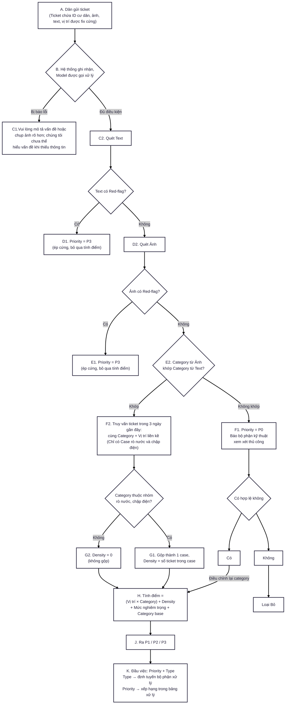

# Tài liệu kỹ thuật: Pipeline xử lý ticket phản ánh chung cư

---
# Sơ đồ xử lý ticket




## B. Hệ thống ghi nhận, Model được gọi xử lý

### Mục đích

Đây là bước duy nhất trong toàn bộ pipeline mà AI (model NLP + model Vision) trực tiếp xử lý dữ liệu thô (ảnh, văn bản tự do). Nhiệm vụ của bước này **chỉ là một việc**: chuyển dữ liệu phi cấu trúc (unstructured — ảnh, câu chữ tự nhiên) thành các trường dữ liệu có cấu trúc, giá trị cố định (structured fields). Mọi bước xử lý phía sau (F2 trở đi, tính điểm) đều là logic code thông thường, tra bảng, so sánh — không cần gọi AI nữa.

Việc tách bạch này quan trọng vì 2 lý do:

- **Kiểm soát chi phí**: AI chỉ được gọi 1 lần duy nhất cho mỗi ticket, không phụ thuộc vào việc bảng ngoại lệ hay quy tắc phía sau có bao nhiêu dòng.
- **Khả năng giải thích (explainability)**: một khi dữ liệu đã ở dạng cố định (category="hong_khoa", severity="High"...), mọi quyết định tiếp theo đều tra được ngược lại bằng bảng, không phụ thuộc vào "AI nghĩ gì" tại thời điểm xử lý.

### Các trường dữ liệu được lưu lại

**1. Text**

| Trường        | Kiểu dữ liệu                                                | Mô tả                                                                                                                                                                                                               |
| ------------- | ----------------------------------------------------------- | ------------------------------------------------------------------------------------------------------------------------------------------------------------------------------------------------------------------- |
| `Category`    | Nhãn cố định (chọn từ danh sách category đã định nghĩa sẵn) | Model NLP đọc văn bản mô tả của cư dân, phân loại thuộc category nào (điện, nước, thang máy, an ninh...). Có thể gán nhiều nhãn cùng lúc (multi-label) nếu vấn đề liên quan nhiều loại.                             |
| `RedFlagText` | Boolean (Có / Không)                                        | Model kiểm tra văn bản có chứa dấu hiệu thuộc danh sách từ khóa nguy hiểm định nghĩa trước hay không: **khói, lửa, dây điện hở, nước tràn, ngất xỉu, gây rối**. Chỉ cần khớp 1 trong các dấu hiệu này → gán `True`. |

**2. Ảnh**

| Trường          | Kiểu dữ liệu                                    | Mô tả                                                                                                                                                                                                                                                                 |
| --------------- | ----------------------------------------------- | --------------------------------------------------------------------------------------------------------------------------------------------------------------------------------------------------------------------------------------------------------------------- |
| `Category`      | Nhãn cố định (cùng danh sách category với Text) | Model Vision nhìn ảnh, tự phân loại thuộc category nào — **độc lập** với category rút ra từ Text. Dùng để đối chiếu ở bước F5 (phát hiện trường hợp ảnh và mô tả không khớp nhau).                                                                                    |
| `RedFlagSignal` | Boolean (Có / Không)                            | Tương tự `RedFlagText`, nhưng model Vision nhận diện trực tiếp từ hình ảnh: khói/lửa, dây điện hở lộ ra ngoài, nước tràn diện rộng.                                                                                                                                   |
| `Severity`      | Nhãn cố định: `Low` / `Medium` / `High`         | Model Vision đánh giá mức độ nghiêm trọng nhìn thấy được qua ảnh (ví dụ diện tích nước đọng, độ dài vết nứt). Cố tình giới hạn chỉ 3 mức rời rạc thay vì cho ra 1 con số liên tục — vì 3 mức dễ giải thích, dễ audit hơn nhiều so với việc AI tự chấm điểm số cụ thể. |

**3. Vị trí**

| Trường          | Kiểu dữ liệu                                                                           | Mô tả                                                                                                                       |
| --------------- | -------------------------------------------------------------------------------------- | --------------------------------------------------------------------------------------------------------------------------- |
| `Tầng`          | Chọn từ dropdown cố định                                                               | Cư dân tự chọn khi gửi ticket, **không phải do AI suy luận** — đảm bảo độ chính xác tuyệt đối.                              |
| `Vị trí cụ thể` | Chọn từ danh sách loại vị trí cố định (hành lang, cầu thang thoát hiểm, bãi xe hầm...) | Tương tự — cư dân tự chọn từ danh sách có sẵn, dùng để tra bảng (Vị trí × Category) và xác định "vị trí liền kề" ở bước F2. |

> **Lưu ý:** cả `Tầng` và `Vị trí cụ thể` đều là input do cư dân tự chọn (dropdown), không phải output do AI trích xuất — đây là điểm khác biệt quan trọng so với `Category`/`RedFlag`/`Severity`, vốn do model tự suy luận từ ảnh/text. Trường hợp không có ảnh, chỉ cần trích xuất dữ liệu từ text (Cho trường hợp mất điện, ồn ào, chập điện nguy hiểm - người dân không thể chụp hoặc không tiện chụp).

---

## C1. Trường hợp hệ thống yêu cầu phải ticket không hợp lệ

Yêu cầu người dùng tạo lại ticket **category** hoặc có dấu hiệu **red_flag** nhưng chưa chắc chắn

## F2. Truy vấn ticket trong 3 ngày gần đây

### Mục đích

Bước này nhằm phát hiện **1 sự cố lớn đang lan rộng** (ví dụ: nước rò từ tầng trên chảy xuống tầng dưới, chập điện lan qua nhiều căn hộ cùng tầng) — thay vì coi mỗi ticket là 1 sự cố độc lập, riêng lẻ.

### Điều kiện kích hoạt

Bước F2 **chỉ chạy khi cả 2 điều kiện sau đều đúng**:

1. Ticket đã đi qua bước F5 và **category giữa Ảnh và Text khớp nhau** (nếu không khớp, ticket đã bị chuyển sang P0 ở bước trước, không tới F2 nữa).
2. Category của ticket thuộc đúng 2 loại: **rò nước** hoặc **chập điện**. Các category khác (đèn, khóa, thang máy...) bỏ qua bước này hoàn toàn, `Density` mặc định = 0.

_(Lý do giới hạn chỉ 2 category này: đây là 2 loại sự cố có khả năng "lan" vật lý thật sự qua kết cấu tòa nhà — nước thấm theo trần/sàn, điện lan theo hệ thống dây chung. Các category khác như "hỏng đèn" không có cơ chế vật lý nào khiến nó lan sang căn hộ khác, nên không cần áp dụng logic này.)_

### Logic truy vấn

```
Khi ticket mới (category = rò nước, đã qua F5) đến:

TRUY VẤN database, tìm các ticket khác thỏa mãn ĐỒNG THỜI:
  ├─ Category = "rò nước" (giống ticket hiện tại)
  ├─ Thời gian tạo ticket trong vòng 3 ngày trong phiên (Giả sử ở đây đội ngũ kĩ thuật 3 ngày sẽ trực một lần và duyệt các ticket)
  └─ Vị trí liền kề với ticket hiện tại, định nghĩa là:
       • Cùng tầng, HOẶC
       • Tầng ngay trên, HOẶC
       • Tầng ngay dưới

NẾU tìm thấy ≥ 1 ticket khớp điều kiện:
  → Gộp tất cả các ticket này (bao gồm ticket hiện tại)
    thành 1 "case" duy nhất
  → Density = tổng số ticket trong case đó

NẾU không tìm thấy ticket nào khớp:
  → Density = 1 (chỉ có chính ticket hiện tại), coi như không có cụm
```

**Điểm kỹ thuật quan trọng:** đây là một bước **truy vấn cơ sở dữ liệu (database query)** chạy ở tầng backend, xảy ra **trước khi** đưa dữ liệu vào công thức tính điểm — hoàn toàn không liên quan đến việc "viết prompt cho AI". AI không tham gia vào bước này; bước này chỉ là code thông thường đối chiếu các trường `Category`, `Vị trí`, `Thời gian tạo` đã được chuẩn hóa từ bước B.

### Đầu ra của bước F2

`Density` (số nguyên) — được đưa thẳng vào công thức tính điểm cuối cùng:

```
Tính điểm = (Vị trí × Category) + Density + Servirity + Category 
```

---

## H. Tính điểm = (Vị trí × Category) + Density + Mức nghiêm trọng + Category base

> **Lưu ý:** các con số cụ thể trong mục này (10, 30, +15...) là bảng ví dụ minh họa để kiểm tra logic có hợp lý không — không phải số chuẩn từ nghiên cứu nào. Cần điều chỉnh lại dựa trên dữ liệu vận hành thực tế của từng tòa nhà (xem cơ chế tinh chỉnh ở phần scorecard đã bàn).

### 0. Quy tắc ưu tiên tuyệt đối — không đổi

**Red-flag (từ Text HOẶC Ảnh) → ép ngay Priority = P3**, bỏ qua toàn bộ phần tính điểm dưới đây.

### 1. Định nghĩa 3 mức Priority

| Priority | Ý nghĩa                                         | Ví dụ                                                                   | SLA xử lý  |
| -------- | ----------------------------------------------- | ----------------------------------------------------------------------- | ---------- |
| **P3**   | Cực kỳ nguy hiểm, ảnh hưởng trực tiếp tính mạng | Thang máy hỏng/kẹt, dấu hiệu cháy, gây rối trật tự công cộng, chập điện | **5 phút** |
| **P2**   | Phiền toái nghiêm trọng, ảnh hưởng sinh hoạt    | Điều hòa hỏng, mất điện, khóa cửa chính hỏng, mùi hôi thối              | **3 giờ**  |
| **P1**   | Vấn đề bình thường                              | Rò nước, hỏng đèn hành lang, phàn nàn hàng xóm thông thường             | **72 giờ** |

### 2. Category — danh sách mở rộng, kèm Priority Ceiling

Mỗi category có thêm thuộc tính **Priority Ceiling** — mức Priority tối đa category đó được phép đạt tới **thông qua tính điểm** (không tính red-flag). Lý do: một số category (hỏng khóa, điều hòa, mùi hôi...) không có cơ chế vật lý nào khiến chúng đe dọa tính mạng dù ảnh/mô tả "trông tệ" tới đâu, nên bị chặn cứng ở P2 hoặc P1. Ngược lại, category có khả năng leo thang thật (rò nước lan nhiều tầng, chập điện gây cháy, thang máy kẹt người) thì **không giới hạn**, để công thức cộng điểm bên dưới tự do quyết định.

> Model NLP/Vision cần **linh hoạt quy văn bản/ảnh tự do về 1 trong các category cố định này** — ví dụ "máy lạnh không mát", "điều hòa kêu to" đều quy về category `Điều hòa`, không cần khớp chính xác từng chữ.

| Category                               | Base điểm | Priority Ceiling |
| -------------------------------------- | --------- | ---------------- |
| Rò nước                                | 10        | _Không giới hạn_ |
| Chập điện                              | 50        | _Không giới hạn_ |
| Thang máy (kẹt, hỏng, tiếng kêu lạ...) | 35        | _Không giới hạn_ |
| An ninh nghiêm trọng / Gây rối trật tự | 40        | _Không giới hạn_ |
| Hỏng khóa / cửa                        | 25        | **P2**           |
| Điều hòa / hệ thống thông gió          | 20        | **P2**           |
| Mất điện (cục bộ)                      | 25        | **P2**           |
| Kết cấu (nứt tường, thấm dột)          | 20        | **P2**           |
| Hỏng đèn (khu vực chung)               | 10        | **P2**           |
| Mùi hôi / vệ sinh                      | 10        | **P1**           |
| Tiếng ồn / hàng xóm (thông thường)     | 10        | **P1**           |

### 3. (Vị trí × Category) — bảng ngoại lệ

| Category                          | Vị trí                           | Điểm bổ sung  |
| --------------------------------- | -------------------------------- | ------------- |
| Hỏng khóa                         | Cửa chính / cửa an ninh          | +30           |
| Hỏng khóa                         | Cửa phòng nội bộ (kho, kỹ thuật) | +0            |
| Hỏng đèn                          | Cầu thang thoát hiểm             | +25           |
| Hỏng đèn                          | Hành lang thường                 | +0            |
| _(mọi tổ hợp khác không liệt kê)_ |                                  | +0 (mặc định) |

### 4. Density — chỉ áp dụng cho rò nước, chập điện

| Số ticket gộp trong cụm | Điểm Density |
| ----------------------- | ------------ |
| 1 (không gộp)           | +0           |
| 2–3                     | +15          |
| ≥4                      | +30          |

### 5. Mức nghiêm trọng — có ảnh dùng Vision, không có ảnh dùng Text

| Mức  | Điểm | Nguồn                                                                   |
| ---- | ---- | ----------------------------------------------------------------------- |
| Thấp | +0   | Vision (nếu có ảnh) **hoặc** NLP tự suy luận từ text (nếu không có ảnh) |
| Vừa  | +10  | nt                                                                      |
| Cao  | +20  | nt                                                                      |

_(Khi cư dân không gửi ảnh, model NLP đọc mô tả bằng chữ, tự ước lượng Low/Medium/High theo đúng thang điểm này — không để trống, không mặc định Thấp.)_

### 6. Ngưỡng quy đổi điểm thô → Priority (trước khi áp Ceiling)

| Điểm thô | Priority (thô) |
| -------- | -------------- |
| < 30     | P1             |
| 30–59    | P2             |
| ≥ 60     | P3             |

### 7. Áp Ceiling — bước cuối cùng

```
Priority cuối = MIN(Priority thô từ bước 6, Priority Ceiling của category)
```

### 8. Ví dụ tính thử — kiểm tra logic có hợp lý không

| Tình huống                                      | Base | Vt×Cat | Density | Nghiêm trọng | Điểm thô | Ceiling        | **Priority cuối** |
| ----------------------------------------------- | ---- | ------ | ------- | ------------ | -------- | -------------- | ----------------- |
| Hỏng đèn, hành lang thường, ảnh thấp            | 10   | 0      | 0       | 0            | 10       | P2             | **P1**            |
| Hỏng đèn, cầu thang thoát hiểm, ảnh vừa         | 10   | +25    | 0       | +10          | 45       | P2             | **P2**            |
| Hỏng khóa, cửa chính, ảnh cao (cửa mở toang)    | 25   | +30    | 0       | +20          | 75       | **P2**         | **P2**            |
| Rò nước, gộp 3 ticket (tầng trên→dưới), ảnh vừa | 10   | 0      | +15     | +10          | 35       | Không giới hạn | **P2**            |
| Chập điện, không gộp, ảnh thấp                  | 50   | 0      | 0       | 0            | 50       | Không giới hạn | **P2**            |
| Chập điện, gộp 5 ticket, ảnh cao                | 50   | 0      | +30     | +20          | 100      | Không giới hạn | **P3**            |
| An ninh — gây rối trật tự, ảnh cao              | 40   | 0      | 0       | +20          | 60       | Không giới hạn | **P3**            |
