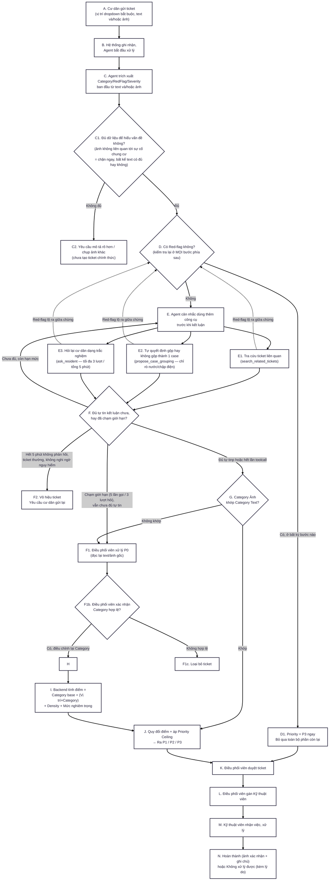

# Tài liệu kỹ thuật: Pipeline xử lý ticket phản ánh chung cư

---

## Sơ đồ xử lý ticket



---

## A. Cư dân gửi ticket

Cư dân chọn Tầng và Vị trí cụ thể từ dropdown cố định (luôn bắt buộc, không do AI suy luận — đảm bảo độ chính xác tuyệt đối cho việc tra bảng vị trí và xác định "liền kề" ở bước H), nhập mô tả bằng chữ và/hoặc chụp/tải ảnh hiện trường. Bắt buộc có ít nhất 1 trong 2: text hoặc ảnh.

## B. Hệ thống ghi nhận, Agent bắt đầu xử lý

Ticket được tạo với trạng thái Mới, trả kết quả ngay cho cư dân, hiển thị "Đang phân tích...". Agent bắt đầu xử lý ở bước C.

## C. Agent trích xuất Category/RedFlag/Severity ban đầu

Agent đọc text và/hoặc ảnh, thử trích xuất ngay lần đầu. Trước khi phân loại, Agent gọi `get_category_catalog()` để lấy đúng danh mục category đang hiệu lực tại thời điểm đó (BQL có thể đã thêm/xóa category qua màn hình quản trị), tránh phân loại theo danh sách cũ:

| Trường             | Nguồn                      | Mô tả                                                                                  |
| ------------------ | -------------------------- | -------------------------------------------------------------------------------------- |
| `text_categories`  | Text                       | Một hoặc nhiều nhãn category, chọn từ danh sách cố định                                |
| `red_flag_text`    | Text                       | Có/không chứa dấu hiệu nguy hiểm: khói, lửa, dây điện hở, nước tràn, ngất xỉu, gây rối |
| `image_categories` | Ảnh (nếu có)               | Cùng danh sách category, model Vision tự phân loại độc lập với text                    |
| `red_flag_signal`  | Ảnh (nếu có)               | Khói/lửa, dây điện hở lộ ra ngoài, nước tràn diện rộng nhìn thấy được qua ảnh          |
| `is_relevant`      | Ảnh (nếu có)               | Ảnh có thực sự liên quan tới sự cố chung cư không — xem quy tắc chặn cứng ở C1         |
| `severity`         | Ảnh nếu có, text nếu không | 3 mức cố định: Thấp / Vừa / Cao — không để trống, không mặc định Thấp                  |

Agent không tự quyết định Priority cuối, không tự so khớp category để kết luận P0, không tự tính Density chính thức — những việc đó là logic Backend thuần túy (bước H, I, J), chạy sau khi Agent trả kết quả, tra bảng và so sánh, không cần gọi AI thêm.

## C1. Đủ dữ liệu để hiểu vấn đề không?

Rẽ sang C2 nếu **một trong hai** điều kiện sau đúng, không cần cả hai:

- Text quá sơ sài và không liên quan gì tới sự cố chung cư và ảnh không đọc được/gần như không có.
- **Ảnh gửi lên không liên quan tới sự cố chung cư** (ví dụ gửi nhầm ảnh không liên quan) — chặn ngay lập tức, bắt gửi lại, **kể cả khi text một mình đã đủ để hiểu vấn đề**. Đây là quy tắc cứng có chủ đích: ảnh sai chủ đề không được phép lọt qua dù text có tốt tới đâu.

## C2. Yêu cầu mô tả rõ hơn / chụp ảnh khác

Phản hồi ngay cho cư dân, **chưa tạo ticket chính thức** , vô hiệu ticket này và bắt tạo lại hoàn toàn.

## D. Có Red-flag không?

Kiểm tra `red_flag_text` hoặc `red_flag_signal`. Đây là điểm kiểm tra **lặp lại ở mọi bước phía sau**, không chỉ 1 lần duy nhất ở đây — bất kỳ lúc nào trong toàn bộ vòng E (kể cả giữa câu trả lời của cư dân ở E3, hoặc dữ liệu mới từ E1), nếu dấu hiệu nguy hiểm xuất hiện, quay lại D và rẽ nhánh D1 ngay lập tức.

## D1. Priority = P3 ngay

Ép ngay Priority = P3, ngắt toàn bộ phần còn lại — không chờ hết lượt hỏi, không chờ hết thời gian, không chờ kết luận category. Đây là luật cứng, không thuộc phạm vi để Agent tự do cân nhắc: SLA của P3 chỉ có 5 phút, không thể để việc hỏi thêm cho chắc ăn hết ngân sách thời gian phản ứng của một ca thực sự nguy hiểm. Ticket vẫn đi tiếp tới K (Điều phối viên duyệt) như bình thường, chỉ khác là Priority đã được ấn định sẵn.

## E. Agent cân nhắc dùng thêm công cụ trước khi kết luận

Khi chưa đủ tự tin ở bước C, Agent tự quyết định có cần dùng thêm công cụ nào, khi nào, và bao nhiêu lần (trong giới hạn ở F) trước khi kết luận. Đây không phải 1 bước chạy 1 lần — là 1 vòng lặp, Agent có thể quay lại E nhiều lần (tối đa tới khi chạm giới hạn ở F).

### E1. Tra cứu ticket liên quan (`search_related_tickets`)

Tra cứu ticket khác cùng category/tầng/vị trí trong vài ngày gần đây để có thêm ngữ cảnh khi đánh giá category/severity. Có thể mở rộng tìm cả ticket đã hoàn thành trong quá khứ (không chỉ ticket đang mở) để phát hiện vấn đề lặp lại dai dẳng ở cùng khu vực. Kết quả trả về gồm cả tóm tắt ngắn gọn vấn đề và vị trí cụ thể của từng ticket liên quan (không trả nguyên văn mô tả gốc của cư dân khác, tránh rò dữ liệu cá nhân).

### E2. Tự quyết định gộp hay không gộp thành 1 case (`propose_case_grouping`)

Chỉ áp dụng khi category là rò nước hoặc chập điện — 2 loại sự cố có khả năng lan vật lý thật qua kết cấu tòa nhà. Sau khi tra cứu ở E1, Agent tự cân nhắc trong số các ticket tìm được, ticket nào **thực sự** cùng 1 sự cố lan rộng với ticket hiện tại — không phải cứ trùng category/tầng/thời gian là gộp máy móc. Ví dụ: nhiều căn hộ cùng báo rò nước ở khu vực có khả năng chung 1 đường ống thì nên gộp; còn 2 ticket rò nước ở 2 đầu tòa nhà, trùng ngày nhưng rõ ràng 2 nguyên nhân khác nhau (một do vòi nước trong nhà, một do thấm trần) thì không nên gộp dù kỹ thuật khớp điều kiện thời gian/category. Trả lại trường **density** = số hộ bị ảnh hưởng

Agent gọi công cụ này với danh sách ticket muốn gộp kèm lý do ngắn . Nếu Agent không thấy ticket nào thực sự liên quan, không gọi công cụ này — mặc định không gộp.

### E3. Hỏi lại cư dân dạng trắc nghiệm (`ask_resident`)

Khi chưa đủ tự tin về category hoặc severity, hỏi lại cư dân dưới dạng trắc nghiệm (nút bấm), áp dụng cho cả text mơ hồ lẫn ảnh không rõ. Với ảnh không rõ, Agent có thể đưa thêm lựa chọn "Chụp lại ảnh khác" tùy tình huống. Có phương án **khác** để cư dân tự nhập vấn đề được hỏi

Tối đa 3 lượt hỏi, tổng thời gian chờ trả lời cho cả 3 lượt cộng lại không quá 5 phút. Trong lúc chờ, màn hình vẫn hiển thị "Đang phân tích...", có câu hỏi thì hiển thị ngay tại chỗ, không điều hướng màn hình khác.

## F. Đủ tự tin kết luận chưa, hay đã chạm giới hạn?

Sau mỗi lần dùng công cụ ở E, kiểm tra lại: đã đủ tự tin để kết luận Category/Severity chưa? Nếu chưa và còn hạn mức (chưa hỏi hết 3 lượt, chưa gọi tool đủ 5 lần, còn thời gian) → quay lại E. Nếu chạm 1 trong các giới hạn mà vẫn chưa đủ tự tin → rẽ nhánh F1 (P0). Nếu hết 5 phút mà cư dân không phản hồi kịp và không có nghi ngờ red-flag phát sinh → rẽ nhánh F2 (vô hiệu). Nếu đủ tự tin → đi tiếp G.

## F1. Điều phối viên xử lý P0

Ticket chuyển trạng thái chờ duyệt thủ công khi: category giữa ảnh và text không khớp (từ G), hoặc Agent đã dùng hết hạn mức công cụ mà vẫn chưa đủ tự tin (từ F). Điều phối viên đọc lại text/ảnh gốc (và các câu hỏi Agent đã hỏi cư dân, nếu có) để tự đánh giá.

## F1b. Điều phối viên xác nhận Category hợp lệ?

- **Có, điều chỉnh lại Category**: ticket quay lại bước H, tính Density và điểm số bình thường theo Category đã được Điều phối viên xác nhận.
- **Không hợp lệ**: ticket bị loại bỏ (F1c) — ví dụ ảnh/mô tả thực chất không phải sự cố cần xử lý và báo lại cho cư dân về lý do.

## F1c. Loại bỏ ticket

Ticket không hợp lệ, không phải sự cố cần xử lý.

## F2. Vô hiệu ticket

Áp dụng cho ticket **không** có dấu hiệu nguy hiểm: hết 5 phút mà cư dân không phản hồi kịp câu hỏi trắc nghiệm ở E3. Ticket bị đóng hẳn, yêu cầu cư dân gửi lại ticket mới — **khác hoàn toàn** với F1 (P0 vẫn giữ ticket lại chờ người duyệt). Nút bấm trắc nghiệm không còn hiệu lực sau thời điểm này, không có cơ chế trả lời trễ để khôi phục.

## G. Category Ảnh khớp Category Text?

So sánh `text_categories` và `image_categories` mà Agent đã trích xuất. Không khớp → F1 (P0). Khớp → tiếp H.

## I. Backend tính điểm

```
Điểm thô = Category base + (Vị trí × Category) + Density + Mức nghiêm trọng
```

| Category                               | Điểm cơ bản | Priority Ceiling |
| -------------------------------------- | ----------- | ---------------- |
| Rò nước                                | 10          | Không giới hạn   |
| Chập điện                              | 50          | Không giới hạn   |
| Thang máy                              | 35          | Không giới hạn   |
| An ninh nghiêm trọng / Gây rối trật tự | 40          | Không giới hạn   |
| Hỏng khóa / cửa                        | 25          | P2               |
| Điều hòa / hệ thống thông gió          | 20          | P2               |
| Mất điện (cục bộ)                      | 25          | P2               |
| Kết cấu (nứt tường, thấm dột)          | 20          | P2               |
| Hỏng đèn (khu vực chung)               | 10          | P2               |
| Mùi hôi / vệ sinh                      | 10          | P1               |
| Tiếng ồn / hàng xóm (thông thường)     | 10          | P1               |

| Category        | Vị trí                  | Điểm bổ sung |
| --------------- | ----------------------- | ------------ |
| Hỏng khóa       | Cửa chính / cửa an ninh | +30          |
| Hỏng khóa       | Cửa phòng nội bộ        | +0           |
| Hỏng đèn        | Cầu thang thoát hiểm    | +25          |
| Hỏng đèn        | Hành lang thường        | +0           |
| _(tổ hợp khác)_ |                         | +0           |

| Density (số căn hộ) | Điểm |
| ------------------- | ---- |
| 1 (không gộp)       | +0   |
| 2–3                 | +15  |
| ≥4                  | +30  |

| Mức nghiêm trọng | Điểm |
| ---------------- | ---- |
| Thấp             | +0   |
| Vừa              | +10  |
| Cao              | +20  |

## J. Quy đổi điểm + áp Priority Ceiling → Ra P1/P2/P3

```
< 30    → P1
30–59   → P2
≥ 60    → P3

Priority cuối = MIN(Priority từ điểm thô, Priority Ceiling của category)
```

**Ví dụ tính thử:**

| Tình huống                              | Cơ bản | Vị trí | Density | Nghiêm trọng | Điểm thô | Ceiling        | Priority cuối |
| --------------------------------------- | ------ | ------ | ------- | ------------ | -------- | -------------- | ------------- |
| Hỏng đèn, hành lang thường, ảnh thấp    | 10     | 0      | 0       | 0            | 10       | P2             | **P1**        |
| Hỏng đèn, cầu thang thoát hiểm, ảnh vừa | 10     | +25    | 0       | +10          | 45       | P2             | **P2**        |
| Hỏng khóa, cửa chính, ảnh cao           | 25     | +30    | 0       | +20          | 75       | P2             | **P2**        |
| Rò nước, Agent gộp 3 căn hộ, ảnh vừa    | 10     | 0      | +15     | +10          | 35       | Không giới hạn | **P2**        |
| Chập điện, Agent không gộp, ảnh thấp    | 50     | 0      | 0       | 0            | 50       | Không giới hạn | **P2**        |
| Chập điện, Agent gộp 5 căn hộ, ảnh cao  | 50     | 0      | +30     | +20          | 100      | Không giới hạn | **P3**        |
| An ninh — gây rối trật tự, ảnh cao      | 40     | 0      | 0       | +20          | 60       | Không giới hạn | **P3**        |

## K. Điều phối viên duyệt ticket

Ticket đã có Category và Priority hợp lệ (dù đi thẳng từ J, từ nhánh red-flag D1, hay từ P0 đã được xác nhận ở F1b) đều tập trung về đây để Điều phối viên duyệt trước khi gán việc.

## L. Điều phối viên gán Kỹ thuật viên

Điều phối viên chọn và gán cho kỹ thuật viên, kỹ thuật viên nhận được thông báo xử lý từ hệ thống.

## M. Kỹ thuật viên nhận việc, xử lý

Kỹ thuật viên xác nhận nhận việc đã được gán, tự chuyển trạng thái khi bắt đầu xử lý thực tế.

## N. Hoàn thành hoặc Không xử lý được

Khi hoàn thành, bắt buộc kèm ít nhất 1 ảnh xác nhận hiện trạng sau xử lý và 1 ghi chú mô tả nguyên nhân/vật liệu đã thay — dùng làm minh chứng khi cần đối chiếu hoặc có tranh chấp sau này. Nếu không xử lý được, bắt buộc nhập lý do. Cư dân nhận thông báo ở mọi mốc chuyển trạng thái quan trọng: được duyệt, được gán kỹ thuật viên, đang xử lý, hoàn thành.
