# Tài liệu kỹ thuật đầy đủ: Pipeline xử lý ticket phản ánh chung cư (bản hợp nhất)

> **Phạm vi:** tài liệu này mô tả xuyên suốt từ lúc Cư dân gửi ticket, Agent phân tích, Backend chốt Category/Priority, Điều phối viên duyệt, phân việc, giám sát phản hồi, đổi Kỹ thuật viên, đến khi kết thúc ticket.

---

## 1. Mục tiêu và nguyên tắc kiến trúc

Hệ thống tiếp nhận phản ánh của cư dân, chuẩn hóa dữ liệu từ text/ảnh, phát hiện nguy hiểm, xác định Category và Priority, hỗ trợ gom các phản ánh có khả năng thuộc cùng một sự cố lan rộng, rồi phân việc cho Kỹ thuật viên.

Pipeline tách rõ trách nhiệm giữa ba thành phần:

| Thành phần | Trách nhiệm |
| --- | --- |
| **AI Agent phân tích** | Đọc text/ảnh; trích xuất Category, red-flag, severity, mức liên quan; dùng công cụ tra cứu, đề xuất gộp và hỏi lại cư dân khi cần. |
| **Backend** | Kiểm tra ràng buộc; so khớp Category; tính Density chính thức; tính điểm; áp Priority Ceiling; quản lý trạng thái, thời gian, quyền, audit và toàn vẹn dữ liệu. |
| **Con người** | Cư dân cung cấp thông tin; Điều phối viên duyệt/override/phân tay; Kỹ thuật viên nhận và xử lý việc. |

Hai mặt dùng AI hoàn toàn tách biệt:

1. **Phân tích ticket (C→G):** AI chỉ trích xuất dữ liệu có cấu trúc và đề xuất; Backend quyết định kết quả nghiệp vụ.
2. **Phân việc (L):** sau khi Category/Priority đã chốt và ticket đã được duyệt, AI được phép chọn Kỹ thuật viên từ danh sách ứng viên đã lọc sẵn. Đây là ngoại lệ có chủ đích, không mở rộng sang việc quyết định Priority hoặc Category.

### 1.1. Các nguyên tắc bất biến

- Vị trí do Cư dân chọn từ danh mục cố định; AI không suy luận vị trí.
- Red-flag phát hiện ở bất kỳ thời điểm nào đều ép P3 ngay.
- P0 không phải Priority. Đây là cách gọi nghiệp vụ cho trạng thái **chờ Điều phối viên duyệt thủ công**.
- Priority hợp lệ chỉ gồm P1, P2 và P3.
- AI phân tích không tự tính điểm hoặc Priority cuối.
- Ticket trùng một sự cố chung đang được xử lý không tạo thêm ticket nghiệp vụ hoạt động; báo cáo mới phải được liên kết với ticket gốc và Cư dân phải nhận thông báo rõ ràng.
- Density chính thức do Backend tính theo **số căn hộ riêng biệt**, không theo số ticket hoặc số tài khoản.
- Một ticket chỉ có tối đa một assignment đang hoạt động.
- Mọi thao tác quan trọng phải có audit log với đúng tác nhân: Cư dân, Điều phối viên, Kỹ thuật viên hoặc Hệ thống.

---

## 2. Sơ đồ xử lý tổng thể

```mermaid
---
config:
  theme: redux
---
flowchart TB
    A["A. Cư dân gửi ticket<br/>vị trí cố định + text bắt buộc<br/>ảnh tùy chọn"] --> A1{"A1. Vượt ngưỡng<br/>chống spam?"}
    A1 -- Có --> A2["A2. Tạm hạn chế gửi ticket mới 12 giờ"]
    A1 -- Không --> B["B. Hệ thống ghi nhận<br/>Agent bắt đầu phân tích"]
    B --> C["C. Trích xuất Category / RedFlag / Severity<br/>độc lập theo từng nguồn"]
    C --> C1{"C1. Đủ dữ liệu để hiểu?"}
    C1 -- Không --> C2["C2. Đóng là không hợp lệ<br/>yêu cầu gửi lại"]
    C1 -- Có --> D{"D. Có Red-flag?"}
    D -- Có --> D1["D1. Ép P3<br/>bỏ qua tính điểm và Ceiling"]
    D -- Không --> E["E. Agent cân nhắc dùng công cụ"]
    E --> E1["E1. Tra cứu ticket và lịch sử liên quan"]
    E --> E2["E2. Đề xuất gộp case<br/>chỉ rò nước / chập điện"]
    E --> E3["E3. Hỏi lại Cư dân"]
    E1 --> E1D{"E1d. Trùng đúng sự cố chung<br/>đang được xử lý?"}
    E1D -- Có --> ED["E-dup. Không tạo ticket hoạt động mới<br/>liên kết ticket gốc và báo Cư dân"]
    E1D -- Không --> F{"F. Đủ tự tin<br/>hoặc đã chạm giới hạn?"}
    E2 --> F
    E3 --> F
    F -- Chưa đủ và còn hạn mức --> E
    F -- Hết 5 phút chờ --> F2["F2. Đóng ticket không hợp lệ"]
    F -- Chạm hạn mức, chưa tự tin --> F1["F1. Chờ Điều phối viên duyệt thủ công"]
    F -- Đủ tự tin --> G{"G. Hai nguồn có mâu thuẫn?"}
    G -- Có --> F1
    G -- Không mâu thuẫn / chỉ có text --> H["H. Backend chốt Category"]
    F1 --> F1B{"F1b. Điều phối viên<br/>xác nhận hợp lệ?"}
    F1B -- Có --> H
    F1B -- Không --> F1C["F1c. Loại bỏ ticket<br/>kèm lý do"]
    H --> I["I. Backend tính điểm<br/>Base + Vị trí×Category + Density + Severity"]
    I --> J["J. Quy đổi điểm và áp Ceiling<br/>P1 / P2 / P3"]
    J --> K["K. Điều phối viên duyệt ticket<br/>sẵn sàng phân việc"]
    D1 --> K
    K --> L{"L. Tự động phân việc đang bật?"}
    L -- Có --> L1["L1. AI chọn Kỹ thuật viên<br/>và gán thẳng"]
    L -- Không --> L2["L2. Điều phối viên phân tay<br/>hoặc bật và duyệt bảng đề xuất"]
    L1 -. AI lỗi / không chọn được .-> L1X["L1x. Báo Điều phối viên<br/>đưa về hàng phân tay"]
    L1X --> L2
    L1 --> M["M. Kỹ thuật viên được gán"]
    L2 --> M
    M --> O{"O. Kỹ thuật viên phản hồi?"}
    O -- Nhận việc --> M1["M1. Bắt đầu xử lý thực tế"]
    O -- Từ chối kèm lý do --> P["P. Đổi Kỹ thuật viên<br/>reset đồng hồ"]
    O -- Im lặng tới mốc cảnh báo --> O1["O1. Gửi cảnh báo"]
    O1 --> O2{"O2. Hết mốc gia hạn<br/>vẫn chưa nhận?"}
    O2 -- Không --> M1
    O2 -- Có --> P
    P --> PCAP{"P-cap. Đã đổi đủ 3 lần?"}
    PCAP -- Chưa --> L
    PCAP -- Rồi --> PMAN["P-man. Khóa tự động cho ticket này<br/>bắt buộc phân tay"]
    PMAN --> L2
    M1 --> N["N. Hoàn thành có ảnh + ghi chú<br/>hoặc Không xử lý được có lý do"]
```



---

## 3. A — Cư dân gửi ticket

### 3.1. Dữ liệu đầu vào

| Nhóm | Trường | Quy tắc |
| --- | --- | --- |
| Danh tính | Tài khoản, căn hộ | Lấy từ phiên đăng nhập; không cho client tự khai báo. |
| Vị trí | Tòa nhà, tầng, vị trí cụ thể | Chọn từ dropdown/danh mục cố định. Có thể tìm kiếm để lọc danh mục nhưng không gửi free-text. |
| Nội dung | Mô tả bằng text bắt buộc; ảnh tùy chọn | Text phải có nội dung. Ảnh chỉ bổ sung bằng chứng, không thay thế mô tả. |
| Thời gian | Thời điểm gửi | Backend ghi nhận, dùng cho truy vấn liên quan, SLA và chống spam. |

Vị trí là dữ liệu do Cư dân xác nhận. AI không được tự đổi tầng hoặc vị trí dựa trên câu chữ hay hình ảnh.

### 3.2. Kiểm tra chống spam trước khi nhận ticket

Hai bộ đếm chạy hoàn toàn ở Backend:

| Điều kiện theo từng tài khoản | Hệ quả |
| --- | --- |
| Gửi 10 ticket trong 1 giờ | Tạm hạn chế gửi ticket mới trong 12 giờ. |
| Có 3 ticket bị Agent kết luận `INSUFFICIENT_INPUT` trong 1 ngày | Tạm hạn chế gửi ticket mới trong 12 giờ. |

Quy tắc chung:

- Đếm theo tài khoản, không theo căn hộ.
- Khóa tự hết hạn sau 12 giờ; Điều phối viên có thể mở sớm.
- Ticket đã gửi trước khi khóa vẫn được xử lý bình thường.
- Ticket đóng vì Cư dân không trả lời kịp 5 phút **không** tính vào bộ đếm `INSUFFICIENT_INPUT`.
- Ticket được xác định là trùng (`DUPLICATE_EXISTING`) vẫn tính vào ngưỡng **10 lượt gửi trong 1 giờ**, vì bộ đếm này đo số lần thao tác gửi. Ticket đó **không** tính vào bộ đếm **3 ticket bị Agent từ chối trong 1 ngày**, vì duplicate là một phản ánh hợp lệ chứ không phải nội dung rác hoặc không hiểu được.
- Không dùng phán đoán của AI về ý đồ để phạt tài khoản; AI contract không có field `injection_suspected`.

---

## 4. B–C — Ghi nhận và trích xuất dữ liệu có cấu trúc

### 4.1. Mục đích

Agent chuyển dữ liệu phi cấu trúc thành các trường có cấu trúc để Backend có thể tra bảng, so sánh, audit và tính điểm.  Agent không còn bị giới hạn ở đúng một lần gọi model: Agent được phép lặp có kiểm soát và dùng công cụ, nhưng vẫn không được tự quyết kết quả nghiệp vụ cuối.

### 4.2. Dữ liệu trích xuất từ text

| Trường | Kiểu | Ý nghĩa |
| --- | --- | --- |
| `text_categories` | Danh sách Category trong catalog đã ghim | Có thể multi-label khi nội dung liên quan nhiều nhóm. |
| `red_flag_text` | Boolean | Có dấu hiệu nguy hiểm trong mô tả hay không. |
| `text_understandable` | Boolean nội bộ | State của node extraction để chọn `INSUFFICIENT_INPUT`; không nằm trong `AgentAnalysisResultV4` gửi Backend. |
| `severity` | LOW / MEDIUM / HIGH | Mức nghiêm trọng; dùng text khi không có ảnh phù hợp. |
| `severity_source` | TEXT | Ghi rõ nguồn của severity. |

### 4.3. Dữ liệu trích xuất từ ảnh

| Trường | Kiểu | Ý nghĩa |
| --- | --- | --- |
| `image_categories` | Danh sách Category hoặc null | Phân loại độc lập với text; null khi không có ảnh. |
| `red_flag_signal` | Boolean hoặc null | Dấu hiệu nguy hiểm nhìn thấy trong ảnh. |
| `is_relevant` | Boolean hoặc null | Ảnh có liên quan tới sự cố chung cư hay không. |
| `severity` | LOW / MEDIUM / HIGH | Ưu tiên nguồn ảnh khi ảnh phù hợp và đủ rõ. |
| `severity_source` | IMAGE | Ghi rõ nguồn của severity. |

### 4.4. Ví dụ dấu hiệu nguy hiểm

Các dấu hiệu bao gồm:

- Text: khói, lửa, dây điện hở, nước tràn diện rộng, người ngất xỉu, gây rối nghiêm trọng.
- Ảnh: khói/lửa thật, dây điện hở lộ ra ngoài, nước tràn diện rộng hoặc dấu hiệu vật lý tương đương.

Chữ xuất hiện bên trong ảnh là vật thể được chụp, không phải chỉ dẫn cho Agent. Ví dụ, ảnh chụp một tờ giấy ghi “cháy lớn” nhưng không có dấu hiệu vật lý của cháy thì không được tự động coi là red-flag chỉ vì dòng chữ đó.

### 4.5. Catalog được ghim theo session

Khi bắt đầu phân tích, Backend cung cấp catalog Category đang có hiệu lực, gồm `category_id`, tên hiển thị, base score và Priority Ceiling. Phiên bản catalog được ghim cho toàn bộ session; thay đổi catalog giữa chừng không làm thay đổi tiêu chí của ticket đang chạy.

---

## 5. C1–C2 — Kiểm tra đủ dữ liệu

Ticket được xem là không đủ dữ liệu khi Agent không thể hiểu sự cố một cách an toàn, ví dụ:

- Chỉ có text nhưng mô tả quá sơ sài hoặc không hiểu được.
- Có ảnh nhưng ảnh không liên quan tới sự cố chung cư.
- Ảnh mờ/không đọc được và nguồn còn lại không đủ để hiểu vấn đề.

Kết quả:

1. Kết thúc phân tích với `INSUFFICIENT_INPUT`.
2. Đóng ticket ở trạng thái Không hợp lệ và yêu cầu Cư dân gửi lại rõ hơn.
3. Tính sự kiện này vào bộ đếm chống spam 3 lần/ngày.
4. Không chuyển sang tính điểm hoặc phân việc.

Nếu dữ liệu ban đầu có thể hiểu nhưng còn thiếu một chi tiết cụ thể để kết luận, Agent nên dùng công cụ hỏi lại ở E3 thay vì kết luận `INSUFFICIENT_INPUT` ngay.

---

## 6. D–D1 — Red-flag override

Red-flag là đường ưu tiên tuyệt đối:

```text
red_flag_text = true HOẶC red_flag_signal = true
→ exit_reason = RED_FLAG
→ Priority = P3
→ bỏ qua tính điểm và Priority Ceiling
→ chuyển sang bước duyệt/phân việc khẩn cấp
```

Agent phải kiểm tra lại red-flag sau mỗi lần nhận thêm dữ liệu hoặc câu trả lời. Nếu phát hiện ở bất kỳ vòng nào, dừng hỏi và dừng tra cứu ngay.

P3 phải được phân việc ngay, không chờ mốc tự động 2 giờ, 5 giờ, 1 ngày hoặc 3 ngày.

---

## 7. E–F — Vòng công cụ của Agent

### 7.1. Ngân sách cứng

| Hạn mức | Giá trị |
| --- | --- |
| Tổng số lần gọi công cụ tính ngân sách | Tối đa 5 |
| Số lượt hỏi Cư dân | Tối đa 3 |
| Tổng thời gian chờ câu trả lời | Tối đa 5 phút cho cả session |

`get_category_catalog` là thao tác khởi tạo và không tính vào ngân sách 5 lần. Ba công cụ có tính ngân sách là tra cứu ticket/lịch sử liên quan, đề xuất gộp và hỏi Cư dân.

### 7.2. E1 — Tra cứu ticket và lịch sử liên quan

E1 có hai mục đích tách biệt:

1. **Phát hiện cùng một sự cố chung đã được báo và đang xử lý**, áp dụng cho mọi Category. Ví dụ: nhiều Cư dân cùng báo một thang máy cụ thể đang hỏng.
2. **Tìm sự cố có khả năng lan rộng để gộp case**, chỉ áp dụng cho rò nước và chập điện ở E2.

Backend tìm các ticket ứng viên theo Category, tòa nhà, tài sản/vị trí chung và trạng thái đang hoạt động. Với mỗi ứng viên, Agent được đọc phần lịch sử cần thiết để xác định có phải cùng một sự cố hay không:

- Mô tả và kết quả phân loại của ticket gốc.
- Tòa nhà, tầng, vị trí và định danh tài sản chung nếu có, ví dụ mã thang máy.
- Trạng thái hiện tại và lịch sử xử lý: đã duyệt, đã phân người, đang xử lý hoặc đang chờ.
- Mốc dự kiến hiện hành và các thay đổi Kỹ thuật viên liên quan.

Không cung cấp cho Agent hoặc người báo trùng danh tính, số điện thoại, căn hộ hay dữ liệu cá nhân của người đã gửi ticket gốc.

#### 7.2.1. Điều kiện kết luận trùng sự cố đang xử lý

Không được kết luận trùng chỉ vì cùng Category. Phải đồng thời thỏa mãn:

1. Ticket gốc còn hoạt động: đang chờ duyệt, đã duyệt, đã phân người hoặc đang xử lý; không phải đã hoàn thành, đã hủy, không hợp lệ hoặc không xử lý được.
2. Cùng Category chính hoặc cùng nhóm vấn đề đủ tương đương.
3. Cùng tòa nhà và cùng tài sản/vị trí chung bị ảnh hưởng. Hai thang máy khác nhau trong cùng tòa không mặc nhiên là một sự cố.
4. Nội dung text/ảnh mô tả cùng hiện tượng, không phải một lỗi khác trên cùng tài sản.
5. Báo cáo mới không chứa red-flag mới, dấu hiệu tình trạng xấu đi đáng kể hoặc thông tin mới cần tạo/escalate ticket riêng.

Agent trả về `DUPLICATE_EXISTING` cùng `master_ticket_id` và lý do ngắn. Backend chỉ chấp nhận kết quả khi ticket tham chiếu nằm trong tập ứng viên E1, vẫn đang hoạt động và vẫn thỏa các ràng buộc Category/vị trí tại thời điểm ghi. Nếu master bị stale, Backend không ghi liên kết: session còn ngân sách thì Agent tiếp tục phân tích; hết ngân sách thì ticket vào `MANUAL_REVIEW`.

#### 7.2.2. Xử lý khi xác nhận là trùng

1. Không tạo thêm một ticket nghiệp vụ hoạt động và không tạo assignment mới.
2. Giữ báo cáo mới dưới dạng một bản ghi `Ticket`, chuyển nó sang trạng thái `LINKED_DUPLICATE` và lưu `duplicate_of_ticket_id = master_ticket_id` để audit, theo dõi và thống kê số người cùng phản ánh.
3. Gửi thông báo cho người vừa gửi: **“Sự cố này đã được một cư dân khác báo và đang được xử lý.”**
4. Thông báo kèm mã tham chiếu, trạng thái và mốc dự kiến hiện hành của ticket gốc, nhưng không lộ thông tin người gửi trước.
5. Đăng ký tài khoản/căn hộ vừa báo nhận các cập nhật trạng thái đã được rút gọn của sự cố gốc; không cấp quyền xem text, ảnh hoặc dữ liệu cá nhân thuộc ticket của căn hộ khác.
6. Không tính ticket này vào Density hoặc số ticket hoạt động; vẫn tính lượt gửi vào ngưỡng 10 lần/1 giờ nhưng không tính vào bộ đếm 3 ticket bị Agent từ chối/ngày.

Red-flag luôn được kiểm tra trước nhánh duplicate. Nếu báo cáo mới có dấu hiệu nguy hiểm hoặc cho thấy tình trạng đã xấu đi đáng kể, không được âm thầm đóng là trùng; pipeline phải tạo/escalate xử lý phù hợp.

#### 7.2.3. Phân biệt duplicate và grouping

| Trường hợp | Duplicate cùng sự cố | Grouping sự cố lan rộng |
| --- | --- | --- |
| Ví dụ | Nhiều người báo cùng thang máy A đang hỏng | Rò nước xuất hiện ở nhiều căn/tầng liền kề |
| Category | Mọi Category | Chỉ rò nước, chập điện |
| Ticket mới | Không trở thành ticket hoạt động riêng | Mỗi ticket vẫn tồn tại và được gom vào một case |
| Density | Không tăng | Tăng theo số căn hộ riêng biệt |
| Mục tiêu | Tránh xử lý lặp cùng một tài sản/sự cố | Nhận diện một sự cố vật lý lan rộng |

Đối với truy vấn phục vụ grouping, Backend tiếp tục giới hạn:

- Chỉ Category rò nước hoặc chập điện.
- Cùng tòa nhà.
- Cùng tầng, tầng ngay trên hoặc tầng ngay dưới.
- Khoảng nhìn lại từ 1 đến tối đa 3 ngày.
- Mặc định loại ticket hoàn thành, đã hủy hoặc không hợp lệ.
- Tối đa 20 kết quả, mới nhất trước.

Vị trí thật trong cơ sở dữ liệu là nguồn đúng. Giá trị tầng/vị trí Agent gửi vào chỉ là gợi ý và không thay thế kiểm tra của Backend.

### 7.3. E2 — Đề xuất gộp case

Agent chỉ được đề xuất các ticket đã xuất hiện trong kết quả E1 của chính session đó. Backend chấp nhận khi:

1. Có ít nhất một ticket liên quan hợp lệ.
2. Các ticket cùng một Category.
3. Category là rò nước hoặc chập điện.
4. Các điều kiện thời gian và vị trí vẫn hợp lệ.

Công cụ này chỉ thẩm định đề xuất; không tạo case chính thức ngay vì Category của ticket mới chưa được chốt. Khi Backend chốt kết quả cuối, case mới được tạo/cập nhật.

Mỗi `INCIDENT_CASE` có tối đa **5 ticket**. Khi finalize grouping, Backend khóa chuỗi case và áp quy tắc:

1. Case hiện hành còn dưới 5 member → thêm ticket theo thứ tự `created_at` tăng dần.
2. Case hiện hành đã đủ 5 member → tạo case kế tiếp cùng `series_id`, tăng `sequence_no` và đưa ticket mới vào case mới.
3. Không di chuyển member đã được phân việc và không cho phép trạng thái trung gian có 6 member trong một case.
4. Các case cùng chuỗi là các đơn vị phân việc độc lập nhưng vẫn liên kết để audit, thống kê và truy vết cùng sự cố vật lý.

### 7.4. E3 — Hỏi lại Cư dân

- Câu hỏi ưu tiên dạng trắc nghiệm; có thể cho phép free-text hoặc yêu cầu chụp ảnh khác.
- Chỉ người gửi ticket được trả lời; thành viên khác cùng căn hộ chỉ xem.
- Mỗi câu hỏi dùng phần thời gian còn lại trong ngân sách 5 phút, không được cấp mới 5 phút.
- Sau câu trả lời, Agent trích xuất lại dữ liệu cần thiết và kiểm tra red-flag trước khi tiếp tục.
- Hết 5 phút không phản hồi → `F2`, đóng ticket Không hợp lệ. Trường hợp này không tính vào bộ đếm “AI từ chối” chống spam.

### 7.5. Điểm thoát của vòng phân tích

| Kết quả | Điều kiện | Xử lý tiếp |
| --- | --- | --- |
| `RED_FLAG` | Có red-flag ở một nguồn bất kỳ | Ép P3. |
| `DUPLICATE_EXISTING` | Cùng một sự cố chung đang hoạt động đã được báo trước | Không tạo ticket hoạt động mới; liên kết ticket gốc và thông báo Cư dân. |
| `DUPLICATE_UNCERTAIN` | Có ứng viên liên quan nhưng chưa đủ chắc chắn để tự liên kết | Duyệt thủ công. |
| `ANALYSIS_COMPLETE` | Agent đã trích xuất đủ dữ liệu có cấu trúc và không thuộc điểm thoát đặc biệt khác | Backend tự đối chiếu Category; khớp thì chốt/tính điểm, mâu thuẫn thì duyệt thủ công. |
| `LIMIT_REACHED` | Chạm 5 tool calls hoặc 3 lượt hỏi mà vẫn chưa tự tin | Duyệt thủ công. |
| `INSUFFICIENT_INPUT` | Không hiểu được vấn đề | Đóng và yêu cầu gửi lại. |

---

## 8. G–H — So khớp và chốt Category

Backend, không phải Agent, thực hiện việc so khớp. Vì vậy Agent V4 không có điểm thoát `CONFIDENT_MATCH` hoặc `CATEGORY_MISMATCH`; Agent chỉ trả `ANALYSIS_COMPLETE` cùng các Category trích xuất độc lập để Backend quyết định node G.

### 8.1. Khi có cả text và ảnh

- Category từ hai nguồn có đúng một kết quả chung rõ ràng → chốt kết quả đó.
- Không có giao hoặc còn nhiều kết quả không thể phân giải chắc chắn → chờ Điều phối viên duyệt thủ công.

### 8.2. Khi chỉ có nguồn text

Nguồn duy nhất đủ rõ và Agent tự tin thì Backend dùng Category từ nguồn đó; không tạo mismatch giả vì nguồn còn lại vắng mặt. Severity cũng lấy từ nguồn đang có.

### 8.3. Duyệt thủ công (trạng thái thường được gọi là P0)

Điều phối viên xem text gốc, ảnh gốc, các Category đề xuất và ghi chú phân tích, rồi chọn:

- **Theo ảnh** hoặc **Theo văn bản**: chỉ hợp lệ nếu analysis run mới nhất có danh sách Category không rỗng của đúng nguồn và Category được chọn thuộc danh sách đó. V3/V4 đối chiếu UUID `category_id`; chỉ V2 legacy đối chiếu mã Category chuẩn hóa.
- **Danh mục khác**: quyết định độc lập của Điều phối viên, hợp lệ cả khi không có analysis run/prediction; lưu lý do và `resolution_source = OTHER` vào audit.
- Chọn Severity nếu ticket chưa có Severity. Backend lưu `severity_source = COORDINATOR_MANUAL`; không có Severity từ AI lẫn Điều phối viên thì dừng với `400 SEVERITY_REQUIRED`, không tính điểm bằng giá trị mặc định.
- Kết luận ticket không hợp lệ → loại bỏ, lưu lý do và thông báo cho Cư dân.

Nếu Điều phối viên chọn `IMAGE`/`TEXT` nhưng ticket không có run, danh sách nguồn là `null`/rỗng, hoặc Category không khớp prediction, Backend trả `400 CATEGORY_REQUIRED`. Điều này bảo đảm audit không ghi một nguồn AI chưa từng dự đoán. Chốt thủ công chỉ chuyển `MANUAL_REVIEW → RESOLVED`; `APPROVE` vẫn là transition riêng trước phân việc. Rule red-flag P3 của scoring luôn được giữ nguyên.

P0 không tham gia công thức điểm, không có SLA riêng và không được hiển thị như một mức nguy hiểm.

---

## 9. I–J — Tính điểm và Priority

### 9.1. Công thức

Backend tính:

```text
Điểm thô = Category base
          + (Vị trí × Category)
          + Density
          + Mức nghiêm trọng
```

Các con số dưới đây là cấu hình nghiệp vụ khởi tạo và phải có khả năng quản trị/phiên bản hóa; không nên hard-code rải rác trong code.

### 9.2. Category base và Priority Ceiling

| Category | Base | Ceiling |
| --- | ---: | --- |
| Rò nước | 10 | Không giới hạn |
| Chập điện | 50 | Không giới hạn |
| Thang máy | 35 | Không giới hạn |
| An ninh nghiêm trọng / Gây rối trật tự | 40 | Không giới hạn |
| Hỏng khóa / cửa | 25 | P2 |
| Điều hòa / thông gió | 20 | P2 |
| Mất điện cục bộ | 25 | P2 |
| Kết cấu: nứt tường, thấm dột | 20 | P2 |
| Hỏng đèn khu vực chung | 10 | P2 |
| Mùi hôi / vệ sinh | 10 | P1 |
| Tiếng ồn / hàng xóm thông thường | 10 | P1 |

Catalog do BQL quản lý. Agent luôn dùng bản catalog đã ghim cho session.

### 9.3. Vị trí × Category

| Category | Vị trí | Điểm cộng |
| --- | --- | ---: |
| Hỏng khóa / cửa | Cửa chính hoặc cửa an ninh | +30 |
| Hỏng khóa / cửa | Cổng / lối ra vào | +25 |
| Hỏng khóa / cửa | Cửa phòng nội bộ, kho hoặc phòng kỹ thuật | +0 |
| Hỏng đèn | Lối/cầu thang thoát hiểm | +25 |
| Hỏng đèn | Sảnh thang máy, sảnh chính/lễ tân, hầm/bãi xe, cổng hoặc đường nội bộ | +10 |
| Thang máy | Thang máy hoặc sảnh thang máy | +15 |
| Chập điện | Phòng điện, phòng kỹ thuật hoặc phòng bơm/bể nước | +20 |
| Chập điện | Hầm/bãi xe, thang máy hoặc sảnh thang máy | +10 |
| Mất điện cục bộ | Phòng điện, phòng kỹ thuật hoặc phòng bơm/bể nước | +15 |
| Mất điện cục bộ | Hầm/bãi xe, thang máy hoặc sảnh thang máy | +10 |
| Rò nước | Phòng bơm/bể nước hoặc phòng điện | +15 |
| Rò nước | Hầm/bãi xe hoặc phòng kỹ thuật | +10 |
| Kết cấu / thấm tường | Sân thượng/mái hoặc mặt ngoài tòa nhà | +15 |
| Kết cấu / thấm tường | Hầm/bãi xe hoặc phòng kỹ thuật | +10 |
| Điều hòa / thông gió | Phòng kỹ thuật hoặc phòng sinh hoạt cộng đồng | +10 |
| An ninh nghiêm trọng | Cổng, chốt bảo vệ, hầm/bãi xe hoặc khu vui chơi | +10 |
| Mọi tổ hợp khác | — | +0 |

Các mã vị trí được áp dụng là `ELEVATOR`, `ELEVATOR_LOBBY`, `LOBBY_RECEPTION`,
`ENTRANCE_GATE`, `DRIVEWAY`, `COURTYARD`, `PLAYGROUND`, `ROOFTOP`,
`EXTERIOR_FACADE`, `TECHNICAL_ROOM`, `ELECTRICAL_ROOM`, `PUMP_ROOM`,
`TRASH_ROOM`, `COMMUNITY_ROOM`, `SECURITY_BOOTH`, cùng các mã đã có. Mã là khóa
nghiệp vụ ổn định; tên hiển thị có thể đổi. Matrix tra bằng `category.code`, không
bằng enum code: Category do BQL quản lý, như `THAM_TUONG`, cũng áp dụng được điểm
vị trí khi có cấu hình tương ứng. Category `THAM_TUONG` dùng cùng quy tắc vị trí với
`STRUCTURAL_ISSUE` nếu BQL chọn tách thành mã riêng.

### 9.4. Density

Chỉ áp dụng cho rò nước và chập điện:

| Số căn hộ riêng biệt bị ảnh hưởng | Điểm Density |
| ---: | ---: |
| 1 | +0 |
| 2–3 | +15 |
| Từ 4 | +30 |

Ví dụ: ba tài khoản cùng căn A-1203 báo một vụ rò nước vẫn chỉ tạo Density bằng 1 căn hộ. Hai căn A-1203 và A-1204 cùng bị ảnh hưởng mới tính là 2.

### 9.5. Mức nghiêm trọng

| Severity | Điểm | Nguồn |
| --- | ---: | --- |
| LOW | +0 | Ảnh phù hợp; nếu không có ảnh thì text. |
| MEDIUM | +10 | Ảnh phù hợp; nếu không có ảnh thì text. |
| HIGH | +20 | Ảnh phù hợp; nếu không có ảnh thì text. |

Không có ảnh không đồng nghĩa mặc định LOW. Agent phải đánh giá severity từ text nếu đó là nguồn khả dụng.

### 9.6. Quy đổi điểm và áp Ceiling

| Điểm thô | Priority thô |
| ---: | --- |
| Dưới 30 | P1 |
| 30–59 | P2 |
| Từ 60 | P3 |

Sau đó:

```text
Priority cuối = MIN(Priority thô, Priority Ceiling của Category)
```

Red-flag là ngoại lệ: ép P3 và không áp Ceiling.

### 9.7. Ví dụ tính điểm

| Tình huống | Base | Vị trí | Density | Severity | Thô | Ceiling | Cuối |
| --- | ---: | ---: | ---: | ---: | ---: | --- | --- |
| Hỏng đèn, hành lang, LOW | 10 | 0 | 0 | 0 | 10 | P2 | **P1** |
| Hỏng đèn, lối thoát hiểm, MEDIUM | 10 | 25 | 0 | 10 | 45 | P2 | **P2** |
| Thang máy, tại thang máy, LOW | 35 | 15 | 0 | 0 | 50 | Không giới hạn | **P2** |
| Hỏng khóa cửa chính, HIGH | 25 | 30 | 0 | 20 | 75 | P2 | **P2** |
| Rò nước, 3 căn hộ, MEDIUM | 10 | 0 | 15 | 10 | 35 | Không giới hạn | **P2** |
| Thấm tường, sân thượng, LOW | 20 | 15 | 0 | 0 | 35 | P2 | **P2** |
| Chập điện, 1 căn hộ, LOW | 50 | 0 | 0 | 0 | 50 | Không giới hạn | **P2** |
| Chập điện, 5 căn hộ, HIGH | 50 | 0 | 30 | 20 | 100 | Không giới hạn | **P3** |
| Gây rối nghiêm trọng, HIGH | 40 | 0 | 0 | 20 | 60 | Không giới hạn | **P3** |

### 9.8. Ý nghĩa Priority và thời gian cam kết

| Priority | Ý nghĩa | Ví dụ | Cam kết ban đầu |
| --- | --- | --- | --- |
| P3 | Nguy hiểm trực tiếp, cần phản ứng tức thời | Cháy/khói thật, dây điện hở nguy hiểm, kẹt thang máy | 5 phút |
| P2 | Ảnh hưởng sinh hoạt nghiêm trọng | Mất điện, khóa cửa chính hỏng, điều hòa hỏng | 3 giờ |
| P1 | Vấn đề thông thường | Hỏng đèn hành lang, tiếng ồn thông thường | 72 giờ |

Giao diện Cư dân dùng diễn giải thân thiện và mốc dự kiến, không hiển thị mã P1/P2/P3, chữ SLA hoặc điểm số.

---

## 10. K — Điều phối viên duyệt ticket

Ticket đã có Category/Priority chính thức vẫn phải qua thao tác APPROVE của Điều phối viên trước khi sẵn sàng phân việc.

Điều phối viên có thể override Category hoặc Priority; bắt buộc lưu:

- Giá trị cũ và mới.
- Lý do.
- Người thực hiện.
- Thời điểm và request/audit context.

Thời điểm duyệt là mốc bắt đầu tính lịch kích hoạt tự động phân việc. Ticket P3 phải hiển thị cảnh báo bắt buộc và không được nằm chờ theo lịch thông thường.

Khi có P3 chờ duyệt/xử lý, giao diện Điều phối viên hiển thị cảnh báo lớn khóa các thao tác không liên quan. Không có nút đóng hoặc hoãn; nếu có nhiều P3 thì xử lý lần lượt. Nếu hệ thống chấm nhầm P3, Điều phối viên dùng chính luồng duyệt/override để hạ mức và mở khóa giao diện.

---

## 11. L — Phân việc cho Kỹ thuật viên

### 11.1. Hai chế độ loại trừ nhau

| | Tự động BẬT | Tự động TẮT |
| --- | --- | --- |
| Người chọn | Hệ thống, theo `RULE_ENGINE_V1` | Điều phối viên |
| Căn cứ | Chuyên môn và tải công việc hiện tại | Điều phối viên tự cân nhắc |
| Kết quả | Gán thẳng | Gán khi xác nhận |

### 11.1a. Bộ máy chọn người

Việc chọn Kỹ thuật viên **mặc định chạy bằng rule-base `RULE_ENGINE_V1`**, không gọi LLM. Lý do là độ trễ: mỗi lượt gọi model được cấp tối đa 300 giây, cộng 300 giây nữa nếu phải fallback, cho một bài toán mà đầu vào là vài số nguyên trên mỗi ứng viên — và mỗi lỗi model lại đẩy thêm một ticket vào hàng phân tay.

Quy tắc đầy đủ nằm ở `agent_backend_contract_v4.md` §4.1a. Tóm tắt ba bước:

1. **Lọc bắt buộc** — ba điều kiện ở 11.3 cộng danh sách loại trừ theo work item, cộng giới hạn tải theo cấu hình (`config/assignment_rules.yaml`).
2. **Sắp work item** — P3 → P2 → P1; cùng Priority thì work item cũ hơn trước. Cụm sự cố là **một** work item, không tách.
3. **Chọn theo khóa xếp hạng, không random** — P3 ưu tiên người ít việc P3 nhất; P1/P2 ưu tiên người ít tổng việc nhất; hòa thì người lâu chưa được giao nhất, cuối cùng là `technician_id`.

Sau mỗi lần chọn, tải **dự kiến** của người được chọn tăng thêm đúng số ticket trong work item, nên cả một đợt vẫn được cân tải — đúng phần việc mà LLM từng đảm nhiệm.

Hệ quả cần biết:

- Cùng đầu vào luôn ra cùng một người. Một quyết định có thể giải thích lại và kiểm tra lại được.
- Không còn ticket nào vào hàng phân tay vì model timeout hay trả sai contract.
- Nếu mọi ứng viên đều chạm trần cấu hình: P1/P2 chuyển sang hàng phân tay, còn P3 vẫn được đặt kèm ghi rõ ngoại lệ quá tải — 5 phút của P3 không bị đổi lấy cân bằng tải.

Bộ máy LLM vẫn còn nguyên và bật lại được bằng `ASSIGNMENT_DECISION_ENGINE=AI`, dành cho trường hợp khóa xếp hạng phân tải theo cách Ban quản lý không đồng ý. Mọi phần còn lại của mục 11 — thời điểm kích hoạt, cụm, SLA, manual-wins, đổi người, audit — không đổi theo bộ máy.

Không có hàng chờ chung để Kỹ thuật viên tự lấy việc. Mỗi việc luôn được gán cho một người cụ thể.

### 11.2. Thời điểm kích hoạt tự động

Năm lựa chọn, tính từ khi ticket được duyệt:

- Ngay lập tức.
- Sau 2 giờ.
- Sau 5 giờ.
- Sau 1 ngày.
- Sau 3 ngày.

P3 luôn gán ngay. Trong thời gian chờ, Điều phối viên vẫn có thể phân tay; phân tay thành công thì AI không xử lý ticket đó nữa.

### 11.3. AI gán thẳng

Backend lọc trước danh sách ứng viên:

- Tài khoản/hồ sơ đang hoạt động.
- Kỹ thuật viên đang bật trạng thái sẵn sàng.
- Có chuyên môn phù hợp Category.

Bộ máy quyết định chọn trong danh sách này. Backend **không xác thực lại lần hai** ba điều kiện nghiệp vụ trước khi ghi.

Backend có thể gom nhiều đơn vị cùng đủ điều kiện vào một đợt DIRECT, tối đa 20 UUID ticket riêng biệt. Hai đơn vị trong cùng đợt là hợp lệ. Mỗi đơn vị có candidate snapshot, `decision_id`, job và transaction riêng; batching không tạo bước duyệt của Điều phối viên. Bộ máy xét toàn đợt và cập nhật tải dự kiến sau từng quyết định để không dùng một snapshot tải bất biến cho nhiều đơn vị.

Mỗi đơn vị gán thẳng có thể là một ticket hoặc một `INCIDENT_CASE` đã được Backend tạo chính thức. Case chỉ đủ điều kiện khi có một Category chung, có tối đa 5 member và toàn bộ member được đưa vào quyết định đã duyệt/đủ điều kiện phân việc. AI chọn một Kỹ thuật viên cho case; Backend tạo assignment riêng cho từng member, nên một Kỹ thuật viên có thể nhận nhiều ticket. Member thêm vào case sau đó không tự kế thừa người đã chọn mà phải có quyết định phân việc mới.

Rủi ro được chấp nhận có chủ đích: trạng thái sẵn sàng của Kỹ thuật viên có thể thay đổi trong khoảng thời gian từ lúc Backend lọc danh sách đến lúc có kết quả — cửa sổ này gần như biến mất với `RULE_ENGINE_V1`, nhưng quy tắc thì không đổi. Người vừa tắt sẵn sàng vẫn có thể bị gán; khi đó họ có thể từ chối và pipeline đổi người tiếp tục xử lý. Đây là đánh đổi để giữ luồng phân việc đơn giản, không phải một bước kiểm tra còn thiếu.

Hai ràng buộc toàn vẹn vẫn bắt buộc:

1. Kỹ thuật viên phải tồn tại theo khóa ngoại.
2. Ticket chưa có assignment đang hoạt động.

Nếu Điều phối viên vừa phân tay trong lúc AI chạy, lệnh tự động thất bại và bỏ qua êm; không ghi đè quyết định của con người.

Audit của gán thẳng ghi tác nhân là **Hệ thống**, không mượn tài khoản Điều phối viên.

### 11.4. Không chọn được người khi gán thẳng

Với `RULE_ENGINE_V1` chỉ còn hai đường vào mục này, và cả hai đều là kết quả nghiệp vụ chứ không phải lỗi kỹ thuật: không còn ứng viên nào sau bước lọc, hoặc mọi ứng viên đều chạm trần cấu hình trên một ticket P1/P2. Ticket đó vào hàng phân tay kèm lý do, tạm dừng tự động riêng nó, và công tắc toàn hệ thống giữ nguyên BẬT.

Phần dưới đây áp dụng khi đang chạy bộ máy `AI`:

1. Backend giữ các decision hợp lệ từ model chính; nếu chỉ một số decision lỗi thì fallback chỉ nhận các đơn vị lỗi.
2. Sau fallback, báo Điều phối viên theo từng decision còn lỗi hoặc không chọn được người, kèm lý do và số ticket liên quan.
3. Chỉ các ticket thuộc decision lỗi xuất hiện trong hàng phân tay; decision hợp lệ khác vẫn được gán.
4. Công tắc tự động **giữ nguyên BẬT**; hệ thống không tự tắt.
5. Tạm dừng tự động riêng các ticket lỗi; không tự retry ở lượt sau. Chỉ tiếp tục khi Điều phối viên xử lý hoặc chủ động cho phép chạy lại.

### 11.5. Bật công tắc khi đang có hàng chờ

Khi công tắc đang tắt và Điều phối viên bấm bật, hệ thống chưa đổi trạng thái công tắc ngay và không tự gán âm thầm toàn bộ ticket hiện có. Hệ thống mở bảng đề xuất tối đa 20 ticket, ưu tiên Priority cao rồi ticket cũ hơn.

- Backend gửi toàn bộ work item còn ứng viên trong một request PROPOSAL để AI nhìn thấy ngữ cảnh phân tải của cả batch; đây không phải 20 quyết định độc lập cùng dùng một tải cũ.
- Mỗi case có tối đa 5 ticket và không bị cắt để lấp chỗ còn lại trong giới hạn 20; không đủ chỗ thì hoãn cả case sang batch kế tiếp.
- AI đề xuất bảng Kỹ thuật viên gắn với các ticket/case đã gom. Một Kỹ thuật viên có thể nhận nhiều ticket hoặc nhiều work item.
- Khi cân bằng tải, AI dùng `active_assignment_count + proposed_assignment_count_in_batch`; sau mỗi lựa chọn dự kiến, tải dự kiến của Kỹ thuật viên tăng theo số ticket trong work item đó.
- Điều phối viên có thể bỏ chọn dòng.
- Chỉ bấm OK mới tạo assignment.
- Đề xuất hết hạn sau 10 phút; quá hạn phải tải lại đợt mới, không được xác nhận snapshot cũ.
- Ticket/case nào AI lỗi hoặc không tìm được người phù hợp thì để trống ô đề xuất kèm lý do; không pause ticket và không chặn các dòng khác.
- Ticket vừa được phân tay trong lúc bảng mở được bỏ qua.
- Checkbox **“Tiếp tục tự động phân việc cho ticket mới”** quyết định trạng thái sau khi bấm OK: có chọn thì công tắc chuyển BẬT theo thời điểm kích hoạt đã chọn; không chọn thì đây là đợt một lần và công tắc vẫn TẮT.
- Đóng bảng hoặc để bảng hết hạn mà không bấm OK thì không tạo assignment và công tắc vẫn TẮT.

Audit trường hợp này ghi Điều phối viên bấm OK là tác nhân, kèm thông tin AI đề xuất.

Kết quả PROPOSAL gồm một `decisions[]` theo từng work item. Backend giữ các decision hợp lệ và chỉ gửi các item thiếu/sai contract sang model fallback; một dòng lỗi không làm mất các dòng đã hợp lệ.

### 11.6. Phân tay

Đường phân tay luôn tồn tại: mở ticket → Phân việc → chọn Kỹ thuật viên → xác nhận. Kỹ thuật viên nhận thông báo ngay.

### 11.7. Mở rộng SLA hoàn thành cho cụm

Khi một decision giao đồng thời `n` ticket của cùng case cho một Kỹ thuật viên, với `1 ≤ n ≤ 5`, Backend tính:

```text
Hệ số cụm = 1 + 0,25 × (n - 1)
SLA hoàn thành mới của từng ticket = SLA cơ sở theo Priority của ticket × Hệ số cụm
```

| n | Hệ số | P1 | P2 | P3 |
| ---: | ---: | ---: | ---: | ---: |
| 1 | 1,00 | 72 giờ | 3 giờ | 5 phút |
| 2 | 1,25 | 90 giờ | 3 giờ 45 phút | 5 phút |
| 3 | 1,50 | 108 giờ | 4 giờ 30 phút | 5 phút |
| 4 | 1,75 | 126 giờ | 5 giờ 15 phút | 5 phút |
| 5 | 2,00 | 144 giờ | 6 giờ | 5 phút |

- Chỉ `sla_due_at` hoàn thành được mở rộng; `acceptance_warning_at` và `acceptance_reassign_at` không đổi.
- P3 giữ 5 phút. Nhu cầu thêm nguồn lực cho P3 phải cảnh báo Điều phối viên, không lùi SLA.
- Mỗi ticket giữ Priority riêng; không tổng hợp một Priority chung cho case.
- Nếu race phân tay làm chỉ một phần member được AI ghi thành công, hệ số được tính lại theo số member thực tế trong transaction.
- Member thêm sau dùng decision/cycle mới và không hồi tố SLA của assignment cũ.

---

## 12. M–N — Kỹ thuật viên xử lý

### 12.1. Trạng thái sẵn sàng

- Kỹ thuật viên tự bật/tắt cho chính mình.
- Tắt chỉ ngăn nhận việc mới, không rút việc đang làm và không kích hoạt đổi người.
- Điều phối viên chỉ xem, không override.

### 12.2. Vòng đời assignment/ticket

```text
Đã gán → Đã nhận việc → Đang xử lý → Hoàn thành
   └→ Từ chối → đổi người
Đang xử lý → Không xử lý được → đóng ticket
```

Không được nhầm:

| | Từ chối | Không xử lý được |
| --- | --- | --- |
| Thời điểm | Chưa bắt đầu làm | Đã tới hiện trường/đã thử xử lý |
| Lý do | Bắt buộc | Bắt buộc |
| Kết quả | Quay lại phân người | Đóng ticket |

### 12.3. Điều kiện hoàn thành

Khi hoàn thành phải có:

- Ít nhất một ảnh hiện trạng sau xử lý.
- Ghi chú nguyên nhân và công việc/vật liệu đã thực hiện.

---

## 13. O — Giám sát phản hồi của Kỹ thuật viên

Mốc dừng đồng hồ phản hồi là lúc Kỹ thuật viên bấm **Nhận việc**, không phải lúc bắt đầu xử lý.

| Priority | Cảnh báo sau | Vẫn im lặng thì đổi sau | Đồng hồ cho người kế tiếp |
| --- | --- | --- | --- |
| P1 | 48 giờ | Thêm 1 giờ, tổng 49 giờ | Reset 48 giờ mới |
| P2 | 2 giờ | Thêm 30 phút, tổng 2,5 giờ | Reset 2 giờ mới |
| P3 | Không có cảnh báo trung gian | 5 phút im lặng | Giữ cam kết 5 phút |

Mốc bắt đầu:

| Loại ticket | Đồng hồ chạy từ |
| --- | --- |
| Ticket đã qua duyệt thủ công/P0 | Lúc được phân việc |
| Ticket thông thường | Lúc ticket được tạo |

Để ticket được gán muộn không sinh deadline đã nằm trong quá khứ, Backend áp sàn theo `assigned_at`:

| Priority | `acceptance_warning_at` | `acceptance_reassign_at` |
| --- | --- | --- |
| P1 | `MAX(cycle_started_at + 48 giờ, assigned_at)` | `MAX(cycle_started_at + 49 giờ, assigned_at + 1 giờ)` |
| P2 | `MAX(cycle_started_at + 2 giờ, assigned_at)` | `MAX(cycle_started_at + 2 giờ 30 phút, assigned_at + 30 phút)` |
| P3 | — | `MAX(cycle_started_at + 5 phút, assigned_at + 5 phút)` |

Với lượt đầu thông thường, `cycle_started_at = ticket.sla_started_at`; với ticket qua duyệt thủ công và mọi lượt tái phân, `cycle_started_at = assigned_at` của assignment mới. Nếu tới mốc cảnh báo mà chưa có assignment/không có ai để cảnh báo, cảnh báo hiển thị cho Điều phối viên. Chỉ đổi người khi đã có assignment active nhưng người được gán chưa bấm nhận việc đúng hạn. “Được gán” và “đã nhận việc” là hai trạng thái khác nhau; khi `accepted_at` đã có thì worker phải bỏ qua deadline.

---

## 14. P — Đổi Kỹ thuật viên

### 14.1. Hai đường kích hoạt

| | Từ chối chủ động | Im lặng quá hạn |
| --- | --- | --- |
| Kích hoạt | Kỹ thuật viên bấm Từ chối | Hết cảnh báo và gia hạn |
| Thời điểm đổi | Ngay | Sau mốc gia hạn |
| Lý do | Bắt buộc, Điều phối viên xem được | Hệ thống ghi nhận quá hạn |

Người thay thế được chọn theo chế độ hiện tại: tự động bật thì AI chọn/gán; tự động tắt thì Điều phối viên phân tay.

Khi Backend tạo candidate snapshot cho AI đổi người, phải loại toàn bộ Kỹ thuật viên đã từng `TECHNICIAN_REJECTED` hoặc `ACCEPTANCE_TIMEOUT` trên chính ticket/work item đó, không chỉ người vừa rời assignment gần nhất. Với case, dùng hợp danh sách loại trừ của các member. Danh sách loại trừ chỉ áp dụng cho AI ở work item hiện tại; Điều phối viên phân tay vẫn có thể chọn lại có chủ đích. Nếu loại trừ xong không còn ứng viên thì chuyển hàng phân tay, không gọi model.

### 14.2. Reset thời gian

Mỗi lần đổi người tạo một đồng hồ hoàn toàn mới, không dùng phần thời gian còn lại. Cư dân phải nhận thông báo gồm:

- Đã đổi Kỹ thuật viên.
- Mốc dự kiến mới.

Vì đồng hồ reset, cam kết ban đầu không còn là giới hạn trên cứng. Báo cáo phải tách “đúng hạn theo cam kết ban đầu” và “đúng hạn theo lần giao cuối”.

### 14.3. Trần ba lần đổi người

- Ba lần đầu: đổi theo chế độ hiện tại.
- Từ lần thứ tư: khóa tự động phân việc cho riêng ticket, báo Điều phối viên và bắt buộc phân tay.
- Công tắc tự động toàn hệ thống không bị ảnh hưởng.

---

## 15. Thông báo, audit và khả năng giải thích

### 15.1. Thông báo cho Cư dân

Gửi tới mọi tài khoản trong cùng căn hộ tại các mốc:

- Ticket được duyệt.
- Được phân Kỹ thuật viên.
- Đổi Kỹ thuật viên và mốc mới.
- Bắt đầu xử lý.
- Hoàn thành hoặc không xử lý được.
- Ticket bị loại sau duyệt thủ công, kèm lý do.
- Báo cáo trùng sự cố đang xử lý: nêu rõ đã có người báo, mã tham chiếu, trạng thái và mốc dự kiến hiện hành; không tiết lộ người gửi trước.
- Người đã báo trùng tiếp tục nhận thông báo trạng thái rút gọn của sự cố gốc.

### 15.2. Audit tối thiểu

Audit các sự kiện:

- Kết quả phân tích và phiên bản model/catalog.
- Red-flag và điểm thoát của Agent.
- Kết luận duplicate, ticket gốc được tham chiếu, lý do, dữ liệu ứng viên đã dùng và kết quả Backend xác thực.
- Override Category/Priority, nguồn Category (`IMAGE`/`TEXT`/`OTHER`) và Severity do Điều phối viên chọn khi cần.
- Duyệt hoặc loại ticket.
- Gán tự động, duyệt đề xuất, phân tay.
- Từ chối, đổi người, chạm trần đổi người.
- Khóa/mở khóa tài khoản.
- Thay đổi trạng thái quan trọng.

Tác nhân phải đúng loại:

- Hành động tự động: Hệ thống.
- Bảng AI đề xuất nhưng Điều phối viên bấm OK: Điều phối viên.
- Phân tay/override: Điều phối viên.
- Nhận/từ chối/xử lý: Kỹ thuật viên.

### 15.3. Dữ liệu giải thích

Để truy vết được kết quả, lưu tối thiểu:

- Input text/ảnh/vị trí gốc.
- Category theo từng nguồn.
- Red-flag theo từng nguồn.
- Severity và nguồn severity.
- Tool usage, câu hỏi và câu trả lời.
- Catalog/model version.
- Category chính thức, điểm thô, Ceiling và Priority cuối.
- Density theo số căn hộ và các ticket/case liên quan.
- Lịch sử assignment và lý do đổi người.

---

## 16. Quy tắc hiển thị theo vai trò

| Dữ liệu | Cư dân | Điều phối viên | Kỹ thuật viên |
| --- | --- | --- | --- |
| Text/ảnh gốc | Ticket của căn hộ | Tất cả | Ticket được giao |
| Category thân thiện | Có | Có | Có |
| Mã P1/P2/P3 | Không | Có |  Không|
| Điểm tổng | Không | Có | Không |
| Breakdown điểm | Không | Không | Không |
| Lý do override/duyệt | Theo thông báo phù hợp | Có |  Không|
| Mốc dự kiến hiện hành | Có | Có | Có |

---

## 17. Các quyết định hợp nhất từ v1 sang v4

| Chủ đề | v1 | Quyết định trong bản hợp nhất |
| --- | --- | --- |
| Số lần AI xử lý | Một lần trích xuất | Dùng Agent có vòng tool giới hạn theo v4. |
| P0 | Gọi là Priority P0 | Chuẩn hóa thành trạng thái duyệt thủ công, không phải Priority. |
| Gộp sự cố | Đếm số ticket | Đếm số căn hộ riêng biệt theo v4. |
| Density không gộp | Raw density có thể ghi 1 | Điểm Density bằng 0 khi chỉ có 1 căn hộ. |
| Text/ảnh | v1 mô tả rõ trường hợp không có ảnh | Text luôn bắt buộc; ảnh tùy chọn; chỉ so mismatch khi có ảnh. |
| Red-flag | Text rồi ảnh theo chuỗi | Kiểm tra mọi nguồn và kiểm tra lại sau mọi vòng. |
| Phân việc | Điều phối viên | Hai chế độ AI/tay, thêm bảng đề xuất cân bằng toàn batch, gán ticket/case, giám sát và đổi người. |
| AI lỗi khi phân việc | Chưa định nghĩa | DIRECT: pause riêng ticket và vào hàng tay; PROPOSAL: để trống dòng lỗi, không chặn bảng; công tắc toàn hệ thống giữ nguyên. |

---


---

## 18. Checklist triển khai Sprint Agent V4

Checkbox được đánh dấu chỉ phản ánh trạng thái thật tại thời điểm cập nhật tài liệu. Hoàn thành đặc tả không đồng nghĩa code/migration/test đã hoàn thành.

### 18.1. Contract và tài liệu — đã hoàn thành

- [x] Đồng bộ contract, logic và nghiệp vụ về sáu exit V4.
- [x] Bỏ quyền kết luận `CONFIDENT_MATCH`/`CATEGORY_MISMATCH` khỏi Agent V4; thay bằng `ANALYSIS_COMPLETE` và giao Backend đối chiếu Category.
- [x] Chốt duplicate theo quan hệ N→1 với một `master_ticket_id`; candidate/evidence nhiều ticket nằm trong tool-call log.
- [x] Chốt DIRECT và PROPOSAL đều có thể gửi nhiều đơn vị trong một request; mỗi decision DIRECT vẫn độc lập và gán ngay.
- [x] Chốt một Kỹ thuật viên có thể nhận nhiều ticket và tải dự kiến phải cộng dồn trong batch.
- [x] Chốt `INCIDENT_CASE` dùng được trong cả DIRECT và PROPOSAL với điều kiện eligibility rõ ràng.
- [x] Chốt rule `excluded_technician_ids` và quyền override chỉ dành cho phân tay.
- [x] Chốt sàn thời gian sau `assigned_at`: P1 1 giờ, P2 30 phút, P3 5 phút.
- [x] Tách status job khỏi status batch/item và chuẩn hóa constraint DIRECT/PROPOSAL.

### 18.2. Analysis Agent V4 — P0

- [ ] Tạo `AgentExitReasonV4` và `AgentAnalysisResultV4` riêng; không sửa đè V3.
- [ ] Giữ đường finalize V3 cho analysis session đang chạy trong giai đoạn chuyển đổi.
- [ ] Xóa node/route mismatch khỏi graph V4; kết thúc trích xuất hợp lệ bằng `ANALYSIS_COMPLETE`.
- [ ] Bổ sung state và prompt để phân biệt `SAME_INCIDENT`, `DIFFERENT_INCIDENT`, `UNCERTAIN`.
- [ ] `SAME_INCIDENT` → `DUPLICATE_EXISTING` với một master chuẩn.
- [ ] `UNCERTAIN` → `DUPLICATE_UNCERTAIN`, không tự liên kết.
- [ ] Red-flag luôn thắng duplicate và không bị auto-close.
- [ ] Không gửi `text_understandable` hoặc `grouping.density` trong payload cuối.
- [ ] Giữ budget: 5 tool calls, 3 lượt hỏi, tổng 300 giây chờ Cư dân.

### 18.3. Backend cho kết quả phân tích — P0

- [ ] Thêm `finalize_v4()` với idempotency và transaction.
- [ ] Backend tự đối chiếu Category text/ảnh khi nhận `ANALYSIS_COMPLETE`.
- [ ] Category không có giao hoặc còn mơ hồ → `MANUAL_REVIEW`; không dựa vào exit mismatch từ Agent.
- [ ] Backend tự tính Density bằng `COUNT(DISTINCT unit_id)` và ghim scoring-rule version.
- [ ] Search tool hỗ trợ riêng `purpose=DUPLICATE` và `purpose=GROUPING`.
- [ ] Lưu candidate/tool-call log để kiểm tra master, stale candidate và audit.
- [ ] Persist duplicate ticket, master relation và incident case. Không còn dispute “Sự cố của tôi khác”: luồng kháng nghị đã bị loại bỏ, chỉ giữ phát hiện và liên kết duplicate.
- [ ] Ticket chỉ người gửi thấy khi `classification_status` là `PENDING`/`PROCESSING`; công bố cho cả căn hộ và Ban quản lý khi phân loại kết thúc. Vị từ chạy trong SQL trước `count`/`offset`/`limit`.
- [ ] Duplicate vẫn tính ngưỡng 10 lượt gửi/giờ nhưng không tính 3 AI rejection/ngày.
- [ ] Thông báo duplicate không lộ PII của người gửi ticket gốc.

### 18.3b. Rule engine phân việc `RULE_ENGINE_V1` — P0

- [ ] `src/assignment_rules`: cấu hình rule, khóa xếp hạng thuần túy, `RuleBasedAssignmentService` cùng surface với `AssignmentAgentService`.
- [ ] `ASSIGNMENT_DECISION_ENGINE` chọn bộ máy, đọc ở đúng một chỗ (`src/services/assignment_decision_engine.py`); mặc định `RULE`.
- [ ] Cấu hình rule ở `config/assignment_rules.yaml`, ghi đè theo `ASSIGNMENT_RULE_<KHÓA>`; không hard-code trần trong code.
- [ ] Startup của cả API và worker parse được rule file; khóa sai chính tả hoặc trần không hợp lệ là lỗi cấu hình làm dừng khởi động.
- [ ] Snapshot ứng viên bổ sung `active_p1_count`, `active_p2_count`, `last_assigned_at`; work item bổ sung `created_at`. Cả bốn đều tùy chọn để bộ máy `AI` không đổi.
- [ ] Sắp work item P3 → P2 → P1 rồi cũ trước, ở cả DIRECT và PROPOSAL, trước khi engine chạy.
- [ ] Tải dự kiến tăng theo `ticket_count` sau từng decision; một case là một work item.
- [ ] Trần hỏi “đã đầy chưa”, không hỏi “có vừa không”; case 5 member vẫn phân được cho người đang rảnh.
- [ ] Mọi ứng viên vượt ngưỡng: P1/P2 → `NO_SUITABLE_CANDIDATE`; P3 vẫn đặt kèm ghi rõ ngoại lệ quá tải.
- [ ] `model_version` của decision ghi `rule_version`; giữ nguyên tên cột và payload API.
- [ ] Bộ máy `AI` giữ nguyên và bật lại được bằng cấu hình, kèm test chứng minh cặp model chỉ bắt buộc khi engine là `AI`.

### 18.4. Phân việc DIRECT — P0

- [ ] Cài đặt `DirectAssignmentBatchRequestV4` và `DirectAssignmentBatchResultV4`.
- [ ] DIRECT gom tối đa 20 ticket riêng biệt/request; mỗi item có job, candidate snapshot, fallback và transaction độc lập.
- [ ] Backend lọc candidate theo tài khoản hoạt động, sẵn sàng và đúng chuyên môn.
- [ ] Backend loại toàn bộ Kỹ thuật viên từng từ chối/im lặng quá hạn trên work item khỏi candidate.
- [ ] Hết candidate sau loại trừ → manual ngay, không chạy bộ máy quyết định.
- [ ] Hỗ trợ work item `TICKET` và `INCIDENT_CASE` chính thức.
- [ ] Bảo vệ tối đa 5 member/case; member tràn tạo case kế tiếp cùng chuỗi trong transaction.
- [ ] Áp hệ số SLA hoàn thành cụm 1,00–2,00 cho P1/P2; P3 và deadline nhận việc không đổi.
- [ ] Với case, bộ máy chọn một KTV; Backend tạo assignment riêng cho từng member đủ điều kiện.
- [ ] Member thêm vào case sau quyết định cũ phải tạo quyết định phân việc mới.
- [ ] Backend không chấm điểm/chọn lại kết quả; chỉ bảo vệ FK, snapshot membership và một assignment active/ticket.
- [ ] Phân tay thắng race và không bị ghi đè.

### 18.5. Phân việc PROPOSAL — P0

- [ ] Cài đặt `AssignmentProposalBatchRequestV4` và `AssignmentProposalBatchResultV4`.
- [ ] Mỗi batch tối đa 20 ticket riêng biệt, sắp Priority giảm dần rồi thời gian gửi tăng dần.
- [ ] Bộ máy nhìn toàn bộ batch và dùng `active_assignment_count + proposed_assignment_count_in_batch`.
- [ ] Cho phép cùng `selected_technician_id` xuất hiện trong nhiều decision.
- [ ] Mỗi decision lưu model/version riêng để batch có thể trộn kết quả primary và fallback.
- [ ] Giữ decision hợp lệ từ primary; chỉ item thiếu/sai contract đi fallback.
- [ ] Item lỗi hoặc `NO_SUITABLE_CANDIDATE` → `EMPTY`, không pause ticket và không chặn batch.
- [ ] Chuẩn hóa `assignment_proposal_item_members` với unique `(batch_id, ticket_id)`.
- [ ] Chỉ bấm OK mới tạo assignment; phân tay trong lúc bảng mở luôn thắng.
- [ ] Batch hết hạn sau 10 phút; đóng/expire không bật công tắc và không tạo assignment.
- [ ] Checkbox `continue_auto_assignment` chỉ có hiệu lực sau confirm thành công.

### 18.6. Từ chối, im lặng và timer — P0

- [ ] Kỹ thuật viên từ chối bắt buộc lý do; đóng assignment và tăng `reassignment_count`.
- [ ] P3 tái phân ngay nếu chưa chạm trần; P1/P2 có cửa sổ Điều phối viên can thiệp 5 phút.
- [ ] Auto tắt hoặc lần đổi thứ tư → manual, không chạy bộ máy quyết định.
- [ ] Tạo `acceptance_warning_at`/`acceptance_reassign_at` bằng công thức `MAX(..., assigned_at + floor)`.
- [ ] Ticket gán muộn không được sinh deadline trong quá khứ hoặc bị đổi người ngay.
- [ ] Kỹ thuật viên bấm Nhận việc thì worker bỏ qua deadline của assignment đó.
- [ ] Tái phân tạo cycle mới và không tái sử dụng deadline cũ.
- [ ] Thông báo đổi KTV bắt buộc có mốc dự kiến mới.

### 18.7. Job, fallback, audit và vận hành — P1

- [ ] Dùng durable queue/job store; không dùng `FastAPI BackgroundTasks` cho cửa sổ 5–10 phút.
- [ ] Bộ máy `AI`: primary có deadline 300 giây; lỗi mới gọi fallback một lần với 300 giây tiếp theo.
- [ ] Bộ máy `AI`: cả hai model lỗi ở DIRECT → pause riêng work item, manual queue và cảnh báo Điều phối viên. `RULE_ENGINE_V1` không có nhánh này.
- [ ] Lỗi một ticket không tự tắt công tắc toàn hệ thống.
- [ ] Lưu candidate snapshot, request, output, completed model và error đã làm sạch.
- [ ] Ghi đúng audit actor: `SYSTEM`, Điều phối viên hoặc Kỹ thuật viên.
- [ ] Không ghi prompt, API key, raw PII hoặc stack trace vào log thông thường.
- [ ] Có metric/alert cho duplicate, manual review, fallback, no-candidate và reassignment cap.

### 18.8. Kiểm thử bắt buộc

- [ ] Contract test V4 dùng `extra = forbid` và từ chối field nội bộ.
- [ ] Regression test bảo đảm session V3 đang chạy vẫn finalize được.
- [ ] Test Backend chốt Category khi hai nguồn khớp và đưa manual khi mâu thuẫn.
- [ ] Test duplicate đúng sự cố, khác tài sản, uncertain và red-flag xấu đi.
- [ ] Test stale master; liên kết duplicate vẫn hoạt động và ticket được công bố sau finalize.
- [ ] Test giai đoạn AI riêng tư: danh sách, tổng số, chi tiết, signed URL ảnh, câu hỏi AI và hủy — cho người gửi, thành viên cùng căn hộ, cư dân căn hộ khác và Điều phối viên; kiểm cả phân trang.
- [ ] Test cùng một KTV nhận nhiều ticket nhưng tải dự kiến tăng sau từng decision.
- [ ] Test một incident case có nhiều member trong DIRECT và PROPOSAL.
- [ ] Test hai hoặc nhiều đơn vị trong cùng DIRECT request, partial fallback và manual-wins độc lập theo decision.
- [ ] Test ticket thứ sáu tự tạo case kế tiếp, không có race làm case vượt 5 member.
- [ ] Test hệ số SLA cụm cho n=1..5, P3 không kéo dài và hệ số tính lại khi một phần member manual-wins.
- [ ] Test item PROPOSAL lỗi cục bộ không làm mất item hợp lệ.
- [ ] Test primary/fallback có thể tạo batch gồm kết quả từ hai model và audit đúng từng item.
- [ ] Test unique active assignment, manual-wins race và unique ticket trong proposal batch.
- [ ] Test exclusion không cho bộ máy chọn lại KTV đã reject/timeout, đúng ở cả `RULE` và `AI`.
- [ ] Test khóa xếp hạng `RULE_ENGINE_V1` theo từng Priority, khóa hòa `last_assigned_at`, và tính lặp lại được của quyết định.
- [ ] Test cân tải trong một đợt: n ticket giống nhau và n KTV rảnh thì mỗi người một việc.
- [ ] Test trần cấu hình chặn đúng, trần không có số đếm thì không chặn, và ngoại lệ quá tải P3 bật/tắt được.
- [ ] Test DIRECT và PROPOSAL chạy trọn vẹn khi không cấu hình model nào.
- [ ] Test timer P1/P2/P3, đặc biệt ticket được duyệt/gán sau deadline gốc.
- [ ] Test lần đổi thứ tư vào manual và không ảnh hưởng global toggle.
- [ ] Test proposal confirm/cancel/expire và semantics checkbox bật tự động.

### 18.9. Definition of Done

- [ ] Migration, schema, Agent graph, worker và API đã triển khai đồng bộ.
- [ ] Toàn bộ test bắt buộc pass trong CI.
- [ ] Không còn khác biệt tên field, enum hoặc hành vi giữa ba tài liệu và code.
- [ ] Trace/audit đủ để tái dựng một quyết định duplicate hoặc phân việc.
- [ ] Có rollout V3→V4 và rollback plan không làm mất session/job đang chạy.
- [ ] Demo end-to-end được ba luồng: duplicate, DIRECT assignment và PROPOSAL nhiều ticket/một KTV.
- [ ] Chạy được trên cả hai bộ máy phân việc, và đổi `ASSIGNMENT_DECISION_ENGINE` không cần đổi code hay migration.
