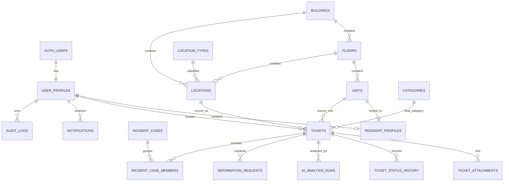

# VHR-04 — Thiết kế Database và API

## Hệ thống phân loại, ưu tiên và điều phối phản ánh chung cư bằng AI

**Phiên bản:** v2.0 — Bỏ vai trò Kỹ thuật viên
**Phạm vi:** Database PostgreSQL/Supabase, REST API, quy tắc phối hợp Backend–Frontend

> **Thay đổi so với v1.0:**
>
> - Bỏ hoàn toàn vai trò **Kỹ thuật viên** — bảng `technician_profiles`, `technician_skills`, `ticket_assignments`, `ticket_work_notes`, mục 11 (API Kỹ thuật viên), và mọi tham chiếu liên quan.
> - Vòng đời ticket rút gọn: bỏ 2 trạng thái `ASSIGNED`/`ACCEPTED` — Điều phối viên tự chuyển trực tiếp `APPROVED → IN_PROGRESS → COMPLETED/UNRESOLVABLE`.
> - Bỏ `COMPLETION_PROOF` (ảnh xác nhận hoàn thành) và ghi chú xử lý — chỉ cần đổi trạng thái.
> - Category không còn dùng để định tuyến kỹ thuật viên — chỉ còn phục vụ tính điểm/thống kê.
> - Bỏ hẳn cơ chế Batching (gộp ticket P1 theo lịch) — cơ chế này vốn triển khai bằng cách gán chung 1 Kỹ thuật viên, không còn áp dụng được.

---

## 1. Mục tiêu thiết kế

Hệ thống phải hỗ trợ hai nhóm người dùng:

1. **Cư dân** gửi và theo dõi ticket.
2. **Điều phối viên BQL** duyệt, điều chỉnh, xử lý và tự cập nhật trạng thái ticket.

Bên cạnh đó, hệ thống AI chạy ngầm để:

- Phân loại Category.
- Phát hiện red flag.
- Xác định Severity.
- Kiểm tra sự phù hợp giữa ảnh và text.
- Tính điểm và Priority.
- Gộp sự cố lan rộng.
- Kích hoạt thông báo theo sự kiện.

Thiết kế ưu tiên bốn đặc tính:

- Quy tắc nghiệp vụ nằm ở Backend, không để Frontend tự suy luận.
- Có lịch sử, truy vết và audit cho các quyết định quan trọng.
- Tách dữ liệu nghiệp vụ khỏi dữ liệu nội bộ của AI.
- Không trộn trạng thái P0 với Priority P1/P2/P3 trong tầng lưu trữ.

---

## 2. Các quyết định kỹ thuật đề xuất

### 2.1. P0 không lưu trong cột Priority

Đặc tả gọi P0 là trạng thái chưa xác định được khi Category từ ảnh và text không khớp. Vì vậy:

- `priority` chỉ nhận `P1`, `P2`, `P3` hoặc `NULL`.
- P0 được biểu diễn bằng `classification_status = MANUAL_REVIEW`.
- API cho Điều phối viên có thể trả thêm `display_code = P0` nếu cần giữ cách gọi trong nghiệp vụ.

Cách này tránh nhầm P0 là mức ưu tiên thấp hơn P1.

### 2.2. Tách trạng thái vòng đời ticket và trạng thái AI

Một ticket có hai trục trạng thái độc lập:

**Vòng đời nghiệp vụ:**

```text
NEW → APPROVED → IN_PROGRESS
               ├→ COMPLETED
               └→ UNRESOLVABLE
```

Điều phối viên tự chuyển trực tiếp qua các trạng thái này — không còn bước gán việc hay chờ người khác xác nhận đã nhận việc.

Các nhánh bổ sung:

```text
NEW → CANCELLED
NEW/MANUAL_REVIEW → WAITING_RESIDENT_INFO → NEW
```

**Trạng thái AI:**

```text
PENDING → PROCESSING → RESOLVED
                     ├→ MANUAL_REVIEW
                     └→ FAILED
```

Frontend cư dân chỉ hiển thị tên thân thiện, không hiển thị toàn bộ trạng thái kỹ thuật.

### 2.3. Database là nguồn sự thật duy nhất

Frontend không được tự tính:

- Priority.
- SLA.
- Quyền thao tác.
- Trạng thái tiếp theo.

Backend trả `available_actions` để FE biết nút nào được phép hiển thị.

### 2.4. Dữ liệu AI phải có phiên bản

Mỗi lần phân tích cần lưu:

- Model/version.
- Rule version.
- Input hash.
- Kết quả trích xuất.
- Điểm tổng và breakdown nội bộ.
- Priority trước và sau ceiling.
- Red flag.
- Thời gian chạy và lỗi.

Breakdown không trả ra giao diện Điều phối viên, nhưng cần lưu để debug và audit.

---

## 3. Kiến trúc schema PostgreSQL

Đề xuất chia thành ba schema:

```text
app         Dữ liệu nghiệp vụ chính
ai_private  Dữ liệu phân tích, rule và model nội bộ
 audit       Nhật ký bất biến
```

Nếu dùng Supabase Auth:

```text
auth.users  Danh tính đăng nhập bằng số điện thoại và OTP
```

Tất cả API nghiệp vụ đi qua Backend. Frontend không truy vấn trực tiếp các bảng nội bộ.

---

## 4. ERD mức khái niệm



---

## 5. Thiết kế bảng chi tiết

## 5.1. Danh tính và phân quyền

### `app.user_profiles`

| Cột          | Kiểu                 | Ghi chú                              |
| ------------ | -------------------- | ------------------------------------ |
| `user_id`    | `uuid PK`            | Tham chiếu `auth.users.id`           |
| `phone_e164` | `varchar(20) UNIQUE` | Số điện thoại chuẩn hóa              |
| `full_name`  | `varchar(150)`       | Có thể bổ sung sau lần đăng nhập đầu |
| `role`       | enum                 | `RESIDENT`, `COORDINATOR`            |
| `is_active`  | `boolean`            | Khóa tài khoản khi cần               |
| `created_at` | `timestamptz`        |                                      |
| `updated_at` | `timestamptz`        |                                      |

### `app.resident_profiles`

| Cột           | Kiểu            | Ghi chú                                        |
| ------------- | --------------- | ---------------------------------------------- |
| `user_id`     | `uuid PK`       | Tham chiếu 1 `auth.users`/số điện thoại        |
| `unit_id`     | `uuid NOT NULL` | Căn hộ mà tài khoản này đại diện               |
| `is_primary`  | `boolean`       | `true` cho tài khoản đăng ký đầu tiên của unit |
| `verified_at` | `timestamptz`   | Thời điểm liên kết căn hộ                      |

Mỗi hộ gia đình dùng chung một unit nhưng có thể có nhiều tài khoản (nhiều số điện thoại) cùng liên kết đến `unit_id` đó — mỗi thành viên vẫn phải đăng ký qua OTP theo số điện thoại riêng, sau đó được rẽ hướng gắn vào cùng unit thay vì tạo unit riêng. `unit_id` không còn ràng buộc `UNIQUE`; thay vào đó có index thường `(unit_id)` để tra cứu nhanh danh sách tài khoản của một căn hộ. Tài khoản đầu tiên bind vào unit được đánh dấu `is_primary = true`; các tài khoản sau là thành viên bổ sung, có quyền thao tác ngang nhau ở mức MVP (tạo ticket, xem lịch sử). Mọi ticket vẫn ghi `source_unit_id` theo unit, không theo user, nên Density và lịch sử phản ánh không đổi dù unit có bao nhiêu tài khoản.

---

## 5.2. Cấu trúc tòa nhà và vị trí

### `app.buildings`

- `id`
- `code`
- `name`
- `is_active`

### `app.floors`

- `id`
- `building_id`
- `floor_code`
- `display_name`
- `adjacency_index integer`

`adjacency_index` dùng để xác định cùng tầng hoặc tầng ngay trên/dưới, kể cả khi có tầng hầm hoặc tên tầng đặc biệt.

### `app.units`

- `id`
- `building_id`
- `floor_id`
- `unit_code`
- `status`

Ràng buộc:

```text
UNIQUE(building_id, unit_code)
```

### `app.location_types`

Danh mục cố định cho dropdown:

- `CORRIDOR`
- `FIRE_EXIT`
- `BASEMENT_PARKING`
- `INSIDE_UNIT`
- Các loại khác do BQL cấu hình.

### `app.locations`

| Cột                | Kiểu            | Ghi chú                          |
| ------------------ | --------------- | -------------------------------- |
| `id`               | `uuid PK`       |                                  |
| `building_id`      | `uuid`          |                                  |
| `floor_id`         | `uuid`          |                                  |
| `location_type_id` | `uuid`          |                                  |
| `unit_id`          | `uuid nullable` | Chỉ dùng khi vị trí trong căn hộ |
| `label`            | `varchar(200)`  | Tên hiển thị                     |
| `is_active`        | `boolean`       |                                  |

Frontend lấy danh sách từ API, không hard-code độc lập.

---

## 5.3. Danh mục Category và rule

### `app.categories`

| Cột                | Kiểu             | Ghi chú                                    |
| ------------------ | ---------------- | ------------------------------------------ |
| `id`               | `uuid PK`        |                                            |
| `code`             | `varchar UNIQUE` | Mã ổn định cho API                         |
| `display_name`     | `varchar`        | Tên thân thiện                             |
| `priority_ceiling` | enum nullable    | `P1`, `P2`, hoặc `NULL` nếu không giới hạn |
| `is_active`        | `boolean`        |                                            |

Danh mục ban đầu:

- `WATER_LEAK`
- `ELECTRICAL_SHORT`
- `ELEVATOR`
- `SERIOUS_SECURITY_DISORDER`
- `LOCK_DOOR`
- `HVAC`
- `LOCAL_POWER_OUTAGE`
- `STRUCTURAL_ISSUE`
- `COMMON_LIGHT`
- `ODOR_HYGIENE`
- `NOISE_NEIGHBOR`

### `ai_private.scoring_rule_versions`

| Cột          | Kiểu             | Ghi chú                                                       |
| ------------ | ---------------- | ------------------------------------------------------------- |
| `id`         | `uuid PK`        |                                                               |
| `version`    | `varchar UNIQUE` | Ví dụ `v1.0.0`                                                |
| `config`     | `jsonb`          | Category base, location matrix, density, severity, thresholds |
| `is_active`  | `boolean`        | Chỉ một bản active                                            |
| `created_by` | `uuid`           |                                                               |
| `created_at` | `timestamptz`    |                                                               |

Không hard-code toàn bộ điểm trong nhiều service khác nhau.

---

## 5.4. Ticket

### `app.tickets`

| Cột                     | Kiểu                   | Ghi chú                    |
| ----------------------- | ---------------------- | -------------------------- |
| `id`                    | `uuid PK`              | Public ID có thể dùng UUID |
| `reporter_user_id`      | `uuid NOT NULL`        | Người gửi                  |
| `source_unit_id`        | `uuid NOT NULL`        | Nguồn dùng cho Density     |
| `location_id`           | `uuid NOT NULL`        | Vị trí bắt buộc            |
| `description`           | `text nullable`        | Text gốc                   |
| `status`                | enum                   | Trạng thái vòng đời        |
| `classification_status` | enum                   | Trạng thái AI              |
| `category_id`           | `uuid nullable`        | Category cuối cùng         |
| `priority`              | enum nullable          | Chỉ P1/P2/P3               |
| `severity`              | enum nullable          | `LOW`, `MEDIUM`, `HIGH`    |
| `red_flag_detected`     | `boolean`              |                            |
| `score_total`           | `numeric nullable`     | Điều phối viên được xem    |
| `sla_started_at`        | `timestamptz nullable` |                            |
| `sla_due_at`            | `timestamptz nullable` |                            |
| `approved_at`           | `timestamptz nullable` |                            |
| `started_at`            | `timestamptz nullable` |                            |
| `completed_at`          | `timestamptz nullable` |                            |
| `cancelled_at`          | `timestamptz nullable` |                            |
| `created_at`            | `timestamptz`          |                            |
| `updated_at`            | `timestamptz`          |                            |
| `version`               | `integer`              | Optimistic locking         |

Enum đề xuất:

```text
priority_level:
P1, P2, P3

classification_status:
PENDING, PROCESSING, RESOLVED, MANUAL_REVIEW, FAILED

ticket_status:
NEW, WAITING_RESIDENT_INFO, APPROVED,
IN_PROGRESS, COMPLETED, UNRESOLVABLE, CANCELLED
```

### Rule tạo ticket

Backend chỉ insert ticket chính thức sau khi:

1. Có vị trí hợp lệ.
2. Có ít nhất text hoặc ảnh.
3. File ảnh hợp lệ.
4. Nếu có ảnh, ảnh phải vượt qua bước kiểm tra chất lượng (đọc được nội dung).

Nếu cư dân gửi kèm ảnh nhưng ảnh không đọc được, hệ thống **không cho phép bỏ ảnh để tiếp tục bằng text**. Backend trả lỗi `IMAGE_UNREADABLE` và không insert ticket chính thức; cư dân phải chụp lại ảnh rõ hơn hoặc gửi lại yêu cầu. Trường hợp cư dân không gửi ảnh ngay từ đầu, ticket vẫn được tạo bình thường nếu có text hợp lệ.

### Rule hủy ticket

Chỉ cho phép khi:

```text
status = NEW
```

Không cho hủy nếu đã approved.

---

## 5.5. Ảnh và tệp đính kèm

### `app.ticket_attachments`

| Cột                    | Kiểu            | Ghi chú                                 |
| ---------------------- | --------------- | --------------------------------------- |
| `id`                   | `uuid PK`       |                                         |
| `ticket_id`            | `uuid NOT NULL` |                                         |
| `attachment_type`      | enum            | `ISSUE_ORIGINAL`, `RESIDENT_SUPPLEMENT` |
| `storage_bucket`       | `varchar`       |                                         |
| `object_path`          | `text`          | Không lưu public URL cố định            |
| `mime_type`            | `varchar`       |                                         |
| `size_bytes`           | `bigint`        |                                         |
| `sha256`               | `char(64)`      | Chống trùng/làm bằng chứng              |
| `image_quality_status` | enum nullable   | `PENDING`, `READABLE`, `UNREADABLE`     |
| `uploaded_by`          | `uuid`          |                                         |
| `created_at`           | `timestamptz`   |                                         |

API trả signed URL ngắn hạn sau khi kiểm tra quyền.

---

## 5.6. Kết quả AI

### `ai_private.analysis_runs`

| Cột                    | Kiểu                   | Ghi chú                                                                                   |
| ---------------------- | ---------------------- | ----------------------------------------------------------------------------------------- |
| `id`                   | `uuid PK`              |                                                                                           |
| `ticket_id`            | `uuid`                 |                                                                                           |
| `run_number`           | `integer`              | Hỗ trợ chạy lại                                                                           |
| `text_model_version`   | `varchar`              |                                                                                           |
| `vision_model_version` | `varchar nullable`     |                                                                                           |
| `rule_version_id`      | `uuid`                 |                                                                                           |
| `input_hash`           | `char(64)`             |                                                                                           |
| `text_categories`      | `jsonb`                | Có thể nhiều nhãn                                                                         |
| `image_categories`     | `jsonb nullable`       |                                                                                           |
| `red_flag_text`        | `boolean`              |                                                                                           |
| `red_flag_signal`      | `boolean`              |                                                                                           |
| `severity`             | enum                   |                                                                                           |
| `severity_source`      | enum                   | `VISION`, `TEXT_FALLBACK` — biết được severity suy ra từ ảnh hay từ text khi không có ảnh |
| `category_match`       | `boolean nullable`     |                                                                                           |
| `score_components`     | `jsonb nullable`       | Chỉ nội bộ                                                                                |
| `score_total`          | `numeric nullable`     |                                                                                           |
| `priority_raw`         | enum nullable          | Trước ceiling                                                                             |
| `priority_final`       | enum nullable          | Sau ceiling                                                                               |
| `ceiling_applied`      | `boolean`              |                                                                                           |
| `status`               | enum                   | `RUNNING`, `SUCCEEDED`, `FAILED`                                                          |
| `error_code`           | `varchar nullable`     |                                                                                           |
| `started_at`           | `timestamptz`          |                                                                                           |
| `completed_at`         | `timestamptz nullable` |                                                                                           |

Quy tắc cập nhật `app.tickets`:

- Red flag → priority P3 ngay.
- Category ảnh và text không khớp → `classification_status = MANUAL_REVIEW`, priority để `NULL`.
- Khớp → tính điểm, quy đổi, áp ceiling và cập nhật bản ghi ticket.

---

## 5.7. Lịch sử và yêu cầu bổ sung

### `app.ticket_status_history`

- `id`
- `ticket_id`
- `from_status`
- `to_status`
- `changed_by`
- `reason`
- `created_at`

### `app.information_requests`

| Cột                      | Kiểu                   | Ghi chú                       |
| ------------------------ | ---------------------- | ----------------------------- |
| `id`                     | `uuid PK`              |                               |
| `ticket_id`              | `uuid`                 |                               |
| `requested_by`           | `uuid`                 | Điều phối viên                |
| `request_message`        | `text`                 |                               |
| `status`                 | enum                   | `OPEN`, `RESPONDED`, `CLOSED` |
| `resident_response_text` | `text nullable`        |                               |
| `responded_at`           | `timestamptz nullable` |                               |
| `created_at`             | `timestamptz`          |                               |

Endpoint cư dân gửi bổ sung là một phần kỹ thuật cần có, dù đặc tả chưa mô tả cụ thể thao tác này.

---

---

## 5.9. Gộp sự cố lan rộng

### `app.incident_cases`

Dùng cho rò nước và chập điện:

- `id`
- `category_id`
- `building_id`
- `status`
- `window_start`
- `window_end`
- `density_value`
- `created_at`

### `app.incident_case_members`

- `case_id`
- `ticket_id`
- `source_unit_id`
- `joined_at`

Việc gom nhóm nhiều ticket P1 theo lịch xử lý (batching) không thuộc phạm vi hệ thống — không xây dựng bảng, trạng thái, hay cơ chế nào cho việc này.

---

## 5.10. Thông báo và audit

### `app.notifications`

- `id`
- `recipient_user_id`
- `ticket_id nullable`
- `notification_type`
- `channel`: `PUSH`, `SMS`, `IN_APP`
- `title`
- `body`
- `payload jsonb`
- `status`: `PENDING`, `SENT`, `FAILED`, `READ`
- `created_at`
- `sent_at`

### `audit.audit_logs`

| Cột             | Kiểu             | Ghi chú                   |
| --------------- | ---------------- | ------------------------- |
| `id`            | `bigserial PK`   |                           |
| `actor_user_id` | `uuid nullable`  | null nếu system           |
| `actor_role`    | `varchar`        |                           |
| `action`        | `varchar`        | Ví dụ `OVERRIDE_PRIORITY` |
| `entity_type`   | `varchar`        | `TICKET`, ...             |
| `entity_id`     | `uuid`           |                           |
| `before_data`   | `jsonb nullable` |                           |
| `after_data`    | `jsonb nullable` |                           |
| `reason`        | `text nullable`  |                           |
| `request_id`    | `uuid`           | Trace API                 |
| `created_at`    | `timestamptz`    |                           |

Audit log phải append-only, không cho cập nhật hoặc xóa qua API thông thường.

---

## 6. Ràng buộc nghiệp vụ quan trọng

### 6.1. Một hộ gia đình — nhiều tài khoản, chung một unit

`resident_profiles.unit_id` không unique. Mỗi số điện thoại vẫn phải đăng ký OTP riêng để có `user_id`, nhưng khi bind với `unit_code` đã tồn tại, backend gắn thêm một dòng `resident_profiles` mới trỏ vào cùng `unit_id` thay vì báo lỗi trùng. Tài khoản bind đầu tiên được đánh dấu `is_primary = true`.

```sql
CREATE INDEX idx_resident_profiles_unit ON app.resident_profiles (unit_id);
```

Một tài khoản (`user_id`) chỉ được bind vào đúng một unit — ràng buộc này vẫn giữ ở mức `PRIMARY KEY (user_id)` kết hợp kiểm tra ở Backend trước khi insert.

### 6.2. Tạo ticket

Backend kiểm tra trong một transaction:

- Location tồn tại và đang hoạt động.
- User là cư dân đã bind unit.
- Có text hoặc ảnh.
- Ảnh hợp lệ và đọc được theo rule.
- `source_unit_id` lấy từ hồ sơ cư dân, không nhận từ request FE.

### 6.3. Quyền xem ticket

- Cư dân: `source_unit_id` của mình.
- Điều phối viên: tất cả.

### 6.4. Override

Mọi override Category hoặc Priority phải:

1. Có `reason`.
2. Lưu old/new value.
3. Ghi audit log.
4. Tính lại SLA nếu Priority thay đổi.

### 6.5. SLA

Mapping:

```text
P3 → 5 phút
P2 → 3 giờ
P1 → 72 giờ
```

P0/manual review chưa có SLA cho đến khi Category và Priority được xác định.

SLA bắt đầu tính từ thời điểm hệ thống nhận được ticket (`sla_started_at = created_at`), áp dụng cho mọi mức Priority. Với ticket rơi vào `MANUAL_REVIEW`, `sla_started_at` vẫn ghi nhận từ `created_at`, nhưng `sla_due_at` chỉ được tính sau khi Điều phối viên resolve Category/Priority.

### 6.6. Density

Một căn hộ được tính là một nguồn duy nhất, không phụ thuộc số ticket căn hộ đó gửi. Công thức chính thức:

```text
Density = COUNT(DISTINCT source_unit_id)
```

Ngoài ra, hệ thống chặn một căn hộ gửi nhiều ticket trùng Category/vị trí trong cùng cửa sổ ba ngày để tránh làm sai lệch Density.

---

## 7. Thiết kế REST API

Base path:

```text
/api/v1
```

Authentication:

```http
Authorization: Bearer <Supabase access token>
```

Backend xác minh JWT, lấy `user_id`, sau đó đọc role và unit từ database. Không tin role hoặc unit do Frontend gửi lên.

### Response envelope

```json
{
  "data": {},
  "meta": {},
  "error": null,
  "request_id": "uuid"
}
```

### Error envelope

```json
{
  "data": null,
  "error": {
    "code": "INVALID_STATUS_TRANSITION",
    "message": "Ticket không thể chuyển từ trạng thái hiện tại."
  },
  "request_id": "uuid"
}
```

Các thao tác tạo ticket, assign, override và complete nên hỗ trợ:

```http
Idempotency-Key: <uuid>
```

---

## 8. API xác thực và hồ sơ

### `POST /auth/otp/request`

Yêu cầu gửi OTP đến số điện thoại.

### `POST /auth/otp/verify`

Xác minh OTP. Có thể do Supabase Auth xử lý trực tiếp; Backend chỉ nhận access token ở các API nghiệp vụ.

### `POST /me/bind-unit`

Liên kết tài khoản lần đầu với mã căn hộ.

Request:

```json
{
  "unit_code": "A-1205"
}
```

Nếu `unit_code` đã có tài khoản khác liên kết, Backend vẫn cho phép bind: tạo thêm một `resident_profiles` gắn với cùng `unit_id`, `is_primary = false`. Không báo lỗi trong trường hợp này.

Errors:

- `UNIT_NOT_FOUND`
- `ACCOUNT_ALREADY_BOUND` — chính tài khoản đang gọi API đã bind vào một unit khác trước đó.

### `GET /me`

Trả hồ sơ, role, unit và quyền cơ bản.

---

## 9. API cho Cư dân

### `GET /catalog/locations`

Lấy tầng và loại vị trí cho dropdown.

### `GET /catalog/categories`

Lấy tên hiển thị Category cho bộ lọc.

### `POST /tickets`

Content-Type:

```text
multipart/form-data
```

Fields:

- `location_id` bắt buộc.
- `description` tùy chọn.
- `image` tùy chọn.

Quy tắc: ít nhất một trong `description` hoặc `image`.

Phản hồi thành công:

```http
202 Accepted
```

```json
{
  "data": {
    "ticket_id": "uuid",
    "status": "NEW",
    "classification_status": "PROCESSING",
    "display_status": "Đang phân tích..."
  }
}
```

Nếu ảnh không đọc được:

```http
422 Unprocessable Entity
```

```json
{
  "error": {
    "code": "IMAGE_UNREADABLE",
    "message": "Hệ thống không thể xác định vấn đề. Vui lòng mô tả rõ hơn hoặc chụp ảnh khác."
  }
}
```

Không tạo ticket chính thức.

### `GET /tickets`

Query:

- `status`
- `category`
- `from`
- `to`
- `page`
- `page_size`

Backend tự giới hạn theo unit của cư dân.

### `GET /tickets/{ticket_id}`

Response cho cư dân chỉ gồm:

- Mô tả.
- Category thân thiện.
- Trạng thái thân thiện.
- Mức độ ưu tiên diễn giải.
- Thời gian dự kiến xử lý.
- Timeline công khai.
- Ảnh thuộc ticket của chính mình.

Không trả:

- Mã P1/P2/P3.
- Từ SLA.
- Score.
- Breakdown AI.
- Audit nội bộ.

### `POST /tickets/{ticket_id}/cancel`

Chỉ hợp lệ khi `status = NEW`.

### `POST /tickets/{ticket_id}/supplements`

Endpoint cần bổ sung để cư dân phản hồi yêu cầu cung cấp thêm thông tin.

Fields:

- `information_request_id`
- `description`
- `image`

Sau khi bổ sung:

```text
WAITING_RESIDENT_INFO → NEW
classification_status → PROCESSING
```

### `GET /notifications`

Danh sách thông báo của người dùng.

### `POST /notifications/{id}/read`

Đánh dấu đã đọc.

---

## 10. API cho Điều phối viên

Prefix:

```text
/coordinator
```

### `GET /coordinator/tickets`

Filters:

- `category`
- `priority`
- `status`
- `classification_status`
- `from`
- `to`
- `search`

Mặc định:

```text
priority DESC, created_at ASC
```

Manual review/P0 cần một nhóm riêng ở đầu dashboard hoặc filter riêng.

### `GET /coordinator/tickets/{ticket_id}`

Trả:

- Text gốc.
- Ảnh gốc.
- Vị trí.
- Category.
- Priority.
- Score tổng.
- Timeline.
- Available actions.

Không trả score breakdown mặc định.

### `POST /coordinator/tickets/{ticket_id}/manual-review/resolve`

Request:

```json
{
  "category_id": "uuid",
  "resolution_source": "IMAGE",
  "reason": "Ảnh thể hiện rõ chập điện tại ổ cắm."
}
```

`resolution_source`:

- `IMAGE`
- `TEXT`
- `OTHER`

Backend chạy lại scoring theo Category được xác nhận.

### `POST /coordinator/tickets/{ticket_id}/request-information`

Request:

```json
{
  "message": "Vui lòng chụp rõ khu vực dây điện và mô tả có mùi khét hay không."
}
```

Chuyển ticket sang `WAITING_RESIDENT_INFO` và tạo notification.

### `POST /coordinator/tickets/{ticket_id}/approve`

Duyệt ticket đã có Category và Priority hợp lệ.

### `PATCH /coordinator/tickets/{ticket_id}/classification`

Override Category hoặc Priority.

Request:

```json
{
  "category_id": "uuid",
  "priority": "P2",
  "reason": "AI đánh giá thấp mức độ ảnh hưởng thực tế."
}
```

Mọi thay đổi phải ghi audit.

### `POST /coordinator/tickets/{ticket_id}/start`

```text
APPROVED → IN_PROGRESS
```

Điều phối viên tự chuyển ticket sang xử lý, không qua bước gán việc.

### `POST /coordinator/tickets/{ticket_id}/complete`

```text
IN_PROGRESS → COMPLETED
```

Không yêu cầu ghi chú hay ảnh xác nhận. Tạo notification cho cư dân.

### `POST /coordinator/tickets/{ticket_id}/unresolvable`

```text
IN_PROGRESS → UNRESOLVABLE
```

Không yêu cầu body. Tạo notification cho cư dân.

### Audit log

```text
GET /coordinator/audit-logs
```

Filters:

- `actor_user_id`
- `action`
- `entity_type`
- `entity_id`
- `from`
- `to`

### Reports

```text
GET /coordinator/reports/tickets-summary
GET /coordinator/reports/sla-performance
POST /coordinator/reports/export
```

Định dạng export:

- CSV cho dữ liệu bảng.
- PDF nếu cần báo cáo trình bày.

---

## 11. API nội bộ cho AI và worker

Các endpoint này không public ra Internet hoặc yêu cầu service credential riêng.

```text
POST /internal/tickets/{id}/analyze
POST /internal/tickets/{id}/recalculate
POST /internal/incidents/rebuild
POST /internal/notifications/dispatch
```

Tốt hơn hết AI được kích hoạt qua queue/job thay vì để FE gọi trực tiếp.

Luồng:

```text
POST /tickets
→ validate input
→ insert ticket
→ enqueue AI job
→ worker phân tích
→ transaction cập nhật ticket + analysis_run + history
→ emit notification event
```

### 11.1. Contract giữa Backend và AI Agent

Schema chính thức cho `POST /internal/tickets/{id}/analyze` — ranh giới rõ giữa phần AI thật sự tạo ra và phần Backend tự tính.

**Request** (worker gọi Agent):

```json
{
  "ticket_id": "uuid",
  "text": "string | null",
  "image": { "storage_bucket": "string", "object_path": "string" } | null,
  "rule_version_id": "uuid"
}
```

**Response** (Agent trả về — chỉ đúng phần AI thật sự tạo ra):

```json
{
  "text_categories": ["string"],
  "red_flag_text": true,
  "image_categories": ["string"] | null,
  "red_flag_signal": false,
  "severity": "LOW | MEDIUM | HIGH",
  "severity_source": "VISION | TEXT_FALLBACK",
  "text_model_version": "string",
  "vision_model_version": "string | null",
  "error_code": "string | null"
}
```

**Nguyên tắc ranh giới:** Agent chỉ trả về đúng các trường trên. Backend tự tính `category_match`, `score_components`, `score_total`, `priority_raw`/`priority_final`, `ceiling_applied` sau khi nhận response (theo công thức ở tài liệu Logic xử lý chính, mục H), rồi mới ghi đủ vào `ai_private.analysis_runs`.

**Ảnh hưởng từ việc bỏ vai trò Kỹ thuật viên:** contract này không đổi. Việc định tuyến kỹ thuật viên trước đây chưa từng là việc của Agent — đó là logic Backend tiêu thụ `text_categories`/`image_categories` sau khi nhận response. Category vẫn cần đủ chi tiết như cũ vì vẫn phục vụ tính điểm (Category base) và báo cáo/thống kê, chỉ mất đi mục đích định tuyến.

**Điểm còn cần Lead chốt thêm** (chưa quy định rõ ở đây): cách so khớp `text_categories` với `image_categories` để tính `category_match` khi cả hai đều là danh sách nhiều nhãn — cần khớp toàn bộ tập nhãn, hay chỉ cần giao nhau ít nhất 1 nhãn.

---

## 12. Ma trận quyền API

| Nhóm API                    | Cư dân |  Điều phối viên |
| --------------------------- | -----: | --------------: |
| Tạo ticket                  |     Có |           Không |
| Xem ticket của mình         |     Có |       Có tất cả |
| Hủy ticket NEW              |     Có | Có thể quản trị |
| Duyệt P0                    |  Không |              Có |
| Override Category/Priority  |  Không |              Có |
| Start/Complete/Unresolvable |  Không |              Có |
| Xem audit                   |  Không |              Có |
| Xem score                   |  Không |              Có |

---

## 13. Quy tắc phối hợp Backend và Frontend

### Backend bắt buộc chịu trách nhiệm

- Kiểm tra role và ownership.
- Kiểm tra state transition.
- Tính Category/Priority/SLA.
- Áp ceiling và red flag.
- Chọn dữ liệu nào được phép trả ra theo role.
- Ghi history và audit.
- Tạo signed URL cho ảnh.
- Gửi notification theo sự kiện.
- Bảo đảm idempotency và transaction.

### Frontend bắt buộc lưu ý

- Không hiển thị P1/P2/P3 hoặc từ SLA cho cư dân.
- Không tự tính thời gian dự kiến.
- Không dùng URL ảnh công khai cố định.
- Không cho người dùng nhập `unit_id` tùy ý ngoài lần bind đầu và không gửi `source_unit_id` khi tạo ticket.
- Luôn dùng `available_actions` từ API để quyết định nút thao tác.
- Có trạng thái loading `Đang phân tích...` khi AI đang chạy.
- P0/manual review chỉ hiển thị cho Điều phối viên.
- Cần UI riêng cho `WAITING_RESIDENT_INFO` vì luồng này có trong nghiệp vụ nhưng chưa nằm trong danh sách trạng thái cư dân ban đầu.

---

## 14. Giao dịch cần atomic

Các cụm thao tác sau phải nằm trong một transaction hoặc kết hợp outbox:

1. Tạo ticket + attachment metadata + AI job event.
2. Resolve P0 + scoring mới + status history + audit.
3. Override + lưu old/new + cập nhật SLA + audit.
4. Đổi trạng thái (start/complete/unresolvable) + history + notification.

---

## 15. Các mã lỗi thống nhất cho FE

```text
AUTH_REQUIRED
FORBIDDEN
UNIT_NOT_FOUND
ACCOUNT_ALREADY_BOUND
TEXT_OR_IMAGE_REQUIRED
IMAGE_UNREADABLE
INVALID_LOCATION
TICKET_NOT_FOUND
TICKET_NOT_OWNED
INVALID_STATUS_TRANSITION
P0_REVIEW_REQUIRED
CATEGORY_REQUIRED
OVERRIDE_REASON_REQUIRED
CONFLICT_VERSION
```

FE hiển thị message thân thiện, nhưng logic xử lý dựa trên `code`.

---

## 16. Tóm tắt các quyết định nghiệp vụ đã chốt

| Chủ đề                                | Quyết định                                                                                                                                                                                         |
| ------------------------------------- | -------------------------------------------------------------------------------------------------------------------------------------------------------------------------------------------------- |
| Density                               | `COUNT(DISTINCT source_unit_id)`, kết hợp chặn trùng Category/vị trí trong 3 ngày cho cùng unit                                                                                                    |
| Thời điểm bắt đầu SLA                 | Từ lúc hệ thống nhận được ticket (`created_at`), áp dụng mọi Priority                                                                                                                              |
| Ảnh không đọc được                    | Không cho phép bỏ ảnh để tiếp tục bằng text; trả lỗi `IMAGE_UNREADABLE` và không tạo ticket chính thức                                                                                             |
| Trạng thái xử lý                      | Điều phối viên tự chuyển trực tiếp `APPROVED → IN_PROGRESS → COMPLETED/UNRESOLVABLE`, không qua bước gán/nhận việc; không yêu cầu ghi chú hay ảnh xác nhận                                         |
| Đánh giá của cư dân / điểm trung bình | Không xây dựng; bỏ hoàn toàn khỏi phạm vi báo cáo và API                                                                                                                                           |
| Batching ticket P1                    | Không xây dựng — không còn cơ chế nào (kể cả gán chung kỹ thuật viên) để gộp lịch xử lý                                                                                                            |
| Nhiều thành viên trong một căn hộ     | Mỗi hộ gia đình dùng chung một `unit_id`; mỗi số điện thoại vẫn đăng ký OTP riêng và được rẽ hướng bind vào cùng unit thay vì tạo unit riêng; Density luôn tính theo unit, không theo số tài khoản |

---

## 17. Chỉ mục database đề xuất

```sql
CREATE INDEX idx_tickets_dashboard
ON app.tickets (priority DESC, created_at ASC)
WHERE status NOT IN ('COMPLETED', 'CANCELLED');

CREATE INDEX idx_tickets_resident_history
ON app.tickets (source_unit_id, created_at DESC);

CREATE INDEX idx_tickets_category_window
ON app.tickets (category_id, created_at DESC);

CREATE INDEX idx_tickets_location_window
ON app.tickets (location_id, created_at DESC);

CREATE INDEX idx_audit_entity
ON audit.audit_logs (entity_type, entity_id, created_at DESC);

CREATE INDEX idx_resident_profiles_unit
ON app.resident_profiles (unit_id);
```

---

## 18. Kết luận

Thiết kế này giữ đúng các rule nghiệp vụ cốt lõi của VHR-04, đồng thời giải quyết các rủi ro kỹ thuật quan trọng:

- Không trộn P0 với Priority.
- Không để Frontend tự suy luận nghiệp vụ.
- Có audit cho override và manual review.
- Có history cho mọi chuyển trạng thái.
- Tách dữ liệu AI nội bộ khỏi dữ liệu API công khai.
- Kiểm soát quyền theo resident unit và coordinator scope.
- Có cấu trúc mở rộng cho Density, notification và báo cáo; không xây dựng cơ chế batching riêng cho ticket P1.

Thiết kế v2.0 có thể dùng làm nền cho hai đầu việc tiếp theo:

1. Chuyển schema thành migration PostgreSQL.
2. Viết OpenAPI specification để BE và FE cùng tích hợp.
