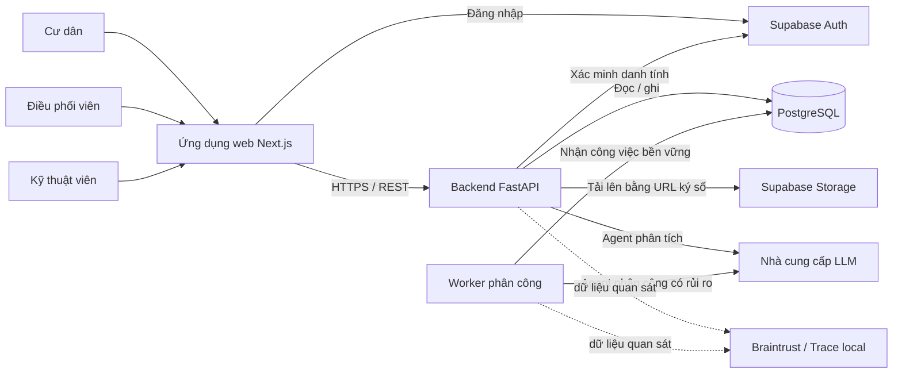
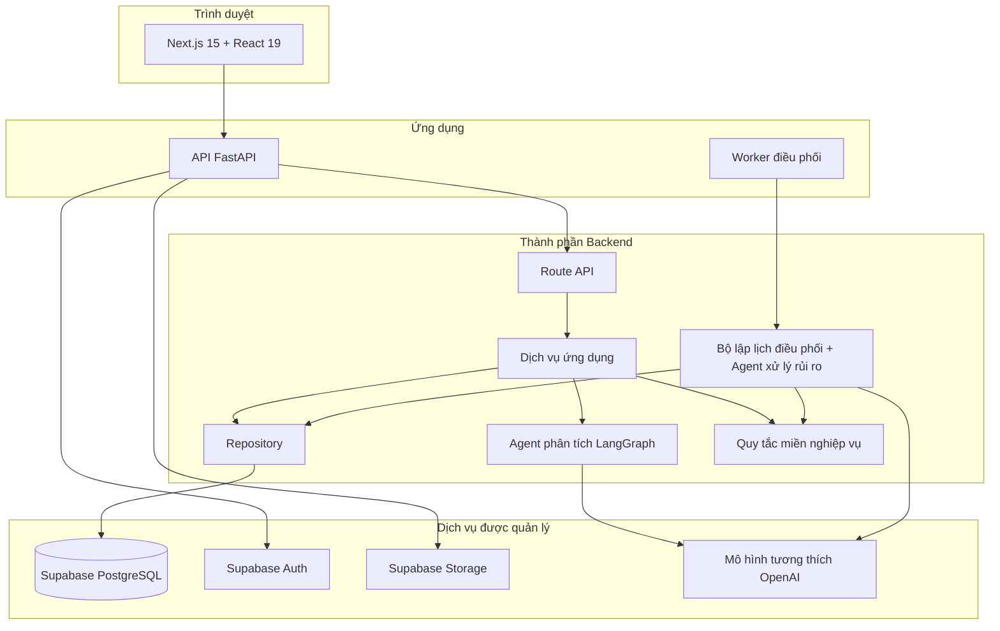
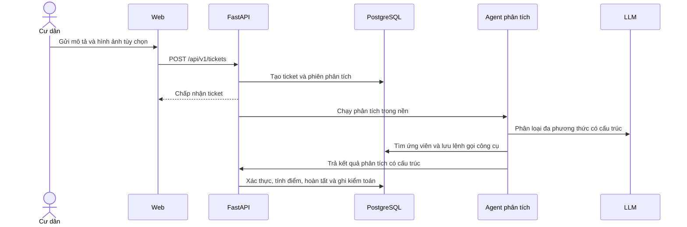
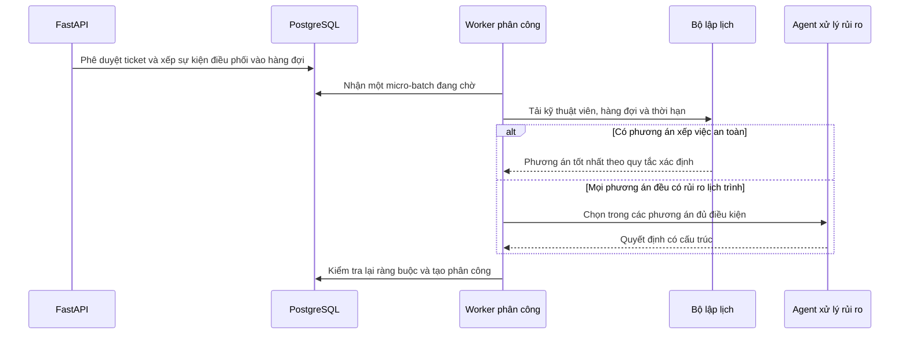

# Kiến trúc hệ thống

- **Trạng thái:** Hiện hành
- **Kiểm chứng lần cuối:** 2026-09-01
- **Kiểu kiến trúc:** Ứng dụng web ba tầng với công việc bất đồng bộ được lưu bền vững trong cơ sở dữ liệu

## 1. Bối cảnh hệ thống

FixIt Agent phục vụ ba vai trò đã xác thực:

- **Cư dân:** báo cáo sự cố, cung cấp bằng chứng, trả lời câu hỏi làm rõ và theo dõi tiến độ.
- **Điều phối viên:** xem xét ngoại lệ, quản lý danh mục và tài khoản, phân công công việc, giám sát điều phối và xem báo cáo.
- **Kỹ thuật viên:** quản lý trạng thái sẵn sàng và thực hiện công việc được giao.

## 2. Các container khi chạy

## 3. Trách nhiệm của các thành phần

| Thành phần | Trách nhiệm | Khu vực triển khai chính |
| --- | --- | --- |
| Ứng dụng Next.js | Màn hình theo vai trò, tích hợp API, trạng thái xác thực và hành vi PWA cho cư dân. | `frontend/app`, `frontend/components`, `frontend/lib` |
| Tuyến FastAPI | Hợp đồng HTTP, thành phần phụ thuộc phục vụ xác thực, kiểm tra dữ liệu và cấu trúc phản hồi. | `src/api` |
| Dịch vụ ứng dụng | Ranh giới giao dịch và điều phối ca sử dụng. | `src/services` |
| Agent phân tích | Phân loại đa phương thức, làm rõ thông tin, suy luận trùng lặp và bằng chứng rủi ro có cấu trúc. | `src/agents` |
| Quy tắc miền nghiệp vụ | Tính điểm xác định, điều kiện vòng đời, đồng hồ SLA và chuyển đổi phân công. | `src/domain` |
| Hệ thống điều phối | Hàng đợi sự kiện bền vững, mô phỏng năng lực, bộ lập lịch và quyết định xếp việc có rủi ro. | `src/dispatch`, `src/workers` |
| Lớp truy cập dữ liệu | Truy cập cơ sở dữ liệu sau ranh giới giao dịch của lớp dịch vụ. | `src/repositories` |
| Lưu trữ bền vững | Các bảng PostgreSQL và lược đồ do Alembic kiểm soát. | `src/database`, `alembic/versions` |
| Khả năng quan sát | ID yêu cầu, bản ghi truy vết JSONL của Agent và span Braintrust tùy chọn. | `src/observability`, `src/agents/trace.py` |

## 4. Ranh giới tin cậy

Backend là nguồn có thẩm quyền duy nhất đối với trạng thái nghiệp vụ.

- Trình duyệt không bao giờ ghi trực tiếp vào các dòng trong cơ sở dữ liệu.
- Token Supabase xác lập danh tính; kiểm tra vai trò tại Backend xác lập quyền truy cập.
- Agent phân tích đề xuất các dữ kiện có cấu trúc và điểm tiêu chí. Agent không thể trực tiếp đặt mức ưu tiên cuối cùng hoặc trạng thái ticket.
- Điểm rủi ro và mức ưu tiên cuối cùng được mã Backend xác định bằng quy tắc.
- Ứng viên phân công được lọc theo các ràng buộc cứng trước khi bất kỳ mô hình nào được chọn giữa các ứng viên.
- Mọi thao tác thay đổi trạng thái đều được xác thực lại bên trong giao dịch cơ sở dữ liệu.
- Quyền truy cập Storage dùng URL ký số có thời hạn ngắn; đường dẫn đối tượng và phiên tải lên được xác thực trước khi bản ghi tệp đính kèm hiển thị.

## 5. Các luồng dữ liệu chính

### Luồng sự cố của cư dân

### Luồng phân công

## 6. Tài liệu kiến trúc

- [Luồng Agent phân tích](agent-flow.md)
- [Mô hình dữ liệu](data-model.md)
- [Kiến trúc triển khai](deployment.md)
- [Thiết kế API](../specification-and-design/api-design.md)
- [Thiết kế phân công](../specification-and-design/assignment-design.md)
