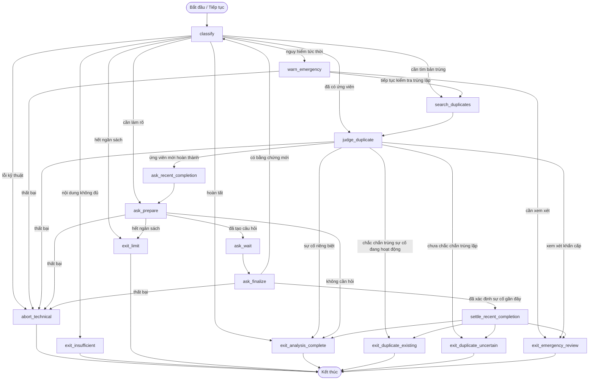

# Luồng Agent phân tích

- **Trạng thái:** Hiện hành
- **Kiểm chứng lần cuối:** 2026-09-01
- **Nền tảng chạy:** LangGraph với ranh giới phiên được lưu bền vững trong cơ sở dữ liệu

## 1. Mục đích

Agent phân tích chuyển báo cáo của cư dân thành bằng chứng có cấu trúc để Backend ra quyết định. Trách nhiệm của Agent được chủ động giới hạn hẹp hơn toàn bộ quy trình ticket:

- hiểu văn bản và hình ảnh tùy chọn;
- xác định các danh mục tiềm năng và dữ kiện sự cố có thể quan sát;
- chấm năm tiêu chí rủi ro từ 0 đến 4 và báo cáo blocker theo tên;
- yêu cầu làm rõ khi bằng chứng hiện có chưa đủ;
- tìm sự cố liên quan đang hoạt động hoặc mới hoàn thành;
- xác định trường hợp trùng lặp chắc chắn hoặc yêu cầu con người xem xét khi chưa chắc chắn.

Agent không đặt mức ưu tiên cuối cùng, không phê duyệt ticket và không phân công kỹ thuật viên.

## 2. Đồ thị

## 3. Trạng thái và lưu trữ bền vững

Phiên phân tích được lưu độc lập với trạng thái nghiệp vụ của ticket. Phiên ghi lại:

- ID ticket và bản chụp danh mục;
- tiến trình đồ thị và trạng thái Agent có cấu trúc;
- mức sử dụng ngân sách cho mô hình và lệnh gọi công cụ;
- số vòng làm rõ và thời gian đã chờ phản hồi của cư dân;
- câu hỏi hiện tại và hạn chờ;
- kết quả kết thúc hoặc lỗi kỹ thuật.

Cơ chế điểm kiểm tra của LangGraph cho phép dừng đồ thị để yêu cầu làm rõ mà không mất trạng thái. Câu trả lời của cư dân quay lại đúng phiên đó và bổ sung vào gói bằng chứng trước khi tiếp tục phân loại.

## 4. Đầu ra phân loại

Agent trả về các trường có cấu trúc thay vì quyết định dạng văn bản tự do:

| Đầu ra | Ý nghĩa |
| --- | --- |
| Danh mục tiềm năng | Các ID danh mục được suy ra từ bằng chứng văn bản và hình ảnh. |
| Dữ kiện sự cố | Các phát biểu ngắn, có thể quan sát và có căn cứ trong bằng chứng được cung cấp. |
| Điểm tiêu chí | `human_safety`, `property_spread`, `essential_function`, `affected_scope`, `deterioration_speed`; mỗi giá trị là số nguyên từ 0 đến 4 khi xác định được. |
| Dữ kiện chưa biết | Tên các tiêu chí không thể chấm điểm trung thực từ bằng chứng hiện có. |
| Blocker | Các dữ kiện có tên, thiết lập sàn ưu tiên tối thiểu. |
| Yêu cầu làm rõ | Một câu hỏi có thể thực hiện khi bằng chứng bổ sung từ cư dân có thể giải quyết điểm chưa chắc chắn. |
| Đánh giá trùng lặp | Trùng lặp chắc chắn, chưa chắc chắn hoặc sự cố riêng biệt. |

Backend từ chối đầu ra sai cấu trúc, mâu thuẫn hoặc nằm ngoài phạm vi. Tiêu chí chưa biết phải được nêu tên rõ ràng; điểm bị thiếu không được ngầm hiểu là 0.

## 5. Kết quả kết thúc

| Kết quả | Tác động tại Backend |
| --- | --- |
| Phân tích hoàn tất | Xác thực bằng chứng, tính rủi ro, công bố phân loại và tiếp tục quy trình. |
| Xem xét khẩn cấp | Giữ lại để điều phối viên quyết định; cấm phân công tự động. |
| Bản trùng đã tồn tại | Liên kết báo cáo mới với sự cố gốc và chỉ hiển thị dữ liệu tiến độ an toàn cho cư dân. |
| Chưa chắc chắn trùng lặp | Giữ lại để điều phối viên xem xét, không tự động liên kết. |
| Đạt giới hạn | Giữ lại để xem xét thủ công cùng bằng chứng đã thu thập. |
| Đầu vào không đủ | Đóng là không hợp lệ khi không thể làm cho báo cáo trở nên có thể xử lý. |
| Dừng vì lỗi kỹ thuật | Đánh dấu phân tích thất bại mà không hiển thị phân loại giả tạo. |

## 6. Khả năng quan sát

Mọi nút và bộ định tuyến có thể được bọc bằng cơ chế truy vết có cấu trúc trên máy cục bộ mà không làm thay đổi hành vi đồ thị. Tích hợp Braintrust là tùy chọn và hoạt động theo nguyên tắc không gây gián đoạn: lỗi dữ liệu quan sát không bao giờ được biến báo cáo hợp lệ của cư dân thành ticket thất bại. Khoảng truy vết từ xa chứa ID, kết quả, số lượng và thời gian — không chứa văn bản tự do của cư dân, tiêu đề xác thực hoặc URL Storage có chữ ký.

## 7. Vị trí triển khai

- Cấu trúc đồ thị: `src/agents/graph.py`
- Trạng thái Agent: `src/agents/state.py`
- Hành vi nút: `src/agents/nodes.py`
- Điều phối phiên: `src/agents/service.py`, `src/services/agent_session_service.py`
- Ranh giới hoàn tất: `src/services/agent_result_service.py`
