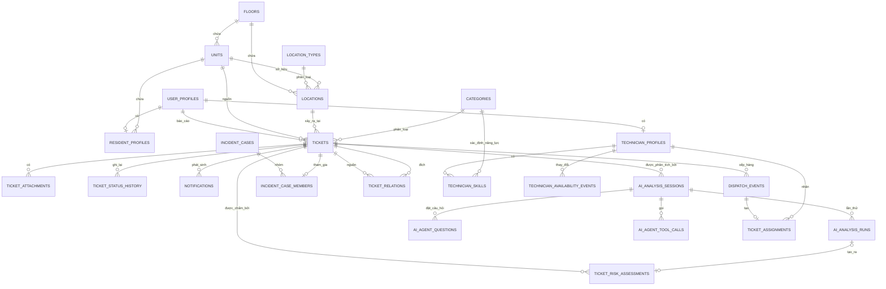

# Mô hình dữ liệu

- **Trạng thái:** Hiện hành
- **Kiểm chứng lần cuối:** 2026-09-01
- **Cơ sở dữ liệu:** PostgreSQL được quản lý qua SQLAlchemy và Alembic

## 1. Mô hình cốt lõi

## 2. Ranh giới cụm dữ liệu

### Cụm dữ liệu ticket

`tickets` là bản ghi nghiệp vụ hiển thị cho cư dân. Bản ghi sở hữu hoặc tham chiếu:

- người báo cáo, căn hộ nguồn và vị trí sự cố;
- danh mục, mức ưu tiên và trạng thái phân loại hiện tại;
- trạng thái vòng đời nghiệp vụ;
- phiên bản đánh giá rủi ro hiện tại;
- quan hệ với ticket gốc khi trùng lặp;
- tệp đính kèm, lịch sử trạng thái và thông báo cho cư dân.

Thay đổi trạng thái được thực hiện qua lớp dịch vụ, không sửa trực tiếp các dòng cơ sở dữ liệu từ tuyến API.

### Cụm dữ liệu phân tích

Dữ liệu phân tích được tách riêng để các lần thử lại và vòng làm rõ không ghi đè lịch sử kiểm toán:

- `ai_analysis_sessions` lưu cuộc hội thoại bền vững và ngân sách công cụ;
- `ai_analysis_runs` lưu từng lần thực thi và đầu ra có cấu trúc;
- `ai_agent_questions` lưu câu hỏi phục vụ dừng/tiếp tục;
- `ai_agent_tool_calls` lưu tương tác công cụ đã được làm sạch.

### Cụm dữ liệu rủi ro

`ticket_risk_assessments` chỉ cho phép ghi nối tiếp. Mỗi phiên bản lưu:

- điểm của năm tiêu chí;
- phạm vi tác động thực tế và nguồn đóng góp;
- mã blocker và sàn ưu tiên;
- điểm rủi ro dạng số, mức ưu tiên theo điểm và mức ưu tiên cuối cùng;
- mã thang đánh giá, nguồn và người xem xét nếu có;
- liên kết tới phiên bản bị thay thế.

Ticket trỏ tới phiên bản hiện tại để tối ưu thao tác đọc; các phiên bản lịch sử vẫn có thể kiểm toán.

### Nhóm sự cố

`incident_cases` biểu diễn một sự cố chung. `incident_case_members` liên kết tối đa năm báo cáo với một sự cố trong khi vẫn giữ ticket gốc của từng cư dân. Bản trùng được liên kết bằng một quan hệ riêng: bản trùng trỏ tới ticket gốc và không nhận phân công riêng.

### Cụm dữ liệu phân công

`dispatch_events` là đơn vị công việc tự động được lưu bền vững. Một sự kiện thành công tạo `ticket_assignment`. Lịch sử phân công vẫn được giữ sau khi từ chối, phân công lại, không thể xử lý hoặc hoàn thành.

## 3. Các bất biến chính

- Mỗi người dùng có một hồ sơ vai trò đáng tin cậy; năng lực cư dân và kỹ thuật viên bắt nguồn từ hồ sơ do Backend quản lý.
- Mỗi ticket có tối đa một phân công đang hoạt động.
- Chỉ ticket đã được phê duyệt, đã phân loại và không phải khẩn cấp mới được đưa vào điều phối tự động.
- Công việc P5 không bao giờ đi vào luồng điều phối kỹ thuật viên.
- Mỗi kỹ thuật viên có tối đa một phân công đang thực hiện tại một thời điểm.
- Đánh giá rủi ro là các phiên bản bất biến; tính lại sẽ ghi nối tiếp thay vì ghi đè.
- Liên kết trùng lặp có dạng nhiều báo cáo về một ticket gốc.
- Tư cách thành viên nhóm sự cố và liên kết trùng lặp là hai khái niệm riêng.
- Chỉ tạo bản ghi tệp đính kèm sau khi phiên tải lên bằng URL ký số tương ứng được xác thực.
- Sự kiện điều phối có trạng thái kết thúc và không thể được nhận lại sau khi hoàn tất.

## 4. Vòng đời lược đồ

Bản di trú Alembic là cơ chế thay đổi lược đồ duy nhất được hỗ trợ. Khi khởi động, ứng dụng xác minh phiên bản cơ sở dữ liệu khớp với revision head được kỳ vọng trước khi phục vụ lưu lượng. Cơ chế này ngăn bản triển khai chạy với cấu trúc cơ sở dữ liệu không tương thích.

## 5. Vị trí triển khai

- Mô hình ORM: `src/database/models`
- Siêu dữ liệu khai báo: `src/database/base.py`
- Quản lý session: `src/database/session.py`
- Kiểm tra lược đồ: `src/database/schema_version.py`
- Bản di trú: `alembic/versions`
