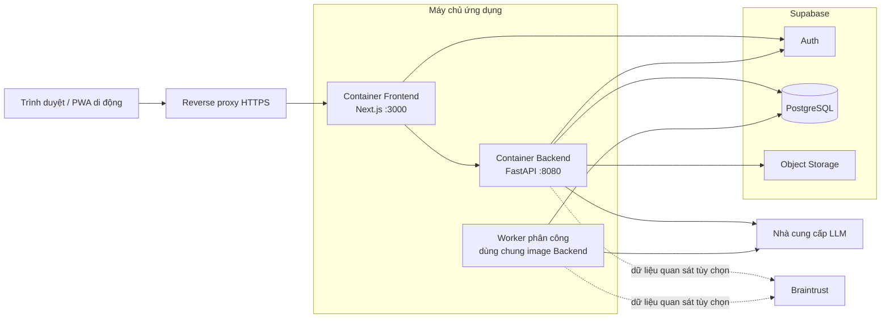

# Kiến trúc triển khai

- **Trạng thái:** Hiện hành
- **Kiểm chứng lần cuối:** 2026-09-01
- **Đóng gói:** Ảnh Docker với các định nghĩa Compose theo từng môi trường

## 1. Cấu trúc môi trường vận hành

Backend và dịch vụ Compose `assignment-worker` dùng cùng một ảnh ứng dụng nhưng chạy các lệnh khác nhau. Cách này giữ mã miền nghiệp vụ và kỳ vọng lược đồ đồng nhất, đồng thời tách xử lý yêu cầu khỏi việc thăm dò hàng đợi và phân công có hỗ trợ của mô hình.

## 2. Trách nhiệm của các tiến trình

| Tiến trình | Bắt buộc | Trách nhiệm |
| --- | --- | --- |
| Frontend | Có, để truy cập bằng web | Phục vụ ứng dụng theo vai trò và giao tiếp với API. |
| Backend | Có | Phục vụ `/api/v1`, điểm cuối kiểm tra sức khỏe, OpenAPI và phân tích nền do cư dân khởi tạo. |
| Tiến trình phân công | Có, để điều phối tự động và quét vận hành | Nhận sự kiện điều phối, chạy lô siêu nhỏ và xử lý công việc dựa trên thời gian. |
| PostgreSQL | Có | Lưu bền vững trạng thái nghiệp vụ, trạng thái hàng đợi, dấu vết kiểm toán và phiên Agent. |
| Supabase Auth | Có khi bật xác thực | Cấp danh tính và xác minh JWT. |
| Supabase Storage | Bắt buộc khi dùng tệp đính kèm | Lưu hình ảnh sự cố gốc và bằng chứng hoàn thành. |
| Nhà cung cấp LLM | Bắt buộc cho phân tích AI | Phân tích có cấu trúc và quyết định phân công có rủi ro. |
| Braintrust | Không | Span truy vết từ xa; thiếu dịch vụ hoặc dịch vụ ngừng hoạt động không chặn công việc. |

## 3. Cấu trúc cục bộ

Định nghĩa Compose cục bộ khởi động các tiến trình Backend và xử lý phân công, đồng thời gắn `./data` để lưu dữ liệu vận hành cục bộ. Frontend ở môi trường phát triển chạy riêng bằng máy chủ phát triển của Next.js. Compose cho môi trường vận hành bổ sung container Frontend đã dựng và chỉ gắn các cổng ứng dụng vào giao diện vòng lặp để proxy ngược kết thúc kết nối.

## 4. Kiểm tra sức khỏe và mức sẵn sàng

- `GET /health` là điểm cuối kiểm tra tiến trình sống công khai.
- `GET /ready` xác minh các thành phần phụ thuộc cần thiết để phục vụ công việc.
- Cơ chế kiểm tra sức khỏe của container Backend gọi `/health` từ bên trong.
- Quá trình khởi động từ chối cấu hình môi trường chạy không an toàn hoặc lược đồ cơ sở dữ liệu chưa đạt migration head được kỳ vọng.
- Sức khỏe của tiến trình phân công được đánh giá theo tiến trình; thành phần này không mở điểm cuối HTTP.

## 5. Các nhóm cấu hình

| Nhóm | Ví dụ | Ghi chú |
| --- | --- | --- |
| Ứng dụng | môi trường, máy chủ, cổng, mức nhật ký, nguồn CORS | Theo từng môi trường; không chứa bí mật trong ảnh. |
| Cơ sở dữ liệu | URL cơ sở dữ liệu, kích thước vùng kết nối API, kích thước vùng kết nối của tiến trình phân công | Hai vùng kết nối được giới hạn độc lập. |
| Supabase | URL dự án, khóa công khai, khóa máy chủ, chế độ xác minh JWT, vùng lưu trữ | Thông tin xác thực máy chủ chỉ nằm ở Backend. |
| LLM | khóa nhà cung cấp, mô hình, mức suy luận và độ ngẫu nhiên | Được khởi tạo trễ sau khi thiết lập truy vết. |
| Điều phối | kích thước lô, khoảng thăm dò, khoảng an toàn, thời gian hết hạn nhận việc, giới hạn thử lại | Làm thay đổi hành vi lập lịch và phải nhất quán giữa các tiến trình phân công. |
| Truy vết | công tắc/đường dẫn truy vết cục bộ, khóa API Braintrust | Truy vết từ xa là tùy chọn và không gây gián đoạn khi lỗi. |

## 6. Cô lập lỗi

- Yêu cầu API và thao tác thăm dò điều phối chạy ở các tiến trình riêng.
- Công việc điều phối được biểu diễn bằng các dòng cơ sở dữ liệu, vì vậy khởi động lại tiến trình phân công không làm mất ticket đang chờ.
- Sự kiện đã được nhận có thời gian hết hạn và có thể quay lại hàng đợi chờ sau khi tiến trình phân công bị gián đoạn.
- Khi mô hình lỗi trong quyết định có rủi ro, hệ thống có thể quay về bộ lập lịch xác định nếu vẫn tồn tại một phương án hợp lệ.
- Lỗi dữ liệu quan sát được lớp observability hấp thụ.
- URL Storage có chữ ký sẽ hết hạn; bản ghi bền vững lưu đường dẫn đối tượng thay vì liên kết công khai có thể tái sử dụng.

## 7. Kiểm tra trước phát hành

Trước khi triển khai:

1. Dựng ảnh Backend và Frontend.
2. Xác thực cả hai cấu hình Compose.
3. Chạy bộ kiểm thử đơn vị, tích hợp và Frontend.
4. Chạy bản di trú bằng lệnh đã được phê duyệt.
5. Xác nhận `/health`, `/ready`, `/openapi.json` và quá trình khởi động tiến trình phân công đều đạt.
6. Kiểm tra CORS trong môi trường vận hành, URL gốc của API, Supabase và thông tin xác thực mô hình.

## 8. Vị trí triển khai

- Ảnh Backend: `Dockerfile`
- Ảnh Frontend: `frontend/Dockerfile`
- Dịch vụ cục bộ: `docker-compose.yml`
- Dịch vụ môi trường vận hành: `docker-compose.prod.yml`
- Thiết lập môi trường chạy: `src/config.py`
- Điểm vào tiến trình phân công: `src/workers/dispatch_worker.py`
