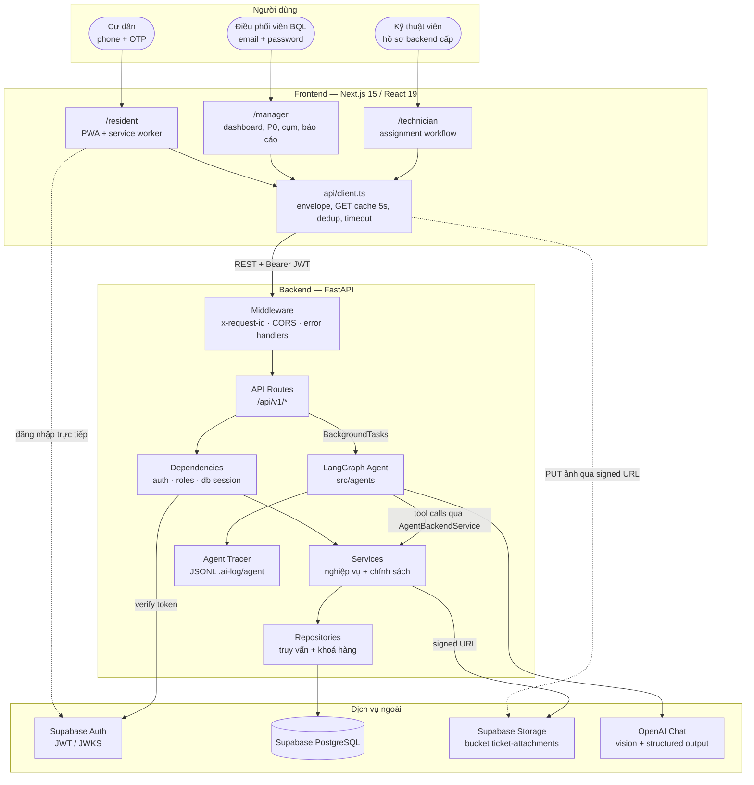
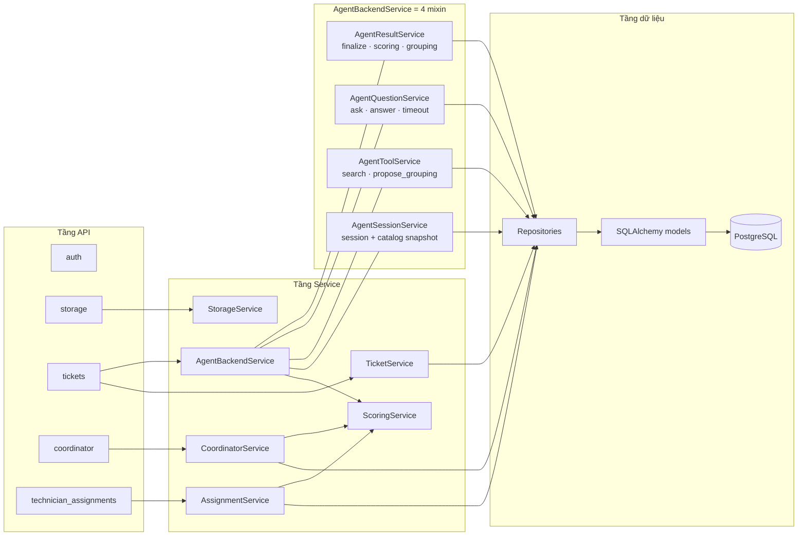
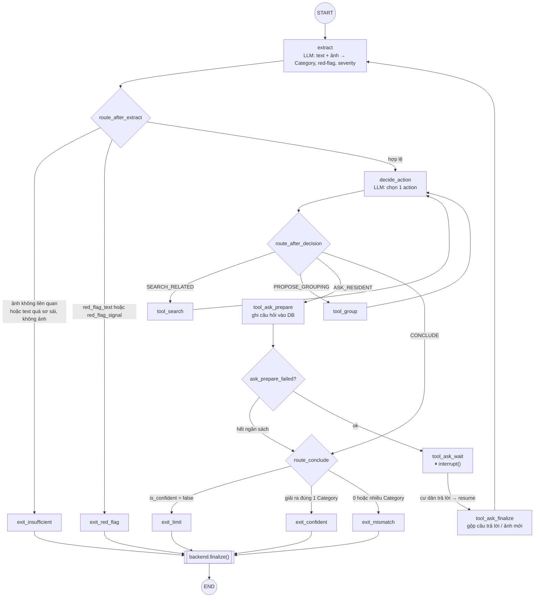
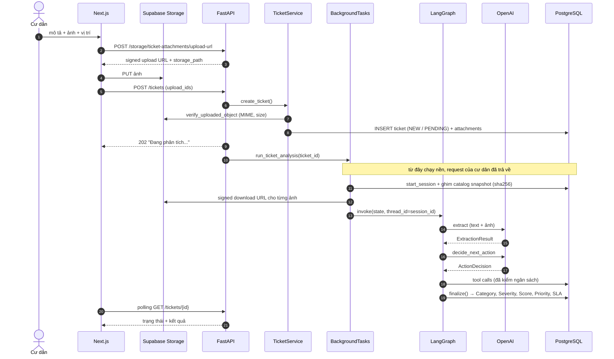
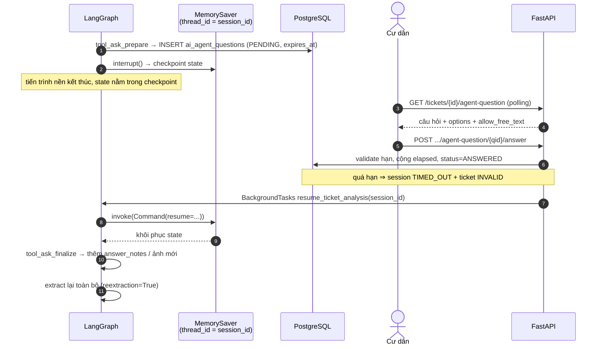
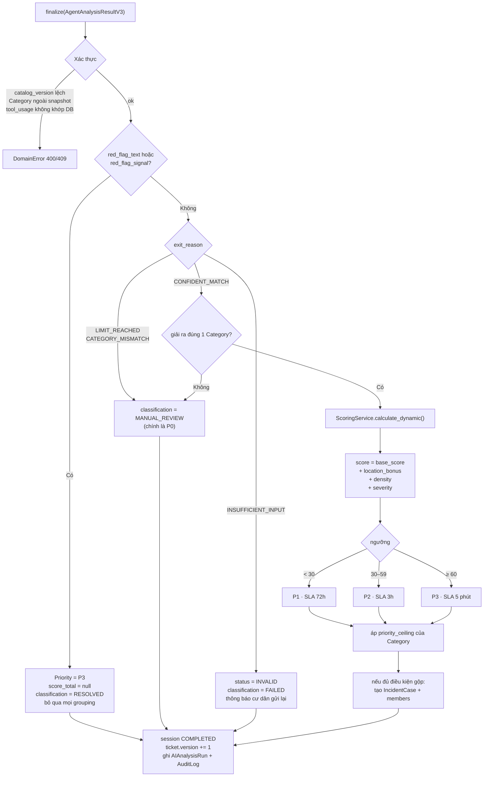
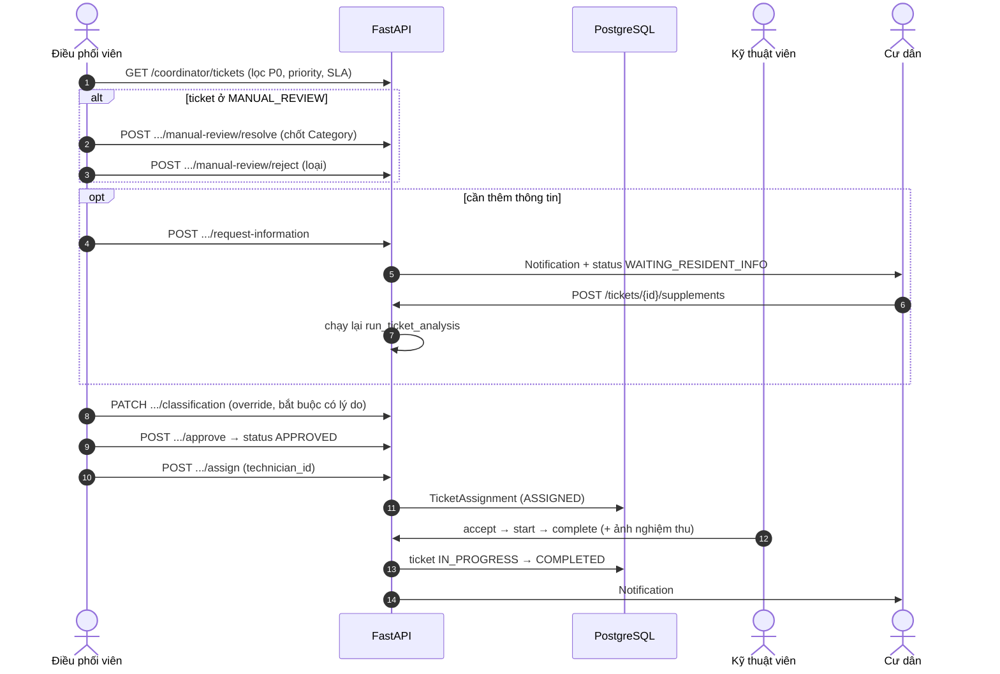
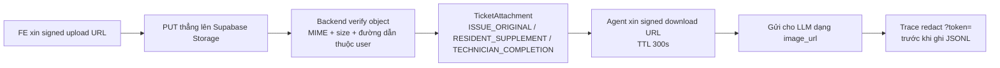
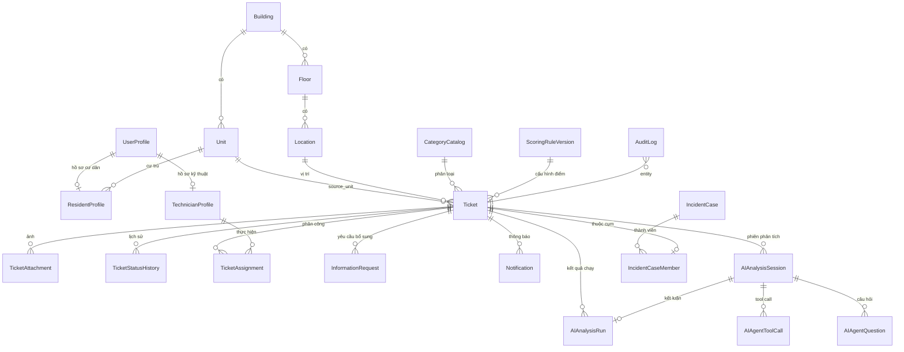

# Architecture Diagram — FixIt Agent (P-092)

> Hệ thống tiếp nhận, phân loại và ưu tiên phản ánh sự cố trong chung cư, với một AI Agent (LangGraph) làm bước phân loại tự động giữa Cư dân và Ban quản lý.
>
> **Đã lỗi thời — giữ lại làm tài liệu lịch sử.** Sơ đồ dưới đây mô tả kiến
> trúc `v3` với hai bước trích xuất text/ảnh riêng, `red_flag`, `severity` và
> công thức `base_score + location_bonus + density + severity`. Không phần nào
> trong số đó còn tồn tại: pipeline đã gộp thành một lượt phân loại đa phương
> thức, và rubric rủi ro v2 đã thay toàn bộ công thức chấm điểm.
>
> Nguồn đúng cho từng phần:
>
> - Chấm điểm và mức ưu tiên: [`docs/risk_scoring_v2.md`](risk_scoring_v2.md)
> - Luồng phân loại: [`docs/ui/CLASSIFICATION_FLOW.md`](ui/CLASSIFICATION_FLOW.md)
> - Vận hành và migration: [`docs/operations.md`](operations.md)
>
> Viết lại sơ đồ này là việc riêng, không gộp vào đợt đổi rubric — một sơ đồ sai
> một nửa khó đọc hơn một sơ đồ nói rõ nó đã cũ.

---

## 1. Tổng quan hệ thống

FixIt Agent là hệ thống 3 tầng với một AI Agent chạy nền:

- **Frontend** — Next.js 15 (App Router) + React 19, ba khu vực theo vai trò (`/resident`, `/manager`, `/technician`), riêng khu Cư dân là PWA (service worker + webmanifest).
- **Backend** — FastAPI (đồng bộ, SQLAlchemy 2.0), phân tầng `routes → services → repositories → models`, trả về envelope thống nhất `{data, error, meta, request_id}`.
- **AI Agent** — LangGraph state machine chạy trong tiến trình backend qua `BackgroundTasks`, có khả năng **tạm dừng giữa chừng để hỏi lại cư dân** rồi tiếp tục ở request sau.
- **Hạ tầng ngoài** — Supabase (Auth + PostgreSQL + Storage) và OpenAI (vision + structured output).

Ba đặc điểm kiến trúc quan trọng nhất:

| Đặc điểm | Ý nghĩa |
|---|---|
| **Backend là ranh giới tin cậy** | Agent chỉ *đề xuất*; Backend xác thực mọi tool call, giữ ngân sách, và tự tính điểm/ưu tiên trong `finalize()`. Agent không được ghi thẳng vào ticket. |
| **Human-in-the-loop thật sự** | `interrupt()` của LangGraph dừng graph tại `tool_ask_wait`; state được checkpoint và chỉ chạy tiếp khi cư dân trả lời qua một HTTP request khác (có thể vài phút sau). |
| **Không có Vector Store / RAG** | Bài toán là phân loại có cấu trúc trên một catalog Category động, không phải hỏi–đáp tài liệu. Ngữ cảnh lấy từ chính DB nghiệp vụ (tool `search_related_tickets`), không từ embedding. |

---

## 2. Sơ đồ components — mức hệ thống

### Vai trò từng component

| Component | Vị trí | Trách nhiệm |
|---|---|---|
| API Routes | [src/api/routes/](../src/api/routes/) | Nhận request, validate Pydantic, gọi service, gói envelope. Không chứa logic nghiệp vụ. |
| Auth dependency | [auth.py](../src/api/dependencies/auth.py) | Xác thực JWT Supabase → phân giải `CurrentActor` (resident/coordinator/technician) từ `user_profiles`. |
| Services | [src/services/](../src/services/) | Toàn bộ chính sách nghiệp vụ: ticket, phân công, điều phối, chấm điểm, storage, và 4 service Agent. |
| Repositories | [src/repositories/](../src/repositories/) | Truy vấn có kiểm soát, `SELECT ... FOR UPDATE`, phân trang. |
| Domain transitions | [src/domain/](../src/domain/) | Bảng chuyển trạng thái hợp lệ của ticket và assignment. |
| Agent | [src/agents/](../src/agents/) | Graph, nodes, state, LLM client, tracing. |
| Scoring | [scoring_service.py](../src/services/scoring_service.py) | Công thức điểm minh bạch → Priority + SLA. Không dùng LLM. |

### Kiến trúc bên trong Backend

`AgentBackendService` là **façade** ghép 4 mixin ([agent_backend_service.py](../src/services/agent_backend_service.py)) trên nền `AgentServiceBase` — nơi đặt hằng số ngân sách, helper khoá session, ghi audit và thông báo.

---

## 3. AI Agent — LangGraph

### 3.1 State

`AgentState` ([state.py](../src/agents/state.py)) là `TypedDict` **chỉ chứa kiểu JSON nguyên thuỷ** — không ORM, không `Session` — để checkpoint được qua khoảng dừng chờ cư dân trả lời.

| Nhóm | Trường |
|---|---|
| Input cố định | `ticket_id`, `session_id`, `description`, `floor_label`, `location_label`, `image_paths`, `image_urls`, `model_version` |
| Catalog ghim | `catalog`, `catalog_version` |
| Kết quả trích xuất  | `text_categories`, `image_categories`, `red_flag_text`, `red_flag_signal`, `text_understandable`, `is_relevant`, `severity`, `severity_source`, `is_confident`, `confidence_notes` |
| Vòng lặp  | `related_tickets`, `grouping`, `iterations`, `pending_question_id`, `answer_notes`, `reextraction` |
| Quyết định bước  | `next_action`, `action_reason`, `action_grouping_ticket_ids`, `action_question_text`, `action_question_options`, `action_allow_free_text`, `ask_prepare_failed` |
| Kết cục | `exit_reason` |

### 3.2 Sơ đồ graph

Điểm cần chú ý khi đọc graph:

- **`extract` được chạy lại sau mỗi vòng hỏi** (`tool_ask_finalize → extract`). Khi `reextraction=True`, chốt chặn "thiếu thông tin" bị bỏ qua nhưng **red-flag vẫn kiểm tra lại ở mọi vòng**.
- **Tách `tool_ask_prepare` / `tool_ask_wait`** để lệnh ghi DB (tạo câu hỏi) không bị replay khi graph resume.
- `route_conclude` dùng **đúng luật của `AgentResultService._resolve_confident_category`** (giao của category từ text và từ ảnh phải ra đúng một phần tử), để `exit_reason` trong audit không mâu thuẫn với kết quả thật của ticket.

### 3.3 Hai lần gọi LLM

| Lệnh gọi | Prompt | Structured output | Vai trò |
|---|---|---|---|
| `extract` | `_EXTRACTION_SYSTEM_PROMPT` | `ExtractionResult` | Trích xuất Category (theo **display name** trong catalog ghim), red-flag riêng cho text và ảnh, severity, độ tự tin. Text và ảnh được đánh giá **độc lập** để bước sau phát hiện mâu thuẫn. |
| `decide_next_action` | `_DECISION_SYSTEM_PROMPT` | `ActionDecision` | Chọn đúng 1 trong `SEARCH_RELATED / PROPOSE_GROUPING / ASK_RESIDENT / CONCLUDE`; prompt nhận cả lịch sử hỏi–đáp để không hỏi lại câu đã được trả lời. |

Agent **không bao giờ thấy `code` nội bộ của Category**, chỉ thấy `display_name`; node code map ngược `display_name → category_id` sau khi LLM trả lời ([nodes.py:40](../src/agents/nodes.py#L40)).

### 3.4 Tools và ngân sách

| Tool | Backend kiểm gì | Kết quả |
|---|---|---|
| `search_related_tickets` | Category phải thuộc snapshot; chỉ ticket **cùng toà, tầng liền kề, ≤ 3 ngày**; tóm tắt an toàn, không lộ mô tả gốc | Danh sách ticket liên quan |
| `propose_case_grouping` | Chỉ `WATER_LEAK` / `ELECTRICAL_SHORT`; ticket phải đến từ chính kết quả search của session này; không tạo `IncidentCase` ở bước này | `accepted`, `density`, `rejected_reason` |
| `ask_resident` | Kiểu câu hỏi hợp lệ, trắc nghiệm phải có options, còn ngân sách | Bản ghi `ai_agent_questions` + deadline |

Ngân sách cứng ([agent_common.py:31](../src/services/agent_common.py#L31)) — **tất cả tool, kể cả `ask_resident`, dùng chung quota 5 lần**:

| Giới hạn | Giá trị |
|---|---|
| `MAX_TOOL_CALLS` | 5 |
| `MAX_ASK_ROUNDS` | 3 |
| `MAX_WAIT_SECONDS` | 300s (tổng thời gian chờ cư dân) |
| `MAX_LOOP_ITERATIONS` | 12 (chặn vòng lặp graph) |

---

## 4. Data flow

### 4.1 Luồng chính — Cư dân tạo phản ánh

### 4.2 Vòng hỏi lại cư dân — pause & resume

Đây là luồng đặc thù nhất của hệ thống: **một lần phân tích trải qua nhiều HTTP request rời nhau**.

Câu trả lời được đưa trở lại LLM dưới dạng `answer_notes` — và được truyền vào **cả hai** prompt (extract và decide), vì thiếu nó ở prompt quyết định đã từng gây vòng hỏi lặp lại đúng một câu ([llm_client.py:186](../src/agents/llm_client.py#L186)).

### 4.3 Finalize — Agent đề xuất, Backend quyết

Bảng ánh xạ kết cục:

| `exit_reason` | `classification_status` | `priority` | Ai xử lý tiếp |
|---|---|---|---|
| `RED_FLAG` | RESOLVED | **P3** (bỏ qua chấm điểm) | Điều phối viên duyệt gấp |
| `CONFIDENT_MATCH` (1 Category) | RESOLVED | P1/P2/P3 theo điểm | Điều phối viên duyệt & phân công |
| `CONFIDENT_MATCH` (mơ hồ) | MANUAL_REVIEW | — | Điều phối viên chốt tay |
| `CATEGORY_MISMATCH` | MANUAL_REVIEW | — | Điều phối viên chốt tay |
| `LIMIT_REACHED` | MANUAL_REVIEW | — | Điều phối viên chốt tay |
| `INSUFFICIENT_INPUT` | FAILED (ticket INVALID) | — | Cư dân gửi lại |

> **P0 không phải một Priority.** P0 = `classification_status = MANUAL_REVIEW`. Enum `Priority` chỉ có P1/P2/P3.

### 4.4 Luồng con người — duyệt, phân công, thi công

Cụm sự cố (`IncidentCase`) có luồng riêng cho điều phối viên: `GET /coordinator/clusters`, `POST /clusters/{case_id}/approve`, `POST /clusters/{case_id}/assign`, `DELETE /clusters/{case_id}/tickets/{ticket_id}`.

### 4.5 Đường đi của ảnh

Ảnh **không bao giờ đi qua backend** — backend chỉ ký URL và kiểm metadata. Đường dẫn theo tiền tố `tickets/{user_id}/...`, chặn path traversal, chỉ cho `image/jpeg|png|webp`, tối đa 10MB.

---

## 5. Mô hình dữ liệu

Ba bảng lõi của Agent:

| Bảng | Ghi gì |
|---|---|
| `ai_analysis_sessions` | Một phiên phân tích: `status`, `category_catalog_version` + `category_catalog_snapshot` (ghim), `total_tool_calls`, `ask_resident_rounds`, `ask_resident_elapsed_seconds`, `waiting_deadline_at`. **Đây là nguồn sự thật về ngân sách.** |
| `ai_agent_tool_calls` | Mỗi tool call với `sanitized_request` / `sanitized_response`, `sequence` duy nhất trong session. |
| `ai_agent_questions` | Câu hỏi cho cư dân: loại, options, `round_number`, `expires_at`, câu trả lời (text hoặc `answer_upload_id`). |
| `ai_analysis_runs` | Kết quả cuối một lần chạy (contract `v3`): categories, red-flag, severity, `exit_reason`, `grouping`, `tool_usage` **do backend tính**, `model_version`. |

Migration bằng Alembic — 16 revision trong [alembic/versions/](../alembic/versions/), có cả RLS policy và view bảo mật.

---

## Phụ lục — bản đồ API

| Nhóm | Endpoint tiêu biểu |
|---|---|
| Health | `GET /health`, `GET /ready` |
| Auth | `POST /api/v1/auth/otp/request`, `POST /auth/otp/verify`, `GET /me`, `POST /me/bind-unit` |
| Catalog | `GET /catalog/locations`, `GET /catalog/categories` |
| Storage | `POST /storage/ticket-attachments/upload-url`, `POST /storage/completion-evidence/upload-url` |
| Cư dân | `POST /tickets`, `GET /tickets`, `GET /tickets/{id}`, `POST /tickets/{id}/cancel`, `POST /tickets/{id}/supplements`, `GET /tickets/{id}/agent-question`, `POST /tickets/{id}/agent-question/{qid}/answer` |
| Thông báo | `GET /notifications`, `POST /notifications/{id}/read` |
| Điều phối viên | `GET /coordinator/tickets`, `POST .../approve`, `POST .../assign`, `POST .../manual-review/{resolve,reject}`, `POST .../request-information`, `PATCH .../classification`, `GET /coordinator/clusters`, `GET /coordinator/categories`, `GET /coordinator/technicians`, `GET /coordinator/audit-logs`, `GET /coordinator/reports/*` |
tài | Kỹ thuật viên | `GET /technician/assignments`, `POST .../accept`, `POST .../start`, `POST .../complete`, `POST .../unable-to-handle` |

Tài liệu tương tác: `/docs` (Swagger), `/redoc`, `/openapi.json`.
