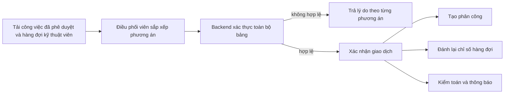
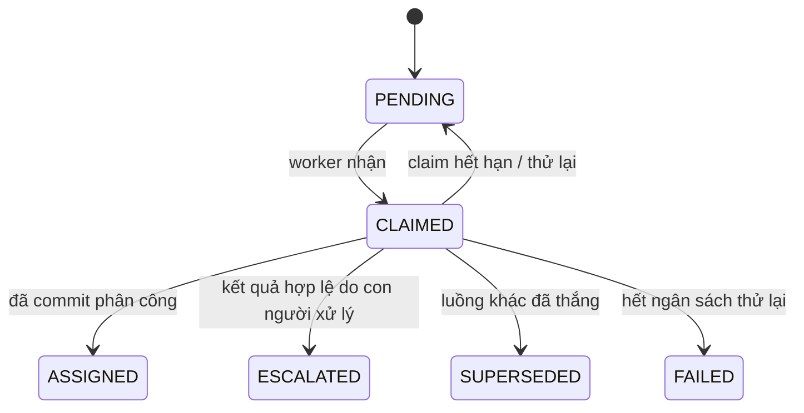
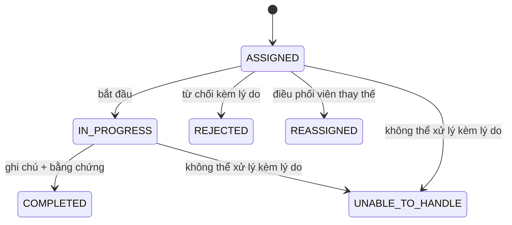

# Thiết kế phân công

- **Trạng thái:** Hiện hành
- **Kiểm chứng lần cuối:** 2026-09-01
- **Múi giờ làm việc:** Asia/Saigon
- **Ca phân công:** 08:00–18:00 hằng ngày

## 1. Các chế độ phân công

| Chế độ | Chủ thể quyết định | Nguồn phân công |
| --- | --- | --- |
| Thủ công | Điều phối viên thao tác trên ticket/nhóm sự cố | `COORDINATOR_MANUAL` |
| Phân công trực quan | Điều phối viên xác nhận bảng phương án xếp việc | `COORDINATOR_VISUAL` |
| Tự động, an toàn | Bộ lập lịch xác định | `AUTO_SCHEDULER` |
| Tự động, có rủi ro | Agent có giới hạn chọn từ các phương án đủ điều kiện | `AUTO_AGENT` |
| Dự phòng tự động | Bộ lập lịch sau khi Agent hết thời gian/thất bại | `AUTO_FALLBACK` |

Mọi chế độ dùng cùng các điều kiện ở cấp giao dịch và tạo cùng một vòng đời phân công.

## 2. Điều kiện đủ

Kỹ thuật viên chỉ đủ điều kiện khi:

- hồ sơ kỹ thuật viên và tài khoản người dùng liên kết đang hoạt động;
- trạng thái sẵn sàng cá nhân được bật;
- kỹ thuật viên có kỹ năng phù hợp với danh mục;
- thao tác phân công diễn ra trong ca làm việc;
- kỹ thuật viên chưa từ chối cùng mục công việc trong luồng tự động chọn lại;
- ticket đã được phê duyệt, đã phân loại và không phải P5;
- ticket không có phân công đang hoạt động khác.

Kỹ thuật viên có thể giữ một hàng đợi công việc `ASSIGNED` nhưng chỉ được bắt đầu một phân công tại một thời điểm.

## 3. Phân công thủ công

Điều phối viên chọn một kỹ thuật viên đủ điều kiện cho thao tác trên một ticket hoặc nhóm sự cố. Backend khóa các bản ghi liên quan, kiểm tra lại trạng thái ticket, tính duy nhất của phân công đang hoạt động và quyền của tác nhân, sau đó tạo phân công cùng các hiệu ứng phụ trong giao dịch.

Phân công thủ công thay thế công việc điều phối tự động đang mở của ticket để tiến trình phân công không thể tạo phân công cạnh tranh sau đó.

## 4. Phân công trực quan

Bảng hiển thị công việc đã phê duyệt và hàng đợi kỹ thuật viên kèm cảnh báo xếp việc. Phương án di chuyển chưa được lưu cho đến khi xác nhận.

Vi phạm ràng buộc cứng sẽ chặn xác nhận. Chỉ báo khối lượng công việc và rủi ro lịch trình cung cấp thông tin cho điều phối viên nhưng không tạo một bộ máy chính sách thứ hai nằm ngoài xác thực của Backend.

## 5. Phân công tự động

### Bật tính năng

Phân công tự động được kiểm soát bằng thiết lập lưu bền vững. Khi bật, ticket đã phân loại và đủ điều kiện có thể được tự động phê duyệt rồi xếp hàng. Bật công tắc cũng có thể xếp hàng tồn đủ điều kiện bằng một thao tác có giới hạn.

### Hàng đợi bền vững

Sự kiện trong cơ sở dữ liệu là đơn vị đảm bảo độ bền. Theo mặc định, tiến trình phân công xử lý lô siêu nhỏ tối đa 20 mục với khoảng cách xấp xỉ 750 ms. Yêu cầu nhận việc hết hạn và có thể được khôi phục sau khi tiến trình bị gián đoạn.

### Lập lịch

Tiến trình phân công tải hàng loạt kỹ thuật viên, hàng đợi hiện tại, kỹ năng, trạng thái sẵn sàng, danh sách loại trừ và thời hạn. Với mỗi ticket, tiến trình này:

1. lọc kỹ thuật viên không đáp ứng ràng buộc cứng;
2. mô phỏng chèn vào từng hàng đợi còn lại;
3. tính khoảng dư đến thời hạn kèm khoảng an toàn;
4. đánh dấu tập phương án là `SAFE` khi ít nhất một phương án giữ khoảng dư cam kết không âm;
5. dùng phương án an toàn tốt nhất theo quy tắc xác định khi có;
6. chỉ gọi Agent xử lý rủi ro khi mọi phương án khả thi đều có rủi ro lịch trình.

### Agent xử lý rủi ro

Agent chỉ nhận ID ứng viên đủ điều kiện, vị trí đề xuất trong hàng đợi và cửa sổ hiệu suất lịch sử đã làm sạch. Agent không thể thêm kỹ thuật viên vào tập ứng viên. Đầu ra được xác thực theo lược đồ và bị giới hạn thời gian. Hết thời gian, đầu ra không hợp lệ hoặc nhà cung cấp thất bại có thể dùng phương án dự phòng của bộ lập lịch xác định khi vẫn tồn tại phương án hợp lệ.

### Chuyển cấp

Các lý do chuyển cấp thông thường gồm:

- không có kỹ thuật viên đủ điều kiện;
- không có phương án xếp việc khả thi;
- Phân công tự động bị tắt;
- ticket không còn đủ điều kiện;
- ticket khẩn cấp chạm điều kiện chặn.

Chuyển cấp là quyết định vận hành được ghi lại, không phải lỗi kỹ thuật.

## 6. Vòng đời kỹ thuật viên

Tác động:

- bắt đầu: ticket chuyển thành `IN_PROGRESS`;
- hoàn thành: ticket chuyển thành `COMPLETED`;
- không thể xử lý: ticket chuyển thành `UNRESOLVABLE`;
- từ chối/phân công lại: phân công kết thúc, thông tin loại trừ/kiểm toán được ghi và quy trình phân công lại được hỗ trợ có thể tiếp tục.

## 7. Các bất biến đồng thời

- Ticket và hàng đợi kỹ thuật viên được khóa trước thao tác ghi phụ thuộc trạng thái.
- Ràng buộc cơ sở dữ liệu ngăn nhiều hơn một phân công đang hoạt động trên mỗi ticket.
- Thao tác bắt đầu kiểm tra lại rằng kỹ thuật viên không có phân công `IN_PROGRESS` khác.
- Phương án của tiến trình phân công được xác thực lại với trạng thái cơ sở dữ liệu hiện tại ngay trước khi xác nhận giao dịch.
- Phân công thủ công hoặc trực quan có thể thắng tranh chấp; công việc tự động sau đó chuyển thành bị thay thế thay vì ghi đè quyết định của con người.
- Số lần phân công lại bị giới hạn theo cấu hình.

## 8. Kiểm toán và báo cáo

Mỗi phân công ghi lại nguồn, tác nhân khi do con người thao tác, sự kiện điều phối khi tự động, vị trí hàng đợi, dấu thời gian, lý do kết thúc và nội dung lý do khi bắt buộc. Quyết định có rủi ro lưu ngữ cảnh ứng viên, kỹ thuật viên được chọn, nguồn mô hình/dự phòng và kết quả. Dữ liệu này hỗ trợ báo cáo SLA và năng suất kỹ thuật viên mà không cần suy luận quyết định chỉ từ trạng thái ticket cuối cùng.

## 9. Vị trí triển khai

- Điều kiện đủ: `src/dispatch/eligibility.py`
- Lập lịch: `src/dispatch/scheduler.py`, `src/dispatch/planning.py`
- Điều phối bền vững: `src/dispatch/service.py`, `src/dispatch/enqueue.py`
- Agent xử lý rủi ro: `src/dispatch/agent`
- Tiến trình phân công: `src/workers/dispatch_worker.py`
- Dịch vụ phân công: `src/services/assignment_service.py`
- Phân công trực quan: `src/services/visual_assignment_service.py`
