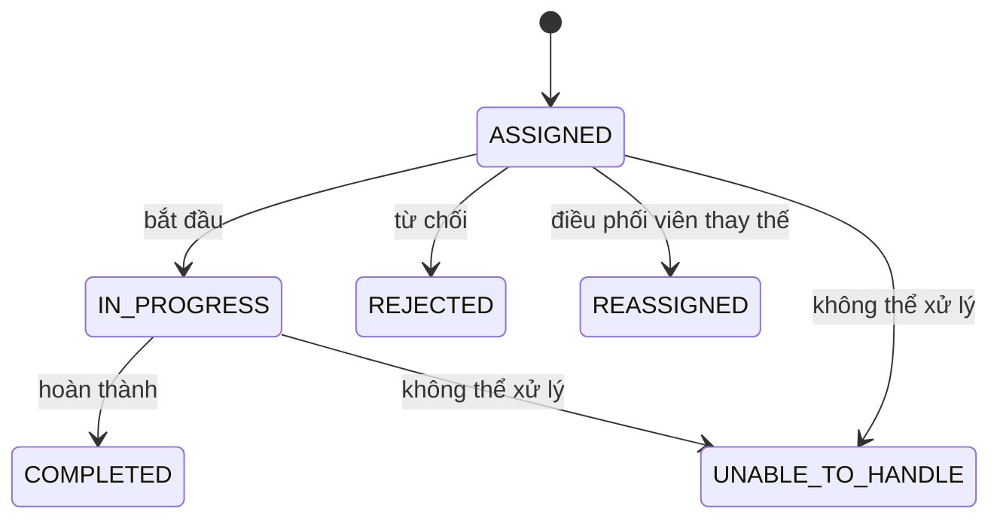
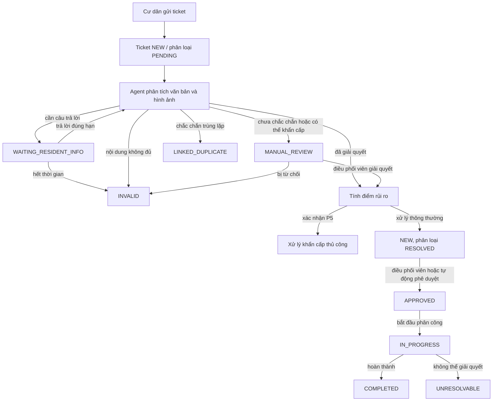

# Quy tắc và luồng nghiệp vụ

- **Trạng thái:** Hiện hành
- **Kiểm chứng lần cuối:** 2026-09-01

## 1. Các chiều trạng thái

Một ticket có nhiều chiều trạng thái. Không được gộp chúng thành một nhãn duy nhất.

### Vòng đời nghiệp vụ

| Trạng thái | Ý nghĩa |
| --- | --- |
| `NEW` | Đã gửi và chưa được phê duyệt cho công việc kỹ thuật. |
| `WAITING_RESIDENT_INFO` | Đang mở một yêu cầu cư dân làm rõ. |
| `APPROVED` | Sẵn sàng để phân công thủ công hoặc tự động. |
| `IN_PROGRESS` | Kỹ thuật viên đã bắt đầu phân công đang hoạt động. |
| `COMPLETED` | Công việc đã hoàn thành với bằng chứng bắt buộc. |
| `LINKED_DUPLICATE` | Theo dõi một sự cố gốc và không có phân công riêng. |
| `UNRESOLVABLE` | Công việc được giao không thể giải quyết qua quy trình được hỗ trợ. |
| `CANCELLED` | Bị hủy bởi hành động được cấp quyền của cư dân. |
| `INVALID` | Bị đóng vì báo cáo không thể trở thành công việc có thể xử lý hoặc đã bị từ chối. |

### Vòng đời phân loại

| Trạng thái | Ý nghĩa |
| --- | --- |
| `PENDING` | Phân tích chưa bắt đầu. |
| `PROCESSING` | Công việc của Agent hoặc yêu cầu cư dân làm rõ đang hoạt động. |
| `RESOLVED` | Phân loại đã hoàn tất thành công. |
| `MANUAL_REVIEW` | Cần điều phối viên quyết định. |
| `FAILED` | Phân tích kết thúc do lỗi kỹ thuật hoặc lỗi kết thúc. |

### Vòng đời phân công



Không có trạng thái xác nhận tiếp nhận nằm giữa `ASSIGNED` và `IN_PROGRESS`.

## 2. Luồng chính của cư dân



## 3. Gửi ticket

1. Cư dân xác thực và được liên kết với một căn hộ.
2. Máy khách yêu cầu đích tải lên bằng URL ký số cho hình ảnh tùy chọn.
3. Máy khách tải hình ảnh trực tiếp lên Storage.
4. Máy khách gửi mô tả, vị trí và các ID tải lên đã xác thực.
5. Backend tạo ticket, bản ghi tệp đính kèm, lịch sử trạng thái và phiên phân tích.
6. API trả về ticket trong khi Agent tiếp tục xử lý.

Agent nhận bản chụp danh mục được cố định và vị trí đã chọn khi gửi. Quá trình hoàn tất thất bại an toàn nếu một thành phần phụ thuộc có thể thay đổi đã thay đổi theo cách làm kết quả mất hiệu lực.

## 4. Làm rõ

- Câu hỏi làm rõ phải nhắm vào thông tin có thể thay đổi phân loại, rủi ro hoặc đánh giá trùng lặp.
- Chỉ một câu hỏi đang hoạt động được hiển thị cho cư dân.
- Câu hỏi bị giới hạn số vòng và tổng thời gian chờ.
- Chỉ người báo cáo được quyền trả lời.
- Câu trả lời hợp lệ tiếp tục trạng thái đồ thị hiện có.
- Hết thời gian không tạo ra điểm giả; hệ thống đóng báo cáo với lý do không hợp lệ rõ ràng khi chính sách yêu cầu đóng.

## 5. Rủi ro và xem xét khẩn cấp

Agent cung cấp bằng chứng và điểm tiêu chí; Backend tính mức ưu tiên. P5 là ranh giới an toàn:

- ứng viên được giữ lại cho điều phối viên;
- không được tự động phê duyệt, gom nhóm hoặc điều phối khi đang chờ xem xét;
- xác nhận sẽ giữ ticket trong quy trình xử lý khẩn cấp thủ công;
- hạ mức sẽ ghi người xem xét, lý do và đánh giá thay thế trước khi tiếp tục xử lý thông thường.

Chi tiết được quy định trong [Tính điểm rủi ro](risk-scoring.md).

## 6. Trùng lặp và gom nhóm sự cố

### Bản trùng được liên kết

Một bản trùng chắc chắn liên kết ticket vừa gửi với một ticket gốc đang hoạt động.

- Ticket mới vẫn tồn tại như bản ghi kiểm toán và theo dõi cho cư dân.
- Ticket mới không nhận phân công riêng.
- Cư dân chỉ nhận bản tóm tắt an toàn về ticket gốc và các cập nhật tiến độ.
- Điều phối viên xử lý ứng viên trùng lặp chưa chắc chắn.

### Nhóm sự cố

Nhóm sự cố gom nhiều báo cáo độc lập cần được quản lý cùng nhau.

- Mỗi ticket vẫn hiển thị độc lập cho cư dân được cấp quyền tương ứng.
- Theo các quy tắc bắt buộc, số thành viên nhóm bị giới hạn ở năm ticket từ các căn hộ nguồn khác nhau.
- Thay đổi nhóm có thể tính lại phạm vi ảnh hưởng đã xác nhận và ghi nối tiếp phiên bản rủi ro.
- Phân công có thể hoạt động trên các thành viên đủ điều kiện trong khi vẫn bảo toàn bản ghi theo từng ticket.

Gom nhóm và liên kết trùng lặp không thể thay thế cho nhau: gom nhóm tạo một tập công việc đang hoạt động được quản lý; liên kết trùng lặp theo dõi ticket gốc mà không tạo công việc trùng.

## 7. Phê duyệt và phân công

### Phê duyệt thủ công

Điều phối viên phê duyệt ticket đã được phân loại, sau đó phân công thủ công, trực quan hoặc tự động có thể tạo phân công đang hoạt động.

### Phê duyệt tự động

Khi bật Phân công tự động, ticket P1–P4 không trùng lặp và có độ tin cậy cao có thể được phê duyệt rồi xếp hàng trong cùng giao dịch hoàn tất phân loại. Không cho phép phê duyệt tự động đối với P5 hoặc trường hợp đang chờ xem xét khẩn cấp.

### Bắt đầu phân công

Khi bắt đầu công việc:

- phân công chuyển từ `ASSIGNED` sang `IN_PROGRESS`;
- ticket chuyển từ `APPROVED` sang `IN_PROGRESS`;
- ràng buộc chỉ một công việc đang thực hiện được kiểm tra trong giao dịch.

### Hoàn thành

Thao tác hoàn thành xác thực tác nhân, trạng thái phân công, ghi chú và bằng chứng đã tải lên. Phân công và ticket cùng chuyển sang `COMPLETED`, đồng thời tạo lịch sử trạng thái, kiểm toán và thông báo cho cư dân.

Chi tiết được quy định trong [Thiết kế phân công](assignment-design.md).

## 8. Hiển thị và quyền riêng tư

```text
giai đoạn AI riêng tư ⇔ classification_status ∈ {PENDING, PROCESSING}
```

- Trong giai đoạn riêng tư, chỉ người báo cáo được đọc ticket.
- Sau khi công bố, cư dân trong cùng căn hộ có thể đọc ticket với các trường dữ liệu an toàn theo vai trò.
- Hành động chỉ dành cho người báo cáo vẫn chỉ dành cho người báo cáo sau khi công bố.
- Điều phối viên có quyền truy cập sau khi công bố hoặc qua quy trình vận hành được cấp quyền.
- Kỹ thuật viên chỉ được truy cập công việc đã phân công.
- Người theo dõi ticket trùng lặp không bao giờ nhận văn bản, hình ảnh, số điện thoại hoặc thông tin căn hộ của người báo cáo ticket gốc.

## 9. Quy tắc thông báo và kiểm toán

Các sự kiện quan trọng tạo thông báo phù hợp với vai trò, bao gồm làm rõ, phê duyệt, phân công, phân công lại, bắt đầu công việc, hoàn thành, không thể xử lý và tiến độ của ticket trùng lặp. Bản ghi kiểm toán phân biệt hành động của con người với hành động hệ thống, đồng thời ghi nguồn phân công hoặc nguồn rủi ro cần thiết để dựng lại quyết định.
