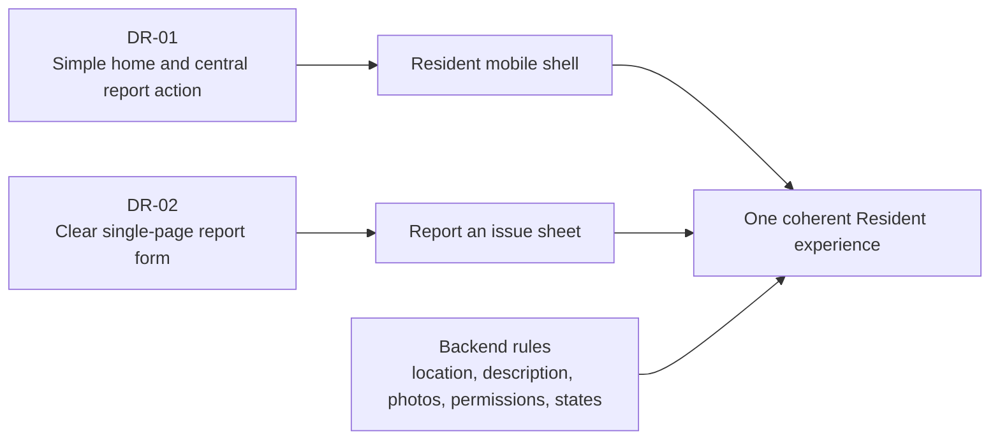

# Resident Mobile Design References

> Scope: the two visual assets already supplied for the Resident experience
>
> Related documents: [`UX_FLOWS.md`](./UX_FLOWS.md), [`SCREEN_INVENTORY.md`](./SCREEN_INVENTORY.md), and [`COMPONENT_STATES.md`](./COMPONENT_STATES.md)
>
> Language rule: all final on-screen copy must be Vietnamese, even when a reference image uses English.

## 1. How references should be used

These images are inspiration for layout and interaction hierarchy. They are not complete product requirements and must not override backend rules.

Use them to answer questions such as:

- Where should the main action sit?
- How much information should appear before a form?
- Which controls should be visually prominent?
- How can a mobile page remain understandable at a glance?

Do not use them as sources for:

- business rules;
- field requirements;
- phone numbers or contact details;
- brand identity;
- exact colors, typefaces, icons, or dimensions;
- legal or emergency instructions;
- hidden product behavior.

Backend and approved product documents remain the source of truth for data, permissions, limits, and status behavior.

## 2. Asset register

| ID | Asset | Size | Source path | Main use |
| --- | --- | --- | --- | --- |
| DR-01 | Municipality / SeeClickFix-style Resident home | 474 × 848 PNG | `C:\Users\pham tien dai\OneDrive - Hanoi University of Science and Technology\Pictures\Screenshots\Screenshot 2026-08-23 163606.png` | Bottom navigation and simple Place content |
| DR-02 | Bevel “Report issue” sheet | 1179 × 2676 PNG | `C:\Users\pham tien dai\Downloads\Bevel iOS 206.png` | Report form layout, guidance, photo input, fixed submit action |

Both files currently live outside the repository. The paths above are local-machine references. Before a design handoff to another machine or team, place approved copies under `docs/ui/assets/` and update this register. This document does not copy or redistribute the images.

## 3. DR-01 — Municipality Resident home

### What is visible

- Large municipality brand area.
- Short welcome and service guidance.
- Three support actions.
- Five-position bottom navigation.
- A large central orange `+` action.
- Tabs for Place, Notices, Requests, and Profile.

### What to reuse

#### Bottom navigation hierarchy

Use the overall relationship:

```text
Trang chủ | Thông báo | [+] | Phản ánh | Tài khoản
```

- Four stable destinations.
- One clearly stronger report action in the center.
- Icon and text label together.
- The current main tab has an obvious selected state.

#### Place content hierarchy

Use the idea of a simple home page that answers:

1. What can I do here?
2. How do I report correctly?
3. How can I contact Building Management?

Keep the instructions short enough to scan without scrolling on common phone sizes when possible.

### What must be adapted

| Reference pattern | Project adaptation |
| --- | --- |
| “Place” label | Visible Vietnamese label: **Trang chủ** |
| “Notices” label | Visible Vietnamese label: **Thông báo** |
| “Requests” label | Visible Vietnamese label: **Phản ánh** |
| “Profile” label | Visible Vietnamese label: **Tài khoản** |
| Central orange `+` | Keep the central action, but use the approved project color and provide accessible label **Gửi phản ánh**. |
| General welcome text | Replace with approved apartment guidance from `UX_FLOWS.md`. |
| Phone/email/video support rows | Only show project-approved actions. Current UX requires a Building Management call action; email and video are not required. |

### What not to copy

- Municipality logo or name.
- SeeClickFix name.
- Phone number, email address, or emergency copy.
- Instruction video link.
- Exact orange/green/blue palette.
- Exact icon artwork.
- Low-resolution typography or spacing.

### Risks in the reference

- The screenshot is small and should not be used for pixel measurements.
- The center action sits close to navigation labels; the implementation must leave enough room for large Vietnamese text and the phone safe area.
- Color appears to carry much of the selected-state meaning. The project must also use shape, weight, or an indicator.
- Several support actions compete with the main report action. The project should keep **Gửi phản ánh** primary and **Gọi Ban quản lý** secondary.

### Screens and components influenced

- R-01 Place
- C-01 Resident app shell
- C-02 Bottom navigation item
- C-03 Central report button
- C-07 Guidance block

## 4. DR-02 — Bevel Report issue sheet

### What is visible

- A full-height white sheet over another surface.
- Close button at top left.
- Centered “Report issue” title.
- A warning/info icon and short instructions.
- One large description field.
- One large outlined photo-add area.
- A wide Submit button anchored near the bottom.

### What to reuse

#### Simple form anatomy

Use this vertical order:

1. Close
2. **Gửi phản ánh**
3. Short “what to include” guidance
4. Required location
5. Required description
6. Optional photos
7. **Gửi phản ánh** button

The reference does not contain a location field, but the project must add it because the backend requires one approved location ID and does not infer location from text or photos.

#### Guidance before input

Use a compact guidance block before the first field:

> **Vui lòng cung cấp:**
>
> - Vị trí xảy ra sự cố
> - Mô tả ngắn về điều đang xảy ra
> - Ảnh bổ sung nếu cần

This gives the Resident a complete mental checklist without adding a separate onboarding step.

#### Photo affordance

Reuse the idea of:

- a large tap target;
- clear **Thêm ảnh** text;
- a visible `+` symbol;
- an optional label;
- a simple empty state.

After selection, the project changes the area into previews with upload status, remove actions, and an **Thêm ảnh khác** tile.

#### Persistent submit action

Keep the primary button visible above the bottom safe area. When the keyboard is open, the button may move above the keyboard or become part of the scroll flow if keeping it fixed would cover fields.

### What must be adapted for backend rules

| Reference behavior | Required project behavior |
| --- | --- |
| Description shown without location | Add required floor and location selection from the backend catalog. |
| One generic photo area | Support up to five unique photos. |
| No visible upload progress | Show preparing, uploading, ready, retry, and remove states. |
| Submit appears disabled | Enable only with a valid location, non-empty description, and no active upload. |
| No duplicate-submit recovery shown | Preserve the draft and avoid a second report when retrying. |
| No permission differences shown | Only the original sender may later answer, cancel, or request duplicate review. |

### What not to copy

- Bevel name or logo.
- Mobbin watermark.
- Health/product-specific warning icon.
- Exact English copy.
- Exact font, corner radius, shadow, or grayscale values.
- Disabled button contrast if it does not meet accessibility requirements.
- The exact vertical whitespace, which may not fit smaller devices or larger text settings.

### Risks in the reference

- The sheet is very tall with large empty space. On smaller devices, required location controls will make scrolling necessary.
- The disabled Submit state has low contrast and no explanation. The project needs nearby validation help.
- The photo action relies heavily on an icon and outline. The project keeps the text label for accessibility.
- The close action does not show dirty-draft behavior. The project must confirm before discarding entered content.

### Screens and components influenced

- R-02 Report an issue
- O-01 Location picker
- O-02 Photo source picker
- O-03 Discard draft confirmation
- C-04 Page header
- C-05 Primary button
- C-07 Guidance block
- C-08 Location selector
- C-09 Description field
- C-10 Photo uploader
- C-11 Photo item

## 5. Combined design direction

The Resident interface combines the strongest idea from each reference:



### Resulting visual hierarchy

1. The main app always makes **Gửi phản ánh** easy to find.
2. The report form explains what is needed before the Resident types.
3. Location and description are visibly required.
4. Photos feel helpful, not mandatory.
5. The submit action is large and predictable.
6. After submission, status and follow-up questions remain in Report details.

## 6. Recommended visual character

This section guides future mockups without locking final brand tokens.

### Layout

- Mobile-first single column.
- Generous but efficient spacing.
- Main controls span the available width.
- Cards group related information, not every individual row.
- Bottom navigation and primary actions respect device safe areas.

### Shape

- Rounded sheet top corners.
- Medium rounded inputs and cards.
- Circular central `+` action.
- Status badges use rounded compact shapes.

### Typography

- Clear Vietnamese sans-serif with full diacritic support.
- Strong page titles and field labels.
- Comfortable body size; avoid small helper text.
- Support larger system text without clipping bottom-navigation labels.

### Color

- One approved primary action color.
- Neutral page and card surfaces.
- Status colors remain secondary to text labels and icons.
- Error, warning, success, and information tones must meet contrast requirements.
- Do not inherit the reference brands’ palettes.

### Iconography

- Familiar, simple line icons.
- Every important icon has a visible label or accessible name.
- Avoid decorative icons that could be mistaken for warnings.
- The central `+` always means **Gửi phản ánh**.

## 7. Responsive and accessibility checks

Future designs based on these references must be checked at:

- narrow phones;
- common modern phone widths;
- large text settings;
- keyboard open;
- five photo previews;
- long Vietnamese location names;
- long Building Management messages;
- bottom safe-area insets;
- reduced motion;
- light and dark system settings if dark mode is included later.

Minimum requirements:

- 44 × 44 point tap targets.
- Visible focus for keyboard/switch access where supported.
- No meaning carried by color alone.
- Error text placed near the related field.
- Timer announcements at meaningful moments, not every second.
- Photo actions use text as well as icons.

## 8. Backend constraints that override the references

The final design must always respect these rules:

1. A report needs one valid location from the Resident’s allowed catalog.
2. A written description is required and may contain up to 5000 characters.
3. Photos are optional, with a maximum of five.
4. Current photo configuration accepts JPEG, PNG, and WebP up to 10 MB each.
5. A submitted report opens in a checking state; the app does not wait on the form for analysis to finish.
6. The assistant may ask up to three questions during one shared five-minute response period.
7. Only the sender may answer the assistant or cancel a New report, and the
   backend enforces both. There is no request-a-review action on an
   existing-issue link.
8. A report is private to its sender while the assistant is analysing it or
   waiting for an answer. Once analysis finishes, all apartment members may view
   it.
9. Linked reports expose only reduced, non-personal information from the existing report.
10. Resident screens show friendly status, urgency wording, and current expected time—not internal codes or calculations.

## 9. Reference-to-deliverable matrix

| Deliverable area | DR-01 | DR-02 | Backend |
| --- | --- | --- | --- |
| Place structure | Primary | Supporting | Profile/contact availability |
| Bottom navigation | Primary | None | Unread badge data |
| Central report action | Primary | Supporting | Apartment eligibility |
| Report sheet structure | None | Primary | Required fields and submission |
| Location selector | None | Layout only | Primary source of truth |
| Description field | Supporting | Primary | Required, 5000-character limit |
| Photo uploader | None | Primary | Five-photo/type/size/private-upload rules |
| Submit states | Supporting | Primary | Validation, rate limit, acceptance |
| Report status/detail | None | None | Primary source of truth |
| Follow-up questions | None | Form styling only | Primary source of truth |
| Requests and Notice | Navigation only | None | Primary source of truth |

## 10. Approval checklist for future mockups

- [ ] Uses DR-01 only for navigation/home hierarchy, not branding or content.
- [ ] Uses DR-02 only for form hierarchy and photo affordance, not branding or exact styling.
- [ ] Includes required location selection even though DR-02 does not show it.
- [ ] Uses Vietnamese for every visible label and message.
- [ ] Uses **phản ánh** rather than the English word “ticket” in the UI.
- [ ] Keeps photos clearly optional.
- [ ] Shows upload, failure, retry, remove, and five-photo-limit states.
- [ ] Protects dirty drafts when closing or logging out.
- [ ] Does not expose another apartment’s information in linked reports.
- [ ] Does not show internal priority codes, scores, AI reasoning, or SLA wording.
- [ ] Remains usable with large text and long Vietnamese copy.
- [ ] Does not hard-code contact data from either reference image.
