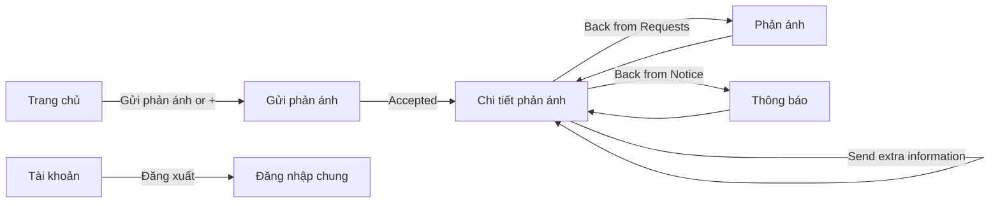

# Resident Mobile Screen Inventory

> Status: Draft based on `UX_FLOWS.md` and the current backend
>
> Scope: Resident mobile only
>
> Language rule: this document is written in English, but **every visible word in the product must be Vietnamese**.

## 1. Source of truth

This inventory follows:

1. [`UX_FLOWS.md`](./UX_FLOWS.md)
2. [`dac_ta_tinh_nang_luong_nghiep_vu_v4.md`](../../Self_Dev_Docs/dac_ta_tinh_nang_luong_nghiep_vu_v4.md)
3. [`agent_backend_contract_v4.md`](../../Self_Dev_Docs/agent_backend_contract_v4.md)
4. Current backend response models, routes, and services
5. Current Resident frontend routes

Backend support labels:

| Label | Meaning |
| --- | --- |
| **Ready** | The current backend provides the main data or action. |
| **Partial** | The flow exists, but some data, permission checks, or behavior is missing. |
| **Product config** | The feature needs approved content or configuration rather than ticket data. |
| **Not in scope** | The current Resident UX does not require this capability. |
| **Not allowed** | Product rules intentionally prevent this action. |

## 2. Screen map

The experience has six main screens. Follow-up questions, rejection and duplicate reports are states inside Report details, not separate pages.

| ID | Screen | Suggested route | Current frontend route | Type | Backend support |
| --- | --- | --- | --- | --- | --- |
| R-01 | Place | `/resident` | `/resident` | Main tab | Partial |
| R-02 | Report an issue | `/resident/new` | `/resident/new` | Full-height sheet | Ready |
| R-03 | Requests | `/resident/requests` | `/resident/history` | Main tab | Partial |
| R-04 | Report details | `/resident/reports/:id` | `/resident/tickets/:id` | Detail page | Partial |
| R-05 | Notice | `/resident/notice` | `/resident/notifications` | Main tab | Partial |
| R-06 | Profile | `/resident/profile` | `/resident/profile` | Main tab | Ready |

The suggested routes use Resident-facing product language. Route migration is optional; visual labels must not expose the word “ticket.”

## 3. Shared app shell

### Bottom navigation

Order from left to right:

1. **Trang chủ** — Place
2. **Thông báo** — Notice
3. central `+` — open Report an issue
4. **Phản ánh** — Requests
5. **Tài khoản** — Profile

Rules:

- The central `+` is larger than the tab icons but must not cover labels or the phone safe area.
- Only one of the four main tabs is active.
- The `+` button never appears active because it opens a task rather than a section.
- The Notice badge shows a number only when an accurate unread total is available.
- The bottom bar is hidden on Report details and while the Report an issue sheet is open.

### Shared access check

Before showing private Resident information, the app checks the current session and Resident profile.

| Result | Destination or state |
| --- | --- |
| Valid Resident with an apartment | Open the requested Resident screen. |
| No session | Open the shared login experience. |
| Wrong role | End the local Resident session and return to shared login. |
| No linked apartment | Show a blocking message with a Building Management contact action. |
| Account inactive | Return to shared login with an account-support message. |

Current backend note: OTP login, current-user profile, and first-time apartment binding endpoints exist. The final shared login method is still a product decision because the business document and current frontend do not use one consistent method.

## 4. R-01 — Place

### Purpose

Explain the app in a few seconds and make reporting or calling Building Management easy.

### Visible Vietnamese copy

| Element | Copy |
| --- | --- |
| Page title | **Trang chủ** |
| Welcome | **Xin chào, {name}** or **Căn hộ {unit}** |
| Primary action | **Gửi phản ánh** |
| Guidance title | **Cách gửi phản ánh** |
| Guidance 1 | **Chọn đúng vị trí xảy ra sự cố.** |
| Guidance 2 | **Mô tả điều đang xảy ra.** |
| Guidance 3 | **Thêm ảnh nếu ảnh giúp giải thích rõ hơn.** |
| Follow-up note | **Sau khi gửi, hệ thống có thể hỏi thêm. Vui lòng trả lời trong vòng 5 phút.** |
| Call action | **Gọi Ban quản lý** |

### Main sections

1. Resident greeting.
2. Report an issue card or button.
3. Three-item guidance block.
4. Five-minute follow-up reminder.
5. Building Management call action.

### Data and actions

| Need | Backend source | Support |
| --- | --- | --- |
| Name, phone, building, floor, apartment | Current-user profile | Ready |
| Linked-apartment check | Current-user profile | Ready |
| Report action | Opens R-02 | Ready |
| Building Management phone number | No current Resident config response | Product config |
| Editable guidance content | No content endpoint | Product config |

### Screen states

- Loading profile
- Ready
- No linked apartment
- Offline with cached guidance
- Profile load failed
- Call action hidden because no approved phone number exists

## 5. R-02 — Report an issue

### Purpose

Collect the minimum valid information in one simple form.

### Presentation

- Full-height sheet over the previous main tab.
- Close button at top left.
- Centered title.
- Scrollable form content.
- Submit button anchored above the bottom safe area and keyboard.

### Visible Vietnamese copy

| Element | Copy |
| --- | --- |
| Title | **Gửi phản ánh** |
| Guidance title | **Vui lòng cung cấp:** |
| Guidance item 1 | **Vị trí xảy ra sự cố** |
| Guidance item 2 | **Mô tả ngắn về điều đang xảy ra** |
| Guidance item 3 | **Ảnh bổ sung nếu cần** |
| Location label | **Sự cố xảy ra ở đâu?** |
| Floor placeholder | **Chọn tầng** |
| Location placeholder | **Chọn vị trí** |
| Missing-location help | **Không tìm thấy vị trí phù hợp? Hãy liên hệ Ban quản lý.** |
| Description label | **Mô tả sự cố** |
| Description placeholder | **Điều gì đang xảy ra? Sự cố nằm chính xác ở đâu và bắt đầu từ khi nào?** |
| Photo label | **Ảnh (không bắt buộc)** |
| Empty photo action | **Thêm ảnh** |
| Camera action | **Chụp ảnh** |
| Library action | **Chọn từ thư viện** |
| Additional photo action | **Thêm ảnh khác** |
| Submit | **Gửi phản ánh** |
| Submitting | **Đang gửi…** |

### Required information

| Input | Rule from backend |
| --- | --- |
| Location | Required; must be one active location returned for the Resident’s building/apartment. |
| Description | Required after trimming; 1–5000 characters. |
| Photos | Optional; maximum five. |
| Photo format | JPEG, PNG, or WebP under current configuration. |
| Photo size | Maximum 10 MB per image under current configuration. |

### Main interactions

1. Open the location picker and select a floor and location from the backend catalog.
2. Enter a description.
3. Optionally take or choose photos.
4. Wait for selected photos to finish uploading.
5. Submit once.
6. On acceptance, clear the draft and open R-04 in its Checking state.

### Backend sequence

1. Load allowed locations.
2. For each photo, request a private upload target and upload the file.
3. Create the report with the selected location, description, and successful upload IDs.
4. The backend returns an accepted report ID and starts analysis.

### Support and known limits

| Need | Support | Note |
| --- | --- | --- |
| Fixed location catalog | Ready | Search is a client-side filter over valid results. |
| Required description | Ready | Current schema rejects empty text. |
| Up to five photos | Ready | Upload IDs must be unique. |
| Private upload flow | Ready | The backend verifies owner, type, size, expiry, and one-time use. |
| Duplicate-submit protection | Partial | Contract requires an idempotency key; verify that the HTTP create path persists and replays it before relying on automatic retry. |
| Rate-limit recovery time | Ready | Current error metadata includes the blocked-until time. |

### Screen states

- Empty
- Partially completed
- Ready to submit
- Choosing location
- Preparing photos
- Uploading photos
- Photo upload partly failed
- Submitting
- Submission failed but draft preserved
- Rate limited
- Offline
- Discard-draft confirmation

## 6. R-03 — Requests

### Purpose

Show every report belonging to the Resident’s apartment that this account may
see: their own reports at any stage, plus other members’ reports once the
assistant has finished analysing them, including reports linked to an existing
issue. A housemate’s report that is still in the private analysis phase is
excluded in SQL, so it affects neither the totals nor the page contents.

### Visible Vietnamese copy

| Element | Copy |
| --- | --- |
| Page title | **Phản ánh** |
| Filter: all | **Tất cả** |
| Filter: active | **Đang theo dõi** |
| Filter: finished | **Đã kết thúc** |
| Category filter | **Loại sự cố** |
| Date filter | **Thời gian** |
| Empty title | **Chưa có phản ánh** |
| Empty body | **Nhấn nút + để gửi phản ánh đầu tiên.** |
| No results | **Không có phản ánh phù hợp với bộ lọc.** |
| Clear filters | **Xóa bộ lọc** |
| Load more error | **Không tải được thêm phản ánh.** |
| Retry | **Thử lại** |
| Filter sheet trigger | **Bộ lọc** |
| Apply filters | **Áp dụng** |
| Invalid date range | **Ngày bắt đầu phải trước ngày kết thúc.** |
| Load next page | **Xem thêm** |
| Result count | **{total} phản ánh** |

### Report card content

Every card must show all of the following. All of them come from the backend.

1. Display report number.
2. Friendly issue name, or **Đang xác định loại sự cố** when classification has not finished.
3. Resident-facing status.
4. Location, from `location_label`, or **Chưa cập nhật vị trí**.
5. Sender within the apartment: **Bạn** when `is_reporter` is true, otherwise
   `reporter_name`, or **Thành viên trong căn hộ** when the profile has no name.
6. Submission date and time.
7. Current expected completion text, when the report is still active.

A sender’s phone number is never part of a card, and a linked duplicate never
shows anything about the other apartment’s reporter.

### Filters backed by the current API

`GET /api/v1/tickets` applies every filter in the database, before counting and
paging:

- `status_group=ACTIVE|FINISHED` — the lifecycle grouping behind the two tabs
- `status` — one exact status, when a screen needs it
- `category_id` — one issue type, from `/catalog/categories`
- `from` and `to` — created-date range; `to` covers the whole Vietnam day
- `page` and `page_size`

Rules the client must respect:

- Changing any filter restarts the list at page 1.
- `total` is the count *after* filtering, so it drives both the result count and
  whether another page exists.
- Never load a large page and filter it in the browser.
- An older in-flight request must never overwrite a newer filter’s result.
- Filters live in the URL so the list survives back-navigation from a report.

A linked duplicate is grouped by the report it was folded into, and that
resolution happens in SQL so pagination stays correct.

### Support and known limits

| Need | Support | Note |
| --- | --- | --- |
| Apartment report list | Ready | Backend limits results to the apartment **and** to what this account may see: own reports always, other members’ reports once analysis has finished. |
| Pagination | Ready | Default 20, maximum 100 per page. |
| Status, category, date, group filters | Ready | All applied in SQL before `count`/`offset`/`limit`. |
| Location on cards | Ready | `location_label` is returned in list and detail. |
| Sender on cards | Ready | `reporter_name` plus `is_reporter`; never a phone number. |
| Free-text search | Not in scope | Not a backend query; searching only the loaded page would miss matches. |
| Accurate current expected time | Partial | Current response returns a friendly estimate, but not the current deadline after reassignment. |
| Linked-report active/finished grouping | Ready | `lifecycle_group` follows the canonical master, resolved in SQL. |

### Screen states

- Initial loading
- Loaded with items
- Loading next page
- Refreshing
- Empty apartment history
- Empty filtered result
- Recoverable load error
- Offline cached list

## 7. R-04 — Report details

### Purpose

Show the report, current progress, and only the actions the Resident is allowed to take.

### Visible Vietnamese copy

| Element | Copy |
| --- | --- |
| Page title | **Chi tiết phản ánh** |
| Issue type fallback | **Đang xác định loại sự cố** |
| Expected time label | **Thời gian dự kiến** |
| Description label | **Nội dung đã gửi** |
| Photos label | **Ảnh đã gửi** |
| Technician label | **Kỹ thuật viên phụ trách** |
| Timeline title | **Tiến trình xử lý** |
| Long checking message | **Bạn có thể rời trang này và theo dõi tiến độ trong mục Phản ánh.** |
| Retry | **Thử lại** |
| Not found | **Không tìm thấy phản ánh này.** |

### Core content returned today

- Report ID
- Description
- Friendly display status
- Friendly issue name
- Friendly urgency description
- Expected-resolution text
- Created and updated times
- Allowed-action codes
- Linked-report reference data
- Current technician summary when available
- Photo metadata and private download action
- Public timeline

### Embedded variants

#### R-04A — Checking

- Status: **Đang kiểm tra phản ánh**
- Show a calm progress indicator.
- Check for a follow-up question while refreshing report status.
- Allow the Resident to leave the screen.

#### R-04B — Follow-up question

- Title: **Cần bạn cung cấp thêm thông tin**
- Show **Câu hỏi {round}/3** and the remaining time.
- Support one of: choices, written answer, or new photo.
- Button: **Gửi câu trả lời**.
- Only the sender may see answer controls.
- After sending: **Cảm ơn bạn. Hệ thống đang kiểm tra lại phản ánh.**

Current backend support: question retrieval, choice answers, free text,
new-photo answers, question round, and expiry time are implemented. Reading the
question and answering it are both **sender-only, enforced by the backend**:
another member of the same apartment gets a not-found on
`GET /tickets/{id}/agent-question` and on the answer endpoint, whether or not
the report has been published.

#### R-04D — Existing issue link

- Status: **Sự cố này đã được báo và đang được xử lý**
- Show only the existing report reference, friendly issue name, status, and current expected time.
- Never show the other apartment’s sender, location inside their unit, text, or photos.
- The card is informational only: there is no action on it.

Current backend support: the link reference and the reduced master display code
exist, and the duplicate-result notification still reaches every account in the
reporting apartment. The response does not yet include the reduced master
status/category/current time the final UX wants.

There is no resident appeal on this screen. If the link is wrong, Building
Management corrects it through the normal review actions.

#### R-04E — Not accepted

The report ended without being accepted, whether by the assistant or by Building
Management. It sits in the finished group and receives no further updates.

- Status: **Chưa được tiếp nhận**
- Explanation comes from `invalid_reason_text`:
  - not enough detail: **Phản ánh chưa được tiếp nhận vì thông tin chưa đủ để xác định sự cố.**
  - response timed out: **Phản ánh chưa được tiếp nhận vì đã hết thời gian trả lời câu hỏi bổ sung.**
  - rejected by Building Management: **Phản ánh chưa được tiếp nhận sau khi Ban quản lý xem xét.**
- Only action: **Gửi phản ánh mới**, linking to R-02.
- No supplement field, supplement button, or link to Notice for sending more information.

The internal reason Building Management recorded is never returned to the Resident client.

### Conditional actions

| Backend action | Visible action | Rule |
| --- | --- | --- |
| `CANCEL` | **Hủy phản ánh** | Sender only and report still New. |

`SUPPLEMENT_INFORMATION` and `DISPUTE_DUPLICATE` are retired and are never
returned by the backend.

The frontend must not create actions by guessing from status. The backend
returns sender-aware allowed actions: `CANCEL` reaches the sender only, and
`POST /tickets/{id}/cancel` re-checks that the caller is the sender, so hiding
the button is a convenience and never the authorization.

### Support and known limits

| Need | Support | Note |
| --- | --- | --- |
| Apartment detail access | Ready | Members of the same apartment can view a report once analysis has finished; before that only the sender can, and everyone else gets a not-found. |
| Public timeline | Ready | Friendly status and public reason are returned. |
| Private photo viewing | Ready | Each image requires a short-lived download URL. |
| Current technician summary | Ready | Returned for active approved/in-progress assignments. |
| Sender-only cancel | Ready | The service checks apartment, reporter identity and New status; a housemate is refused even when the status would allow it. |
| Sender-only assistant answer | Partial | Current question service checks apartment ownership, not reporter identity. |
| Sender-aware actions | Partial | Current action list is based on status only. |
| Current expected completion time | Partial | Static friendly estimate is returned instead of current reassigned deadline. |

### Screen states

- Loading
- Checking
- Follow-up question
- Rechecking after answer
- Being reviewed by Building Management
- New
- Approved
- Technician assigned
- In progress
- Completed
- Could not be resolved
- Cancelled
- Existing issue linked
- Duplicate review open
- Not accepted
- Building Management information request
- Load error
- Not found or no longer accessible

## 8. R-05 — Notice

### Purpose

Show personal copies of apartment updates and open the related report.

### Visible Vietnamese copy

| Element | Copy |
| --- | --- |
| Page title | **Thông báo** |
| Empty title | **Chưa có thông báo** |
| Empty body | **Các cập nhật về phản ánh sẽ xuất hiện tại đây.** |
| Load error | **Không tải được thông báo.** |
| Retry | **Thử lại** |

### Notice row

- Unread marker plus stronger title weight
- Title
- Short body
- Time
- Optional report indicator

Opening a row marks it read. If it has a report ID, it then opens R-04. If report navigation fails, the notice remains readable.

### Support and known limits

| Need | Support | Note |
| --- | --- | --- |
| Latest notices | Ready | Current list is newest first and supports a limit from 1–200. |
| Mark one notice read | Ready | Ownership is checked per user. |
| Open related report | Ready | Notification may contain a report ID. |
| Accurate unread badge | Partial | No unread total or cursor/page metadata is currently returned. |
| Mark all as read | Not in scope | No backend action exists and UX does not require it. |

### Screen states

- Loading
- Loaded with unread and read items
- Empty
- Marking one item read
- Load error
- Offline cached list
- Related report unavailable

## 9. R-06 — Profile

### Purpose

Show basic account information and provide a safe logout action.

### Visible Vietnamese copy

| Element | Copy |
| --- | --- |
| Page title | **Tài khoản** |
| Full name | **Họ và tên** |
| Phone | **Số điện thoại** |
| Building | **Tòa nhà** |
| Floor | **Tầng** |
| Apartment | **Căn hộ** |
| Account status | **Trạng thái tài khoản** |
| Active value | **Đang hoạt động** |
| Contact help | **Thông tin chưa đúng? Liên hệ Ban quản lý.** |
| Logout | **Đăng xuất** |

### Data and actions

| Need | Support | Note |
| --- | --- | --- |
| Name, phone, role, account status | Ready | Returned by current-user profile. |
| Building, floor, apartment | Ready | Returned when the Resident has a linked unit. |
| Edit unit or role | Not allowed | Backend owns these values. |
| Logout | Ready at auth client | Clear session tokens and private local data. |

### Screen states

- Loading
- Ready
- Missing optional name or phone
- No linked apartment
- Profile load error
- Logout in progress
- Unsent-draft warning before logout

## 10. Overlays and dialogs

These are reusable interface layers, not standalone routes.

| ID | Overlay | Used from | Primary Vietnamese actions |
| --- | --- | --- | --- |
| O-01 | Location picker | R-02 | **Chọn**, **Đóng** |
| O-02 | Photo source picker | R-02, R-04B | **Chụp ảnh**, **Chọn từ thư viện**, **Hủy** |
| O-03 | Discard draft confirmation | R-02, logout | **Tiếp tục chỉnh sửa**, **Bỏ bản nháp** |
| O-04 | Request filters | R-03 | **Áp dụng**, **Xóa bộ lọc** |
| O-05 | Cancel report confirmation | R-04 | **Giữ phản ánh**, **Hủy phản ánh** |
| O-06 | Photo viewer | R-04 | **Đóng**, previous/next accessible labels |
| O-07 | Session ended | Any private screen | **Đăng nhập lại** |

## 11. Navigation flow

## 12. Release blockers found in backend alignment

The screens can be designed now, but these items must be resolved before the Resident flow is considered complete:

1. Return the current expected completion deadline/text after technician changes.
2. Return enough reduced master data for linked reports — the reduced status,
   issue name and current expected time shown on R-04D.
3. Enforce sender-only cancel and assistant-answer permissions in backend services.
4. Make `available_actions` sender-aware. The response already carries
   `is_reporter`, so the client can hide sender-only actions, but the backend
   must enforce it too.
5. Provide a reliable unread total if a numeric Notice badge is required.
6. Confirm and test create-report idempotency before enabling automatic retries.
7. Confirm the final shared login method.

Resolved since the first draft:

- Sender identity (`reporter_name`, `is_reporter`) and `location_label` are
  returned in Resident list and detail responses.
- `invalid_reason_text` distinguishes missing information, response timeout and
  a Building Management rejection.
- `lifecycle_group` and `status_group` make active/finished grouping a backend
  concern, including for linked duplicates.
- The Building Management supplement workflow is removed, so its
  information-request ID is no longer needed by any screen.
