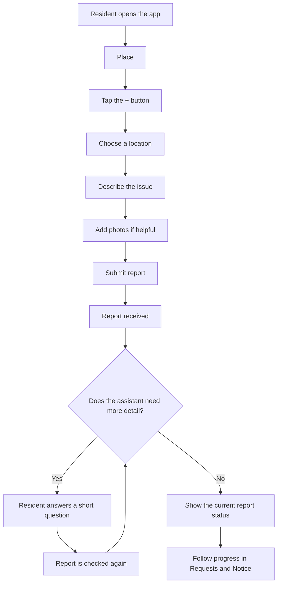

# Resident Mobile UX Flows

> Everything in screen must be VietNamese
## 1. Purpose

The Resident experience should help people complete four simple tasks:

1. Report an issue.
2. Answer a follow-up question when more detail is needed.
3. Check what is happening with a report.
4. Read notices and manage their account.

The interface should use the word **report**, not **ticket**, when speaking to residents. “Ticket” may still be used inside the system, but it is not friendly language for the mobile app.

## 2. How the reference images are used

The municipality app image is a reference for the bottom navigation:

- Place
- Notice
- a central `+` button
- Requests
- Profile

The Bevel image is a reference for the **Report an issue** form:

- a simple sheet that opens above the current page;
- a clear title and close button;
- short instructions before the form;
- one large description field;
- an obvious area for adding photos;
- one large Submit button near the bottom.

The brands, logos, phone numbers, email addresses, video links, watermarks, and product-specific text shown in the reference images are not requirements for this project.

## 3. Experience principles

### Keep it simple

- Show one main action at a time.
- Use short sentences and familiar words.
- Do not show system codes, scores, or technical AI terms.
- Do not ask the resident to choose a problem category. The system works this out after the report is sent.

### Give clear feedback

- Tell the resident when a report has been received.
- Explain what happens next after every action.
- Show what will happen next.
- Never leave a loading spinner on screen without an explanation.

### Protect the resident’s work

- Keep what the resident has typed if the upload or submission fails.
- Do not create the same report twice when the resident retries.
- Ask before closing the form if it contains unsent information.

### Protect privacy

- While the assistant is still analysing a report — including while it is
  waiting for an answer to one of its questions — the report is visible **only
  to the person who sent it**. Nobody else in the apartment sees it in the list,
  in the totals, in the details, in its photos, or in its questions, and
  Building Management has not received it yet.
- Once the analysis finishes, however it finishes, the report is shared with the
  apartment and handed to Building Management — or it ends as not accepted.
- After that, people in the same apartment can see the apartment’s reports.
- Only the person who sent a report can answer the assistant or cancel it. The
  backend enforces this; hiding the buttons is only a convenience.
- A report linked to another apartment’s report must never reveal that
  resident’s name, apartment, phone number, description, or photos.

## 4. Main navigation

The bottom bar appears on the four main sections. The central `+` button is the main action and is not a normal tab.

| Item | What it means | Main content |
| --- | --- | --- |
| **Place** | Home | Short guidance, important rules, and a quick way to contact Building Management |
| **Notice** | Updates | Unread and previous notices |
| **+** | Report an issue | Opens the report form |
| **Requests** | Report history | All new and previous reports for the apartment |
| **Profile** | Account | Basic account and apartment information, plus Log out |

Navigation behavior:

- Opening a main section should remember its last scroll position and filters during the current visit.
- Opening a report from Notice should return to Notice when the resident goes back.
- Opening a report from Requests should return to the same Requests list and filters.
- After a successful submission, open the new report instead of returning to Place.
- The exact page addresses will be defined later in `SCREEN_INVENTORY.md`.

## 5. Overall resident journey

## 6. Flow R-01 — Place

### Goal

Help the resident understand what the app is for and start a report without searching through menus.

### Suggested content order

1. A short welcome using the resident’s name or apartment when available.
2. A primary button: **Report an issue**.
3. Three short instructions:
   - Choose the exact location.
   - Describe what is happening.
   - Add a photo if it helps explain the issue.
4. A short note: **After you submit, we may ask a quick question. Please respond within 5 minutes.**
5. A visible **Call Building Management** action using a phone number supplied by the project, not copied from the reference image.

### Important states

- If the account is not linked to an apartment, explain the problem and provide a way to contact Building Management. Reporting is unavailable until the link is fixed.
- If the guidance content cannot load, use a short copy stored in the app. This should not block reporting.
- If the phone number is not configured, hide the call action rather than showing a placeholder number.
- When offline, the resident can still read the guidance, but the app must explain that an internet connection is needed to send a report.

## 7. Flow R-02 — Report an issue

### 7.1 Form style

The form should follow the simple structure shown in the Bevel reference. It opens as a full-height sheet above the current page.

It is a **single-page form**, not a long step-by-step wizard. The resident can see all required information before pressing Submit.

### 7.2 Suggested layout

From top to bottom:

1. Close button.
2. Centered title: **Report an issue**.
3. Small guidance area.
4. Location selection.
5. Large description field.
6. Photo area.
7. Large Submit button fixed near the bottom safe area.

Suggested guidance copy:

> Please include:
>
> - Where the issue is
> - A short description of what is happening
> - A photo, if it helps

### 7.3 Choose a location

Label: **Where is the issue?**

The resident first chooses a floor, then a specific place from the available list.

- A search field may help narrow the list.
- The final location must be selected from the list.
- The resident cannot create a new location by typing free text.
- The app does not guess the location from the description or photo.

If no suitable location exists, show:

> Can’t find the right location? Contact Building Management so the location list can be updated.

The resident’s description and photos must remain in the form while they retry or refresh the location list.

### 7.4 Describe the issue

Label: **Describe the issue**

Placeholder:

> What is happening? Where exactly can it be seen, and when did it start?

Rules:

- A description is required.
- Blank spaces alone do not count as a description.
- Keep a visible character count only when the resident is close to the limit.
- Do not ask the resident to name a category or urgency level.

If the resident tries to submit without a description, keep all other information and show:

> Please describe the issue before submitting.

### 7.5 Add photos

Label: **Photos (optional)**

The empty photo area should look like the Bevel reference: a large outlined box with **Add photo** and a clear `+` icon.

Tapping it opens two choices when the device supports both:

- **Take a photo**
- **Choose from library**

Photo behavior:

- Up to five photos may be added.
- Supported formats are JPEG, PNG, and WebP.
- Each photo may be up to 10 MB under the current project settings.
- Show a preview for every photo.
- Each photo has a remove action.
- Show upload progress without blocking the rest of the form.
- If one photo fails, allow retry or removal. The resident may still submit without that photo.
- Never remove the description because a photo upload failed.

After at least one photo is added, replace the empty box with a row or grid of previews and an **Add another photo** tile.

### 7.6 Submit button

Button label: **Submit report**

The button remains visible near the bottom of the sheet.

Disabled when:

- no valid location is selected;
- the description is empty;
- a photo is still being prepared or uploaded.

When pressed:

1. Disable the button to prevent repeated taps.
2. Show **Submitting…** inside the button.
3. Keep the form visible until the report is accepted.
4. When accepted, clear the saved draft and open the new report.

Success message:

> Report received
>
> We are checking the details now. We may ask a quick follow-up question.

### 7.7 Closing the form

If the form is empty, the close button dismisses it immediately.

If the resident has entered anything, ask:

> Leave this report?
>
> Your unsent changes will be lost.

Actions:

- **Keep editing**
- **Discard**

### 7.8 Submission problems

| What happened | What the resident sees |
| --- | --- |
| The selected location is no longer available | “Please choose the location again.” Keep the description and photos. |
| A photo is not accepted | Identify the photo and offer Retry or Remove. |
| Too many reports were sent in a short time | Explain when another report can be sent. Requests, Notice, and Call Building Management remain available. |
| Internet connection is lost | Keep the draft and offer Try again. |
| The report may already have been accepted | Check for the existing report before sending again. |
| An unexpected problem occurs | Show a friendly error and a reference number for support. Do not show system details. |

## 8. Flow R-03 — Follow-up questions

### When this appears

After a report is sent, the app may need one more detail. The question appears inside the new report, so the resident does not lose context.

Resident-facing title:

> We need one more detail

Supporting text:

> Your answer helps Building Management understand the issue correctly.

### Question layout

Show:

1. The question number, such as **Question 1 of 3**.
2. The time remaining.
3. One clear question.
4. Answer choices when available.
5. A text box only when a written answer is allowed.
6. **Take a new photo** when a clearer image is requested.
7. A large **Send answer** button.

There may be up to three questions. All questions share one five-minute response period; the timer does not start over for each question.

After the answer is sent, show:

> Thanks — we’re checking your report again.

### Who can answer

- Only the person who sent the report can see and use the answer controls.
- Other members of the apartment do not see the report at all while it is
  waiting for an answer — that whole period is part of the private analysis
  phase. They see it once the analysis finishes, by which time the question is
  closed.

### Possible outcomes

| Situation | Resident-facing result |
| --- | --- |
| Enough information is available | The question closes and the latest report status appears. |
| Another detail is needed | The next short question appears with the remaining time. |
| The issue may be dangerous | Questions stop and the app says the issue is being handled urgently. |
| The five minutes end | The report closes as “Not accepted — response time ended,” with a button to create a new report. |
| The system still cannot decide | “Building Management is reviewing your report.” |

## 9. Flow R-04 — Requests

### Goal

Requests is the single history for every report connected to the apartment that
the signed-in account may see. It includes their own reports at every stage —
including while the assistant is still analysing one — plus older reports and
reports sent by other members of the apartment once those have finished
analysis. A housemate’s report that is still being analysed is not there, and
does not count toward the totals or take up a slot on a page.

### Page structure

1. Title: **Requests**.
2. Simple filters, all applied by the backend:
   - **All**
   - **In progress**
   - **Finished**
   - issue type
   - date range
3. Reports sorted with the newest update first.
4. One page at a time, with a way to load the next page.

The list never loads the whole history to filter it in the app. Filtering,
counting, sorting and paging all happen in the backend, so the result count and
page 2 of a filtered list are always correct. There is no free-text search,
because searching only the page already loaded would quietly miss matches.

Each report card shows:

- report number;
- simple issue name, or **Checking issue type**;
- current status;
- location;
- sender’s name within the apartment;
- date and time;
- current expected completion time when available.

Location, sender, issue type and the submitted date and time are required on
every card; the backend returns all four.

### Empty states

No reports yet:

> No reports yet
>
> Use the + button to report an issue.

No filter results:

> No reports match these filters.

Action: **Clear filters**

## 10. Flow R-05 — Report details

### Content order

1. Report number and current status.
2. A clear action area when the resident needs to answer a question.
3. Issue name, friendly urgency wording, and current expected completion time.
4. Current technician’s name when someone has been assigned.
5. Location, description, and the apartment’s photos.
6. A simple progress timeline.
7. Only the actions that are currently allowed.

Do not show residents:

- internal priority codes;
- scores or calculations;
- the word “SLA”;
- AI confidence or reasoning;
- internal notes or audit records.

### Friendly status language

| Situation | Suggested wording |
| --- | --- |
| The report is being checked | Checking your report |
| A resident answer is needed | Waiting for your answer |
| Building Management must review it | Being reviewed by Building Management |
| The report is ready for handling | New |
| The report was approved | Approved |
| A technician was assigned | {Name} will handle this report |
| The technician changed | Technician changed — new expected time: {time} |
| Work started | In progress |
| Work finished | Completed |
| The issue could not be resolved | Could not be resolved |
| The sender cancelled it | Cancelled |
| There was not enough information | Not accepted — more detail was needed |
| The resident did not answer in time | Not accepted — response time ended |

### Cancel a report

Only the person who sent the report can cancel it, and only while it is still New.

Confirmation:

> Cancel this report?
>
> Building Management will stop processing it.

Actions:

- **Keep report**
- **Cancel report**

If the report changed while the confirmation was open, refresh the page and explain that it can no longer be cancelled.

### When the same issue was already reported

Suggested status:

> This issue is already being handled

The report still appears in Requests. It does not create a second job.

Show only this information from the existing report:

- reference number;
- issue name;
- current status;
- current expected completion time.

Do not show the other resident’s identity, apartment, description, or photos.

The sender sees **My issue is different**. After it is pressed, replace the button with:

> Waiting for Building Management to review

Pressing the action again must not create another request.

### When Building Management does not accept a report

Building Management never asks a resident for more information after a report
arrives. The review has two outcomes: the report is accepted and moves forward,
or it is rejected and ends.

When it is rejected:

- the report moves to a finished state and stops receiving updates;
- the resident sees a short, friendly explanation of why it was not accepted;
- the only action offered is **Report an issue** again;
- no supplement field, supplement button, or link to Notice for sending more
  information is shown anywhere.

The reason Building Management recorded internally is never shown. The resident
only reads approved copy such as “Phản ánh chưa được tiếp nhận sau khi Ban quản lý
xem xét.”

This is separate from the assistant’s five-minute questions, which still run
immediately after submission and are unchanged.

## 11. Flow R-06 — Notice

### Page structure

- Newest notice first.
- Unread notices have both a visual marker and stronger text weight.
- Each item shows a short title, a short message, and time.
- Opening a notice marks it as read.
- A notice connected to a report opens that report.

Residents receive notices when important progress changes, including:

- the report is approved;
- a technician is assigned;
- the technician changes;
- work starts;
- work is completed;
- the report is not accepted;
- the issue is linked to an existing report;
- an existing linked report changes;
- the review of **My issue is different** is complete.

When a technician changes, the notice must include the new expected completion time. Do not use a vague message such as “Please wait longer.”

Empty state:

> No notices yet
>
> Updates about your reports will appear here.

## 12. Flow R-07 — Profile

Profile contains only basic information and Log out:

- full name;
- phone number when available;
- building, floor, and apartment number;
- account status;
- **Log out**.

Residents cannot change their apartment, account role, or account status in the app. If something is wrong, show a way to contact Building Management.

### Log out

1. The resident taps **Log out**.
2. If an unfinished report draft exists, ask whether to keep editing or discard it.
3. End the session and remove private local data.
4. Return to the shared login screen.
5. The device Back action must not reopen Resident information after logout.

## 13. Shared loading and error behavior

### Loading

- Use short skeleton placeholders for lists and report details.
- Keep the page title and navigation visible.
- If checking takes longer than expected, say: **You can leave this page and follow progress in Requests.**

### No connection

- Keep previously loaded Requests and Notices visible when safe.
- Clearly mark that the information may be out of date.
- Do not show a successful submission until the report has truly been received.

### Permission changed

If an action is no longer allowed, refresh the report and explain what changed. Do not blame the resident or show a system error code.

### Account session ended

Save only a safe, unsent draft. Ask the resident to sign in again before sending or viewing private information.

## 14. Information needed before implementation

The current system needs a few additions so the experience above can work correctly:

1. The app needs the current expected completion time, including changes after a technician is replaced.
2. The Notice tab needs a reliable unread total for its badge.
3. The shared login method must be confirmed before its final screens are designed.
4. *(Done.)* The system enforces “only the sender can answer or cancel” in the
   backend, so bypassing the visible buttons changes nothing.

Resolved since the first draft: reports now identify their sender, and cards and
details carry the chosen location label.

These are product and data needs. Residents should never see placeholder information while they are unfinished.

## 15. Accessibility and comfort

- Tap areas should be at least 44 × 44 points.
- The bottom bar and Submit button must stay above the phone’s safe area.
- Every field needs a visible label.
- Error messages appear beside the part that needs attention.
- Do not rely on color alone for unread, error, warning, or status information.
- The five-minute timer should announce important points, such as one minute and fifteen seconds remaining, without reading every second aloud.
- Text should remain readable when the phone’s text size is increased.
- Photo actions need text labels, not icon-only controls.

